<div align="center">


# 🎨 Doodlz — Android Drawing App

**A native Android drawing application, written in Java, that turns the device screen into**
**a digital painting canvas with multi-touch support, a color palette and image saving.**

<br>


-brightgreen?style=for-the-badge)


<br>

🌐 **Choose Language / Selecione o idioma / Elija el idioma**

[](README.md)
[](README_PT.md)
[](README_ES.md)

<br>


</div>

---

## 📚 Table of Contents

| # | Section |
|:-:|:------|
| 1 | [📖 About the Project](#-about-the-project) |
| 2 | [✨ Key Features](#-key-features) |
| 3 | [🛠️ Tech Stack](#️-tech-stack) |
| 4 | [🔑 Implementation Highlights](#-implementation-highlights) |
| 5 | [📂 Repository Structure](#-repository-structure) |
| 6 | [🚀 Getting Started](#-getting-started) |
| 7 | [📋 Engineering & Software Documentation](#-engineering--software-documentation) |
| 8 | [🤝 Contributing](#-contributing) |
| 9 | [👨‍💻 Author](#-author) |
| 10 | [📄 License](#-license) |

<details>
<summary>📋 Jump directly into the Engineering & Software Documentation index (35 artifacts)</summary>

**Requirements**
- [✅ Functional Requirements (FR)](#-functional-requirements-fr)
- [⚙️ Non-Functional Requirements (NFR)](#️-non-functional-requirements-nfr)
- [📏 Business Rules (BR)](#-business-rules-br)
- [🌐 Domain Requirements](#-domain-requirements)
- [💾 Data Requirements](#-data-requirements)
- [🖥️ Interface Requirements](#️-interface-requirements)
- [🎯 Use Cases](#-use-cases)
- [🔗 Requirements Traceability Matrix](#-requirements-traceability-matrix)
- [📄 Software Requirements Specification (SRS)](#-software-requirements-specification-srs)

**UML Diagrams**
- [🧩 Use Case Diagram](#-use-case-diagram)
- [🏗️ Class Diagram](#️-class-diagram)
- [📦 Object Diagram](#-object-diagram)
- [🔁 Sequence Diagram](#-sequence-diagram)
- [💬 Communication Diagram](#-communication-diagram)
- [🏃 Activity Diagram](#-activity-diagram)
- [🔄 State Machine Diagram](#-state-machine-diagram)
- [🧱 Component Diagram](#-component-diagram)
- [🚢 Deployment Diagram](#-deployment-diagram)
- [📦 Package Diagram](#-package-diagram-1)
- [🧬 Composite Structure Diagram](#-composite-structure-diagram)
- [🗺️ Interaction Overview Diagram](#️-interaction-overview-diagram)
- [⏱️ Timing Diagram](#️-timing-diagram)

**Data Model**
- [🗄️ Entity-Relationship Diagram (ERD)](#️-entity-relationship-diagram-erd)
- [💡 Conceptual Data Model](#-conceptual-data-model)
- [🧮 Logical Data Model](#-logical-data-model)
- [⚙️ Physical Data Model](#️-physical-data-model-1)
- [📖 Data Dictionary](#-data-dictionary)
- [🔀 Data Flow Diagram (DFD)](#-data-flow-diagram-dfd)
- [🧵 Data Lineage Diagram](#-data-lineage-diagram)

**Architecture & UX**
- [🏛️ Architecture Diagram (Overview)](#️-architecture-diagram-overview)
- [🔀 Flowchart](#-flowchart)
- [🙋 Persona](#-persona)
- [🧭 User Journey Map](#-user-journey-map)
- [📐 Wireframe](#-wireframe)
- [🖼️ Mockup](#️-mockup)

</details>

---

## 📖 About the Project

> **Doodlz** is a native Android drawing application that turns the device screen into a fully interactive **digital painting canvas**.

The heart of the project is a **custom View** (`DoodleView`) that captures and renders finger movements in real time, with full **multi-touch** support — allowing the user to draw with several fingers simultaneously.

Beyond the drawing experience, the app includes a complete toolbar/menu and direct integration with the **device hardware**: simply shake the phone to clear the canvas, using the native Android accelerometer.

---

## ✨ Key Features

| Icon | Feature | Description |
|:-----:|:---------------|:----------|
| ✍️ | **Multi-Touch Drawing** | Draw with multiple fingers at the same time. Each touch is tracked with its own independent `Path`. |
| 🎨 | **Color Picker** | `ColorDialogFragment` with a `RecyclerView` showing a full color palette for the brush. |
| 〰️ | **Line Width Picker** | `LineWidthDialogFragment` with a `SeekBar` for precise, real-time line-width adjustment. |
| 💾 | **Save Drawing** | Saves the current image directly to the device gallery via `MediaStore`. |
| 🖨️ | **Print** | Sends the drawing to Android's native print service. |
| 🗑️ | **Erase with Confirmation** | `EraseImageDialogFragment` asks for confirmation before clearing the canvas, preventing accidental loss. |
| 📳 | **Shake to Erase** | Uses the **Accelerometer** (`Sensor.TYPE_ACCELEROMETER`) to detect a "shake" gesture and trigger the erase flow. |

---

## 🛠️ Tech Stack

| Technology | Role in the Project |
|:-----------|:------------------|
| **Java** | Main language for all application logic. |
| **Android SDK** | Native framework for Android development. |
| **Fragments + Single Activity Architecture** | `MainActivity` hosts `DoodleFragment` as the main controller. |
| **Custom View (`DoodleView`)** | Custom view containing the entire 2D drawing engine. |
| **Bitmap / Canvas / Paint / Path** | Android's native 2D graphics APIs used to render strokes. |
| **SensorManager** | Access to the accelerometer for shake-gesture detection. |
| **MediaStore** | Android API for saving images to the device gallery. |
| **AndroidManifest.xml** | Declares permissions (`WRITE_EXTERNAL_STORAGE`) and app configuration. |
| **Gradle (Kotlin DSL)** | Build system and dependency management. |

---

## 🔑 Implementation Highlights

### 🖌️ DoodleView.java — The Multi-Touch Painting Canvas

> The core of the entire project. `DoodleView` is a custom `View` that manages all real-time drawing logic.

| Component | Type | Responsibility |
|:-----------|:----:|:-----------------|
| `bitmap` | `Bitmap` | Background canvas where strokes persist between redraws. |
| `bitmapCanvas` | `Canvas` | Canvas bound to the `Bitmap`, where `Paint` actually draws. |
| `pathMap` | `HashMap<Integer, Path>` | Stores each finger's `Path`, keyed by `pointerId`. |
| `previousPointMap` | `HashMap<Integer, Point>` | Holds each finger's previous point to generate smooth, continuous lines. |

**Touch events processed by `onTouchEvent`:**

```java
// Each event is handled individually to support multiple fingers
switch (action) {
    case MotionEvent.ACTION_DOWN:         // First finger touches the screen
    case MotionEvent.ACTION_POINTER_DOWN: // An additional finger touches the screen
    case MotionEvent.ACTION_MOVE:         // Any finger moves
    case MotionEvent.ACTION_UP:           // Last finger leaves the screen
    case MotionEvent.ACTION_POINTER_UP:   // An additional finger leaves the screen
}
```

---

### 📳 SensorEventListenerHelper.java — Shake to Erase

> This class encapsulates all accelerometer logic, keeping `DoodleFragment` clean and with a single responsibility.

```java
// Shake-gesture detection logic
float acceleration = /* resultant acceleration calculation */;

if (acceleration > SHAKE_THRESHOLD) {
    // Invokes eraseImage() on DoodleFragment
    doodleFragment.eraseImage();
}
```

| Item | Detail |
|:-----|:--------|
| **Sensor used** | `Sensor.TYPE_ACCELEROMETER` |
| **Threshold** | `SHAKE_THRESHOLD` constant — defines gesture sensitivity. |
| **Triggered action** | Calls `eraseImage()` on `DoodleFragment` when the threshold is exceeded. |

---

## 📂 Repository Structure

```plaintext
doodlz/
│
├── 📄 build.gradle.kts                        # ⚙️  Project configuration (root level)
│
└── 📁 app/
    ├── 📄 build.gradle.kts                    # ⚙️  'app' module configuration
    │
    └── 📁 src/main/
        │
        ├── 📄 AndroidManifest.xml             # 🔐 Permissions and app configuration
        │
        ├── 📁 java/com/example/doodlz/
        │   ├── 📄 MainActivity.java           # 🏠 Main activity (Host)
        │   ├── 📄 DoodleFragment.java         # 🎛️  Main fragment (Controller)
        │   ├── 📄 DoodleView.java             # 🖌️  Multi-Touch drawing engine ← CORE
        │   ├── 📄 SensorEventListenerHelper.java # 📳 Accelerometer logic ← CORE
        │   ├── 📄 ColorDialogFragment.java    # 🎨 Color picker dialog
        │   ├── 📄 LineWidthDialogFragment.java # 〰️  Line width dialog
        │   └── 📄 EraseImageDialogFragment.java # 🗑️  Erase confirmation dialog
        │
        └── 📁 res/
            ├── 📁 layout/                     # 🖼️  Screen and dialog XML layouts
            │   ├── 📄 activity_main.xml
            │   ├── 📄 fragment_doodle.xml
            │   ├── 📄 fragment_color.xml
            │   └── 📄 fragment_line_width.xml
            ├── 📁 drawable/                   # 🎭 App icons and vectors
            └── 📁 values/                     # 📝 Strings, colors and dimensions
```

---

## 🚀 Getting Started

### 📋 Prerequisites

| Requirement | Detail |
|:----------|:--------|
| **Android Studio** | **Hedgehog** or later, installed and configured. |
| **JDK** | Version **11 or higher** (usually bundled with Android Studio). |
| **Device or Emulator** | A physical Android device (USB + debugging enabled) or a configured AVD. |

---

### 🔧 Step by Step

**1. Clone the repository:**

```bash
git clone https://github.com/VictorHJesusSantiago/doodlz.git
```

**2. Open in Android Studio:**

```
Android Studio → File → Open → Select the 'doodlz' folder
```

**3. Sync Gradle:**

> Android Studio will detect the project automatically. Wait for dependency sync — it's fast since the project has no external libraries.

```
Build → Sync Project with Gradle Files
```

**4. Run the app:**

```
Run → Run 'app'  (or click the ▶️ button in the toolbar)
```

---

### 📱 Testing Hardware Features

| Feature | How to Test |
|:---------------|:------------|
| 🎨 **Multi-Touch Drawing** | On a physical device, use multiple fingers at once. |
| 📳 **Shake to Erase** | Shake the physical device. On the emulator, use `Extended Controls → Virtual sensors`. |
| 💾 **Save to Gallery** | Grant the `WRITE_EXTERNAL_STORAGE` permission when prompted. |

---

## 📋 Engineering & Software Documentation

> A condensed set of software-engineering artifacts (requirements, UML, data model and UX) describing Doodlz. Each item below is collapsible — click to expand.

### 📝 Requirements

<details>
<summary><b>✅ Functional Requirements (FR)</b></summary>

| ID | Requirement | Description | Priority |
|:---|:------------|:-------------|:--------:|
| RF01 | Multi-touch drawing | The app shall allow drawing with multiple fingers simultaneously, each tracked as an independent `Path`. | High |
| RF02 | Color selection | The user shall be able to choose a stroke color from a palette dialog (`ColorDialogFragment`). | High |
| RF03 | Line width adjustment | The user shall be able to adjust the stroke width via a `SeekBar` (`LineWidthDialogFragment`). | Medium |
| RF04 | Save image | The user shall be able to save the current drawing to the device gallery via `MediaStore`. | High |
| RF05 | Print image | The user shall be able to send the drawing to a printer via Android's print framework. | Low |
| RF06 | Erase with confirmation | The user shall be able to clear the canvas, with a confirmation dialog to prevent accidental loss. | High |
| RF07 | Shake to erase | Shaking the device shall trigger the same erase-confirmation flow via the accelerometer. | Medium |

</details>

<details>
<summary><b>⚙️ Non-Functional Requirements (NFR)</b></summary>

| ID | Category | Requirement |
|:---|:---------|:------------|
| RNF01 | Performance | Drawing must render with no perceptible lag — the canvas is redrawn via `invalidate()` on every move event. |
| RNF02 | Compatibility | The app must run on the Android API range declared in `build.gradle.kts` (minSdk/targetSdk). |
| RNF03 | Usability | All destructive actions (erase) require explicit user confirmation before execution. |
| RNF04 | Portability | Layouts must adapt to phones and tablets of varying screen sizes and orientations. |
| RNF05 | Maintainability | Drawing logic is isolated in `DoodleView`; sensor logic in `SensorEventListenerHelper` (single responsibility). |
| RNF06 | Resource Usage | The in-memory `Bitmap` is kept at screen resolution only, avoiding out-of-memory errors. |

</details>

<details>
<summary><b>📏 Business Rules (BR)</b></summary>

- **RN01** — The default stroke color is black and the default width is a predefined constant until changed by the user.
- **RN02** — The canvas can only be cleared after explicit confirmation (dialog), whether triggered manually or via shake.
- **RN03** — Saving an image requires storage permission (`WRITE_EXTERNAL_STORAGE` on legacy Android, scoped storage via `MediaStore` on modern Android).
- **RN04** — Each active finger (`pointerId`) owns exactly one independent `Path`; lifting the finger finalizes and removes its tracking entry.
- **RN05** — Printing reuses the same `Bitmap` used for saving — what the user sees is exactly what gets saved/printed (WYSIWYG).

</details>

<details>
<summary><b>🌐 Domain Requirements</b></summary>

The application domain is **2D raster digital drawing**. Core domain concepts:

- **Canvas** — the drawable surface (backed by a `Bitmap`).
- **Stroke / Path** — a continuous line drawn by one finger.
- **Pointer** — a single finger/touch identified by `pointerId`.
- **Brush** — combination of `Color` + `Line Width` applied via `Paint`.
- **Gesture** — a recognized hardware input (shake) mapped to a domain action (erase).

**Domain constraint:** the model is restricted to 2D raster output — there is no vector persistence, no layers, and no undo/redo history.

</details>

<details>
<summary><b>💾 Data Requirements</b></summary>

| Data | Lifetime | Location |
|:-----|:---------|:---------|
| Active `Path` objects (`pathMap`, `previousPointMap`) | Transient (in-memory, per touch session) | `DoodleView` instance |
| Drawing `Bitmap` | Session-lived (in-memory) | `DoodleView` instance |
| Exported PNG image | Persistent | Device `MediaStore` / Gallery |
| Current color / line width | Session-lived | `DoodleView` fields |

The app has **no relational database and no remote backend** — all persistent data is the exported image asset.

</details>

<details>
<summary><b>🖥️ Interface Requirements</b></summary>

| Screen | Component | Requirement |
|:-------|:----------|:------------|
| Main Drawing Screen | `DoodleFragment` + `DoodleView` | Full-screen canvas with an options menu (Color, Line Width, Erase, Save, Print). |
| Color Dialog | `ColorDialogFragment` | `RecyclerView` palette with live brush preview. |
| Line Width Dialog | `LineWidthDialogFragment` | `SeekBar` with live brush preview. |
| Erase Confirmation Dialog | `EraseImageDialogFragment` | Yes / Cancel buttons; Cancel performs no state change. |

All dialogs are modal and must not alter app state when dismissed via Cancel/back.

</details>

<details>
<summary><b>🎯 Use Cases</b></summary>

| ID | Use Case | Actor | Main Flow |
|:---|:---------|:------|:----------|
| UC01 | Draw on Canvas | User | User touches and drags on screen → `DoodleView` creates/updates `Path` per finger → canvas redraws. |
| UC02 | Select Color | User | User opens menu → Color → picks a swatch → brush color updates. |
| UC03 | Adjust Line Width | User | User opens menu → Line Width → drags `SeekBar` → brush width updates. |
| UC04 | Save Image | User | User opens menu → Save → app writes `Bitmap` to `MediaStore`. |
| UC05 | Print Image | User | User opens menu → Print → Android print dialog opens with the `Bitmap`. |
| UC06 | Erase Canvas (manual) | User | User opens menu → Erase → confirms → canvas cleared. |
| UC07 | Erase Canvas (shake) | User | User shakes device → accelerometer exceeds threshold → erase confirmation shown → confirms → canvas cleared. |

</details>

<details>
<summary><b>🔗 Requirements Traceability Matrix</b></summary>

| Requirement | Use Case | Implementing Class | Verification |
|:------------|:---------|:--------------------|:--------------|
| RF01 / RN04 | UC01 | `DoodleView.onTouchEvent` | Manual multi-finger test on device |
| RF02 | UC02 | `ColorDialogFragment` | Select swatch, draw, confirm color applied |
| RF03 | UC03 | `LineWidthDialogFragment` | Adjust `SeekBar`, draw, confirm width applied |
| RF04 / RN05 | UC04 | `DoodleFragment.saveImage` | Save, check file in gallery |
| RF05 / RN05 | UC05 | `DoodleFragment.printImage` | Trigger print, check preview matches canvas |
| RF06 / RN02 | UC06 | `EraseImageDialogFragment`, `DoodleView.clear` | Erase via menu, confirm canvas cleared |
| RF07 / RN02 | UC07 | `SensorEventListenerHelper` | Shake device, confirm dialog appears |
| RNF01 | UC01 | `DoodleView.onDraw` | Visual check for lag during drawing |
| RNF03 | UC06, UC07 | `EraseImageDialogFragment` | Confirm dialog blocks accidental erase |

</details>

<details>
<summary><b>📄 Software Requirements Specification (SRS)</b></summary>

Condensed SRS outline (IEEE 830 style):

1. **Introduction**
   - *Purpose*: describe the functional and non-functional behavior of the Doodlz drawing app.
   - *Scope*: single-activity Android app for freehand drawing, saving and printing images.
   - *Definitions*: see [Domain Requirements](#-domain-requirements).
2. **Overall Description**
   - *Product perspective*: standalone app, no backend, uses Android OS services (`SensorManager`, `MediaStore`, Print Framework).
   - *User characteristics*: casual users of any age, no training required.
   - *Constraints*: Java + Android SDK, no external libraries (see [Tech Stack](#️-tech-stack)).
3. **Specific Requirements**: see [Functional Requirements](#-functional-requirements-fr), [Non-Functional Requirements](#️-non-functional-requirements-nfr) and [Business Rules](#-business-rules-br).
4. **Appendices**: see [UML Diagrams](#-use-case-diagram), [Data Model](#️-entity-relationship-diagram-erd) and [Architecture & UX](#️-architecture-diagram-overview) below.

</details>

---

### 🧩 UML Diagrams

<details>
<summary><b>🧩 Use Case Diagram</b></summary>

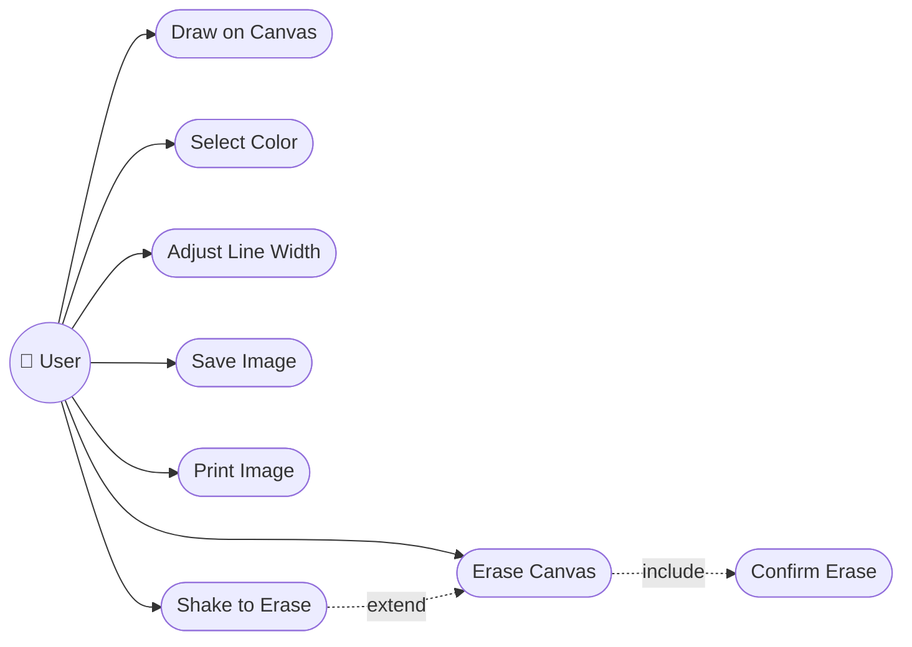

</details>

<details>
<summary><b>🏗️ Class Diagram</b></summary>

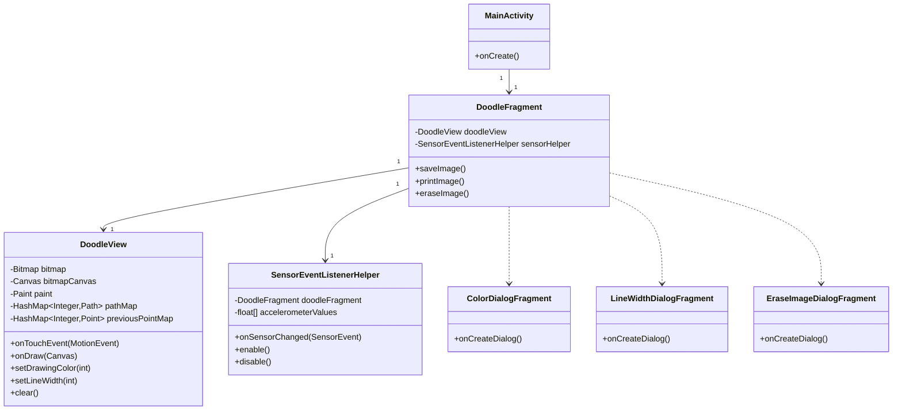

</details>

<details>
<summary><b>📦 Object Diagram</b></summary>

Snapshot of a `DoodleView` instance mid-drawing, with two active fingers:

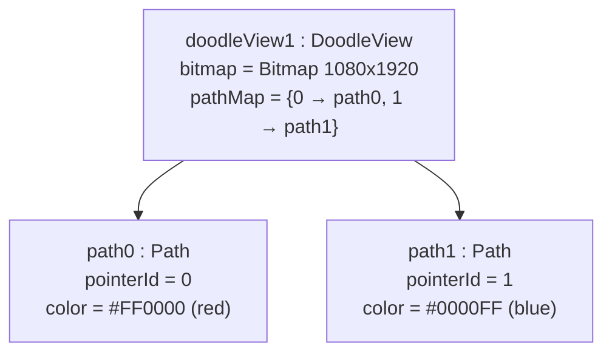

</details>

<details>
<summary><b>🔁 Sequence Diagram</b></summary>

Drawing a single stroke (one finger, `ACTION_DOWN` → `ACTION_MOVE` → `ACTION_UP`):

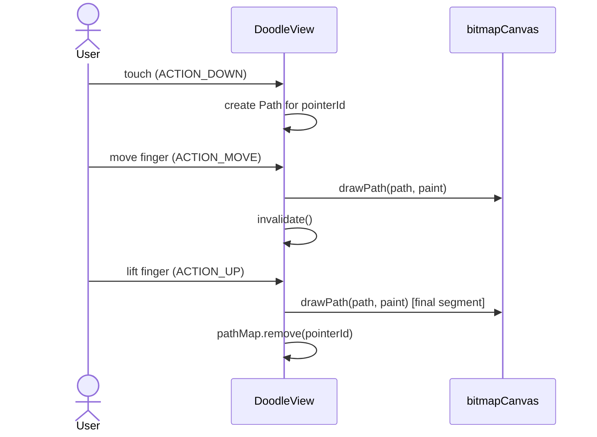

</details>

<details>
<summary><b>💬 Communication Diagram</b></summary>

Message flow for "Shake to Erase" (numbered to show order):

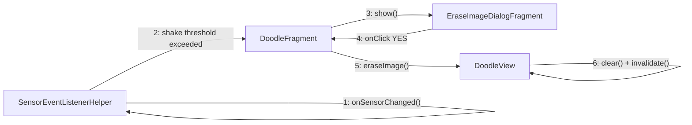

</details>

<details>
<summary><b>🏃 Activity Diagram</b></summary>

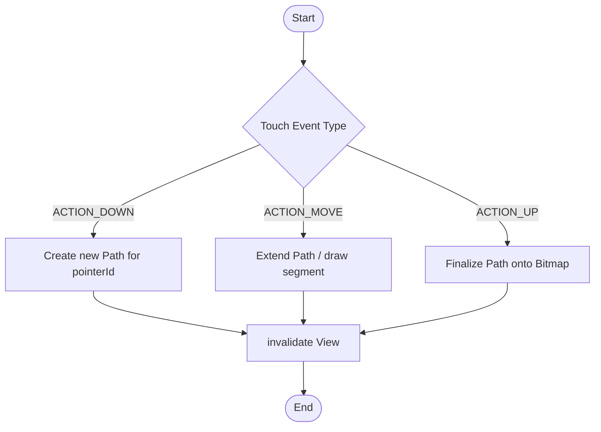

</details>

<details>
<summary><b>🔄 State Machine Diagram</b></summary>

States of `DoodleView` with respect to touch and erase events:

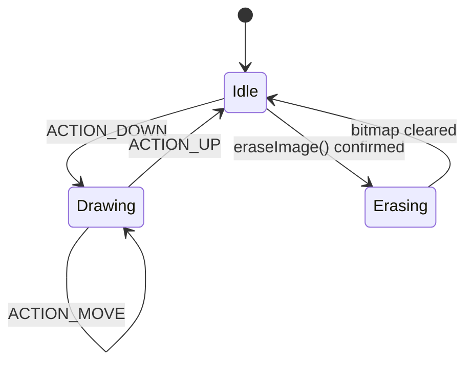

</details>

<details>
<summary><b>🧱 Component Diagram</b></summary>

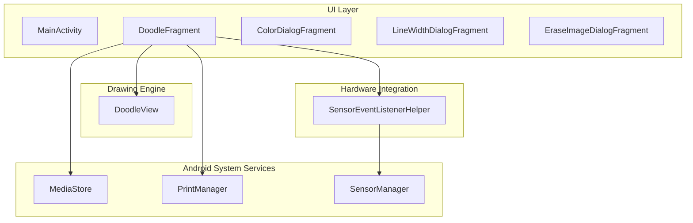

</details>

<details>
<summary><b>🚢 Deployment Diagram</b></summary>

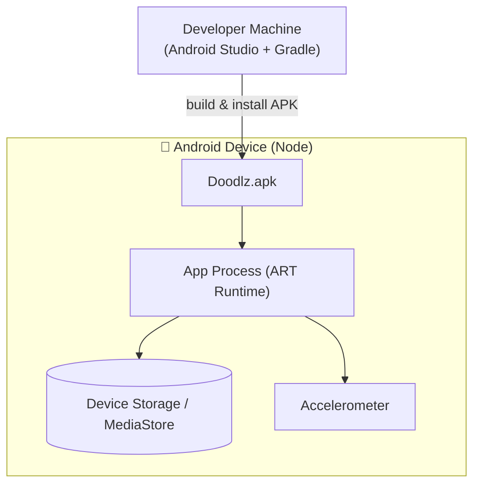

</details>

<details>
<summary><b>📦 Package Diagram</b></summary>

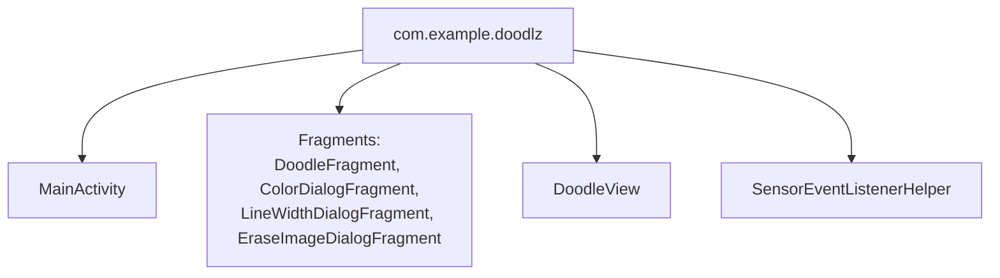

</details>

<details>
<summary><b>🧬 Composite Structure Diagram</b></summary>

Internal structure of `DoodleView`:

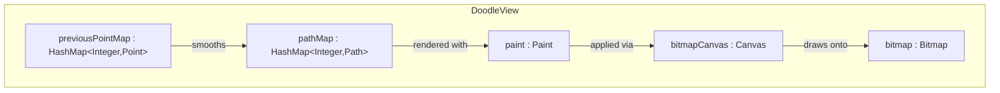

</details>

<details>
<summary><b>🗺️ Interaction Overview Diagram</b></summary>

High-level map of how the individual interaction (sequence) fragments connect:

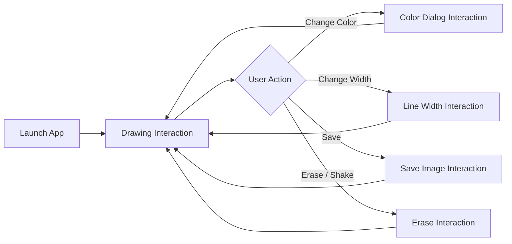

</details>

<details>
<summary><b>⏱️ Timing Diagram</b></summary>

Lifecycle of a single finger's touch input over time:

```text
Time         t0          t1          t2          t3          t4
Finger 0     DOWN ─────── MOVE ─────── MOVE ─────── MOVE ─────── UP
pathMap[0]   created ──── updated ──── updated ──── updated ──── removed
Canvas       idle ─────── drawPath ─── drawPath ─── drawPath ─── drawPath (final)
View state   Idle ─────── Drawing ──── Drawing ──── Drawing ──── Idle
```

</details>

---

### 🗄️ Data Model

<details>
<summary><b>🗄️ Entity-Relationship Diagram (ERD)</b></summary>

Doodlz has no relational database; the diagram below models the **runtime/exported data** in ER notation for documentation completeness.

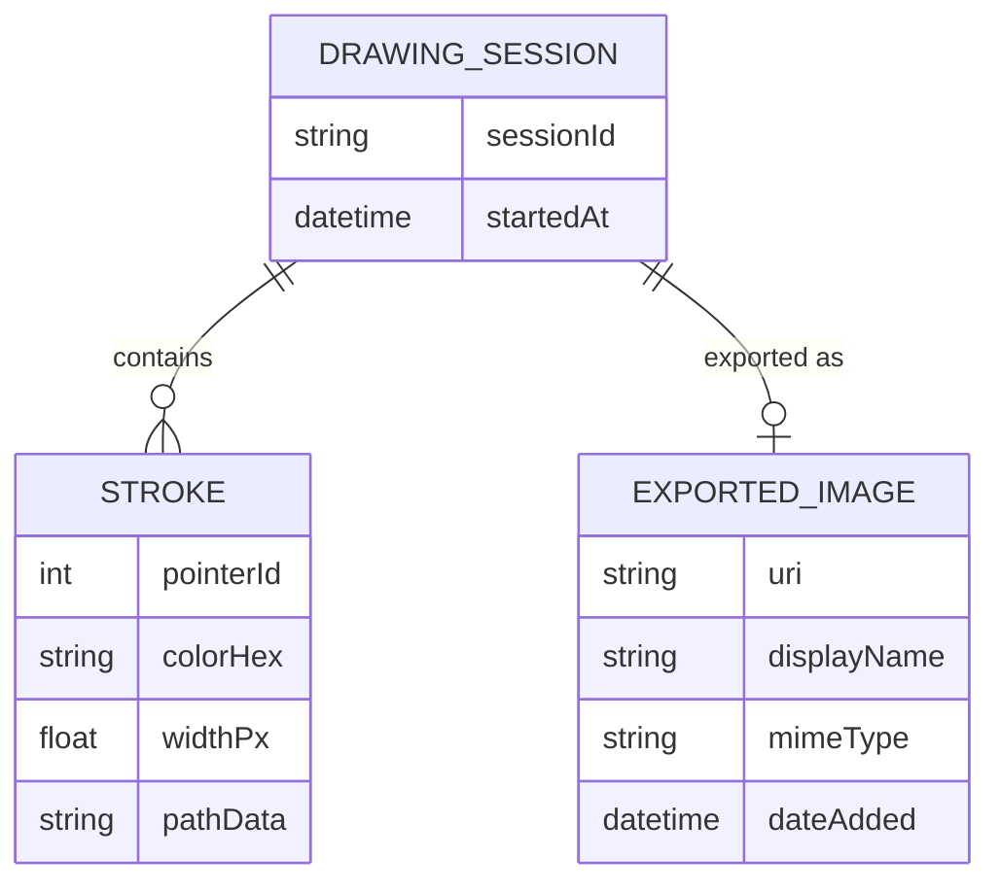

</details>

<details>
<summary><b>💡 Conceptual Data Model</b></summary>

At the conceptual level, a **Drawing Session** is composed of one or more **Strokes** (one per finger gesture) and may produce one **Exported Image**.

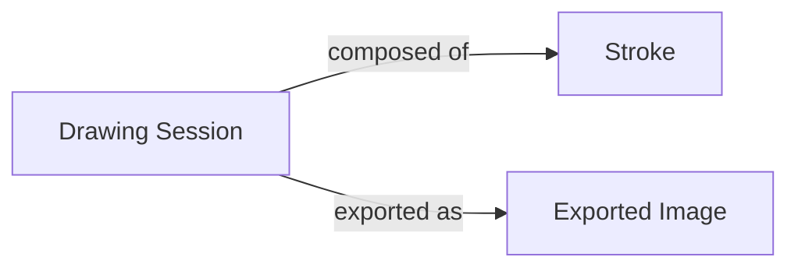

</details>

<details>
<summary><b>🧮 Logical Data Model</b></summary>

| Entity | Field | Type | Description |
|:-------|:------|:-----|:------------|
| Stroke | pointerId | Integer | Identifies the finger that drew the stroke |
| Stroke | colorHex | String(8) | Stroke color (ARGB) |
| Stroke | widthPx | Float | Stroke width in pixels |
| Stroke | pathData | Path (in-memory) | Sequence of line/curve segments |
| ExportedImage | uri | String | `MediaStore` content URI |
| ExportedImage | displayName | String | File name shown in gallery |
| ExportedImage | mimeType | String | `image/png` |
| ExportedImage | dateAdded | DateTime | Export timestamp |

</details>

<details>
<summary><b>⚙️ Physical Data Model</b></summary>

The only physically persisted data is the exported PNG, stored via `MediaStore.Images.Media` with the columns below:

| Column | Type | Notes |
|:-------|:-----|:------|
| `DISPLAY_NAME` | TEXT | File name (e.g. `doodlz_<timestamp>.png`) |
| `MIME_TYPE` | TEXT | `image/png` |
| `RELATIVE_PATH` / `DATA` | TEXT | Storage path (Pictures directory) |
| `DATE_ADDED` | INTEGER (Unix time) | Set automatically by `MediaStore` |

All other data (`bitmap`, `pathMap`, `previousPointMap`, current color/width) lives only in process memory (`DoodleView` instance fields) and is discarded when the app is closed.

</details>

<details>
<summary><b>📖 Data Dictionary</b></summary>

| Field | Type | Scope | Description |
|:------|:-----|:------|:------------|
| `bitmap` | `Bitmap` | `DoodleView` (memory) | Raster surface holding all committed strokes |
| `bitmapCanvas` | `Canvas` | `DoodleView` (memory) | Canvas bound to `bitmap`, used by `Paint` to draw |
| `paint` | `Paint` | `DoodleView` (memory) | Current brush: color, stroke width, style |
| `pathMap` | `HashMap<Integer, Path>` | `DoodleView` (memory) | Active strokes keyed by `pointerId` |
| `previousPointMap` | `HashMap<Integer, Point>` | `DoodleView` (memory) | Last known point per finger, for smoothing |
| `SHAKE_THRESHOLD` | `float` (constant) | `SensorEventListenerHelper` | Minimum acceleration to trigger erase |
| `DISPLAY_NAME` | `String` | `MediaStore` (persisted) | Exported image file name |
| `MIME_TYPE` | `String` | `MediaStore` (persisted) | Exported image MIME type (`image/png`) |

</details>

<details>
<summary><b>🔀 Data Flow Diagram (DFD)</b></summary>

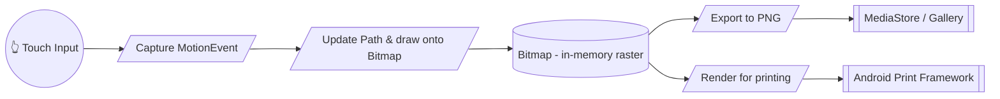

</details>

<details>
<summary><b>🧵 Data Lineage Diagram</b></summary>

How a single touch becomes a saved image:

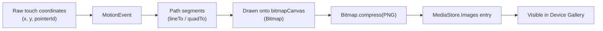

</details>

---

### 🏛️ Architecture & UX

<details>
<summary><b>🏛️ Architecture Diagram (Overview)</b></summary>

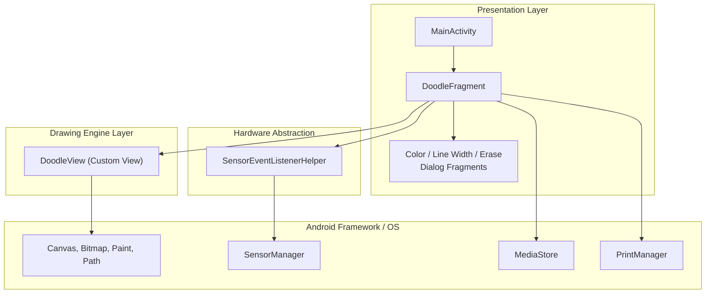

</details>

<details>
<summary><b>🔀 Flowchart</b></summary>

App navigation flow:

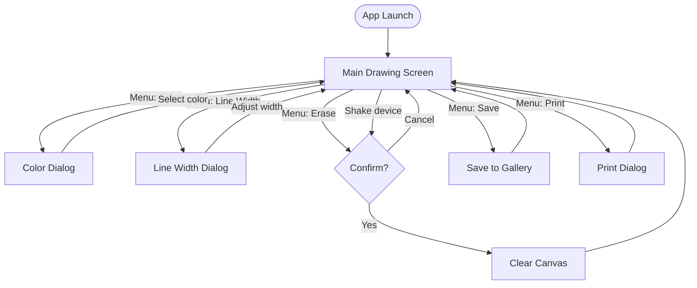

</details>

<details>
<summary><b>🙋 Persona</b></summary>

| | Persona 1 | Persona 2 |
|:--|:----------|:----------|
| **Name** | Ana, 8 | Carlos, 34 |
| **Role** | Child, casual doodler | Teacher |
| **Goal** | Draw freely with fingers, see bright colors, save drawings to show family | Quickly sketch a diagram on a tablet to illustrate a concept in class |
| **Tech comfort** | Low — needs large, obvious buttons | Medium — comfortable with menus |
| **Pain points** | Accidentally erasing a drawing | Lines too thin to see from the back of the room |
| **How Doodlz helps** | Shake-to-erase is fun, confirmation dialog prevents accidental loss | Line-width slider lets her draw bold, visible strokes and save/print instantly |

</details>

<details>
<summary><b>🧭 User Journey Map</b></summary>

| Stage | Action | User Thought | Emotion | Pain Point | Opportunity |
|:------|:-------|:--------------|:--------|:-----------|:-------------|
| 1. Launch | Opens the app | "Let's see what this does" | 🙂 Curious | — | Clean canvas shown immediately |
| 2. Draw | Touches and drags fingers | "I can draw with more than one finger!" | 😄 Delighted | Lag would frustrate | Smooth real-time rendering |
| 3. Customize | Opens color/width dialogs | "I want a thicker red line" | 🙂 Engaged | Too many options could confuse | Simple palette + slider |
| 4. Save | Taps Save | "I want to keep this" | 😊 Satisfied | Missing permission blocks save | Clear permission prompt |
| 5. Erase | Shakes device or taps Erase | "Let me start over" | 😟 Anxious (fear of losing work) | Accidental shake erases everything | Confirmation dialog |

</details>

<details>
<summary><b>📐 Wireframe</b></summary>

Low-fidelity layout of the main drawing screen:

```text
┌──────────────────────────────────────────┐
│ ☰  Doodlz                          ⋮ Menu │
├──────────────────────────────────────────┤
│                                            │
│                                            │
│                                            │
│              (Drawing Canvas)             │
│                                            │
│                                            │
│                                            │
│                                            │
├──────────────────────────────────────────┤
│ [🎨 Color]  [〰️ Width]  [🗑️ Erase]  [💾 Save] │
└──────────────────────────────────────────┘
```

</details>

<details>
<summary><b>🖼️ Mockup</b></summary>

High-fidelity description of the main screen and color dialog:

```text
┌──────────────────────────────────────────┐
│ ☰  Doodlz                  🎨 〰️ 🗑️ 💾 🖨️ ⋮ │  ← Dark toolbar (#212121)
├──────────────────────────────────────────┤
│  White canvas (#FFFFFF)                   │
│                                            │
│   ╭───╮          ╭──────╮                 │
│   │   ╰──────────╯      ╲                 │
│   │  red stroke (#F44336) ╲                │
│   ╰────────────╮            ╲             │
│                 ╲  blue stroke (#2196F3)   │
│                  ╰─────────────────       │
│                                            │
└──────────────────────────────────────────┘

Color Dialog (RecyclerView grid):
┌───────────────────────────┐
│ 🟥 🟧 🟨 🟩 🟦 🟪 ⬛ ⬜      │
│ Select brush color          │
│        [ OK ]  [ Cancel ]   │
└───────────────────────────┘
```

</details>

---

## 🤝 Contributing

> Contributions are very welcome! Follow the steps below to collaborate in an organized way.

| Step | Action | Command |
|:-----:|:-----|:--------|
| 1️⃣ | **Fork** | Create a fork of the repository to your account. | — |
| 2️⃣ | **Branch** | Create your feature branch from `main`. | `git checkout -b feature/NewFeature` |
| 3️⃣ | **Commit** | Save your changes with a clear, semantic message. | `git commit -m 'feat: Add NewFeature'` |
| 4️⃣ | **Push** | Push the branch to the remote repository. | `git push origin feature/NewFeature` |
| 5️⃣ | **Pull Request** | Open a PR detailing the changes made. | — |

<div align="center">

<br>

**If this project was useful for your studies, leave a ⭐️ on the repository!**

</div>

---

## 👨‍💻 Author

<div align="center">

<br>

**Victor H. J. Santiago**

<br>

[](https://github.com/VictorHJesusSantiago)
[](https://www.linkedin.com/in/victor-henrique-de-jesus-santiago/)

</div>

---

## 📄 License

<div align="center">

This project is distributed under the **MIT License**.
See the [`LICENSE`](./LICENSE) file in the repository for more information.


</div>

---

<div align="center">

*Made with 🎨 and Java by **Victor H. J. Santiago***

</div>

