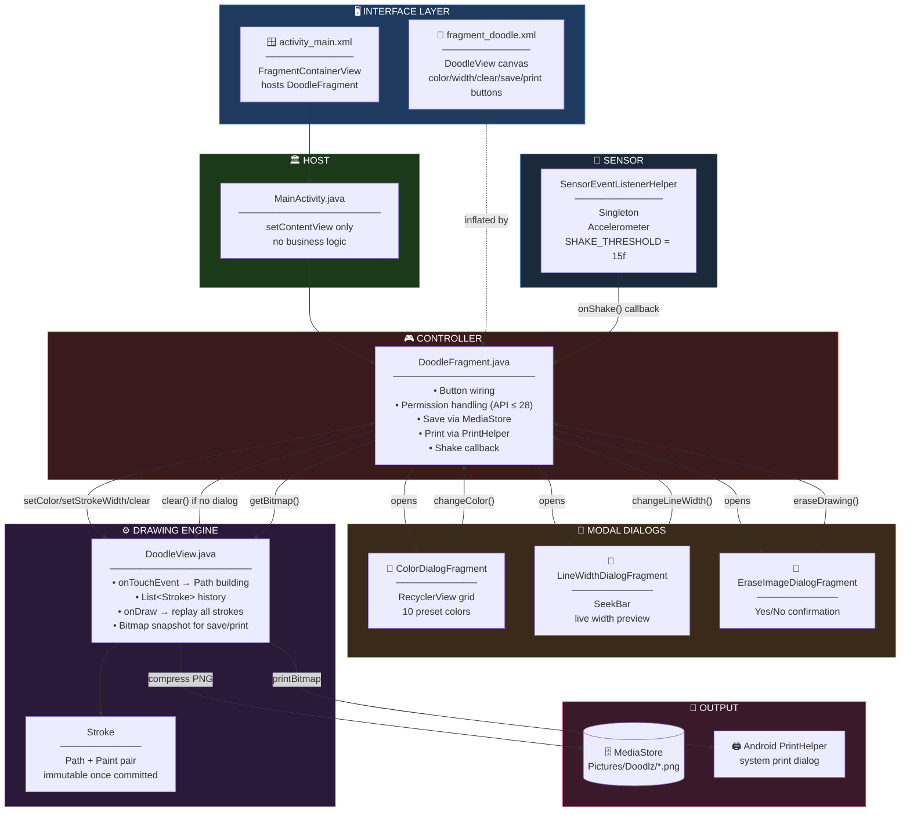
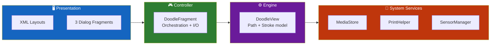
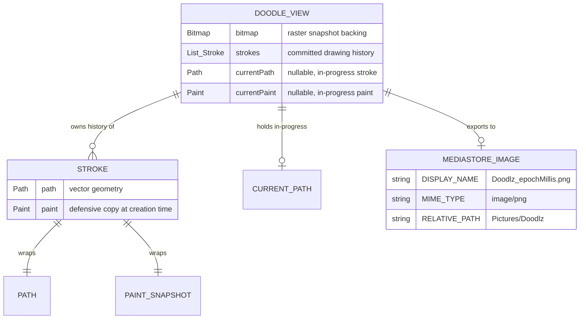
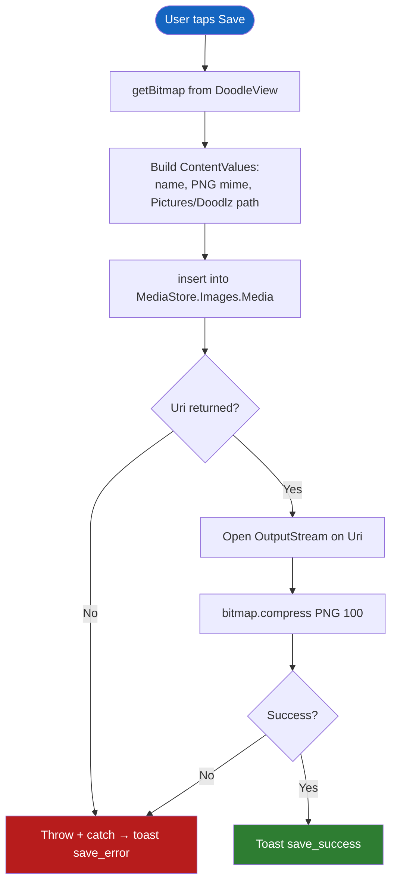
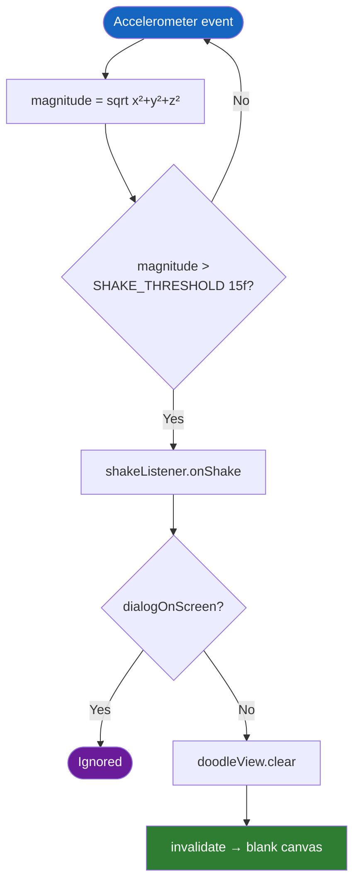
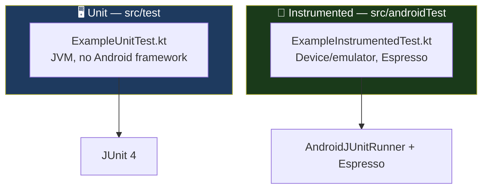

<div align="center">

**🌐 Choose Language / Selecione o Idioma / Elija el Idioma**

[](README.md)&nbsp;&nbsp;&nbsp;[](README_PT.md)&nbsp;&nbsp;&nbsp;[](README_ES.md)

</div>

---

<div align="center">

```
██████╗  ██████╗  ██████╗ ██████╗ ██╗     ███████╗
██╔══██╗██╔═══██╗██╔═══██╗██╔══██╗██║     ╚══███╔╝
██║  ██║██║   ██║██║   ██║██║  ██║██║       ███╔╝
██║  ██║██║   ██║██║   ██║██║  ██║██║      ███╔╝
██████╔╝╚██████╔╝╚██████╔╝██████╔╝███████╗███████╗
╚═════╝  ╚═════╝  ╚═════╝ ╚═════╝ ╚══════╝╚══════╝
        A Touch-Based Finger-Painting Android App
```

---

[](https://developer.android.com/)
[](https://openjdk.org/)
[](https://kotlinlang.org/)
[](https://gradle.org/)
[]()
[]()
[]()

<br/>

> **A finger-painting Android app with a custom `View`-based canvas**
> that records every stroke as a vector path, colors it, saves it, prints it, and clears it on a shake.

<br/>


-FF6B35?style=flat-square)


</div>

---

## 📑 Table of Contents

<details>
<summary>▶️ <strong>Click to expand / collapse this section</strong></summary>

<table>
<tr>
<td valign="top" width="50%">

**🏗️ System**
- [Overview](#-overview)
- [System Architecture](#-system-architecture)
- [Technology Stack](#-technology-stack)
- [Design Patterns](#-design-patterns-applied)
- [Project Structure](#-project-structure)

**📦 Modules**
- [MainActivity — Host](#-mainactivity--fragment-host)
- [DoodleFragment — Controller](#-doodlefragment--drawing-controller)
- [DoodleView — Canvas Engine](#-doodleview--canvas-engine)
- [ColorDialogFragment](#-colordialogfragment--palette-picker)
- [LineWidthDialogFragment](#-linewidthdialogfragment--stroke-sizing)
- [EraseImageDialogFragment](#-eraseimagedialogfragment--confirmation-gate)
- [SensorEventListenerHelper](#-sensoreventlistenerhelper--shake-detector)

</td>
<td valign="top" width="50%">

**💼 Business**
- [Business Rules](#-business-rules)
- [Functional Requirements](#-functional-requirements)
- [Non-Functional Requirements](#-non-functional-requirements)

**📐 Design**
- [Data Model](#-data-model)
- [System Flows](#-system-flows)
- [Stroke Capture Flow](#stroke-capture-flow)
- [Save Flow](#save-flow)
- [Shake-to-Erase Flow](#shake-to-erase-flow)

**🔐 Security & Ops**
- [Security](#-security)
- [Installation & Execution](#-installation--execution)
- [Automated Tests](#-automated-tests)
- [Metrics & Monitoring](#-metrics--monitoring)
- [Known Limitations](#-known-limitations)

</td>
</tr>
</table>

---

</details>

## 🌟 Overview

<details>
<summary>▶️ <strong>Click to expand / collapse this section</strong></summary>

**Doodlz** is a native Android finger-painting application written in Java. It draws with a hand-rolled `View` subclass — `DoodleView` — that tracks every touch gesture as an Android `Path`, paired with a snapshot of the `Paint` in effect at the moment the stroke began. The result is a vector-based drawing surface: color and width changes affect only strokes drawn *after* the change, never strokes already on the canvas.

The application is a single `Activity` hosting a single primary `Fragment` (`DoodleFragment`), which in turn launches three modal `DialogFragment`s for color selection, line-width adjustment, and erase confirmation. A singleton `SensorEventListenerHelper` listens to the device accelerometer and triggers a full-canvas clear when it detects a shake, unless a dialog is currently on screen.

Saving writes the composited bitmap to the public `Pictures/Doodlz` gallery folder through the scoped-storage `MediaStore` API, and printing hands the same bitmap to Android's `PrintHelper` for the system print dialog.

### 🎯 System Objectives

| Objective | Description |
|-----------|-------------|
| ✏️ **Freehand drawing** | Capture continuous touch gestures as smooth, anti-aliased vector paths |
| 🎨 **Color selection** | Offer a 10-color palette through a grid-based picker dialog |
| 📏 **Stroke width control** | Adjust line thickness live via a `SeekBar`, with immediate visual feedback |
| 🧹 **Shake-to-erase** | Detect a physical shake via the accelerometer and clear the canvas after confirmation |
| 💾 **Gallery export** | Save the finished drawing as a PNG in the device's public Pictures folder |
| 🖨️ **Printing** | Send the drawing to any system-registered print service |
| 🔐 **Runtime permissions** | Request storage permissions only on the legacy API range that still requires them |
| 🎭 **Non-destructive editing** | Preserve already-drawn strokes' color and width when the active tool settings change |

---

</details>

## 🏗️ System Architecture

<details>
<summary>▶️ <strong>Click to expand / collapse this section</strong></summary>

### Module Diagram



### Architecture Layers



---

</details>

## 🛠️ Technology Stack

<details>
<summary>▶️ <strong>Click to expand / collapse this section</strong></summary>

<table>
<thead>
<tr>
<th>Layer</th>
<th>Technology</th>
<th>Version</th>
<th>Purpose</th>
</tr>
</thead>
<tbody>
<tr>
<td rowspan="2"><strong>🧠 Language</strong></td>
<td>Java</td>
<td>17</td>
<td>All application logic — 8 classes</td>
</tr>
<tr>
<td>Kotlin Android Plugin</td>
<td>applied, unused directly</td>
<td>Declared for AndroidX KTX dependency compatibility</td>
</tr>
<tr>
<td rowspan="3"><strong>🤖 Platform</strong></td>
<td>Android SDK</td>
<td>compile/target 34</td>
<td>Android 14 target behaviour</td>
</tr>
<tr>
<td>Min SDK</td>
<td>21</td>
<td>Android 5.0 Lollipop floor</td>
</tr>
<tr>
<td>Fragments</td>
<td>AndroidX</td>
<td>`Fragment` + `DialogFragment`, child-fragment-manager based</td>
</tr>
<tr>
<td rowspan="3"><strong>🎨 Graphics</strong></td>
<td>Canvas / Path / Paint</td>
<td>Android Graphics</td>
<td>Freehand vector stroke rendering</td>
</tr>
<tr>
<td>Bitmap</td>
<td>ARGB_8888</td>
<td>Composited raster snapshot for save/print</td>
</tr>
<tr>
<td>RecyclerView + GridLayoutManager</td>
<td>AndroidX</td>
<td>5-column color swatch grid</td>
</tr>
<tr>
<td rowspan="2"><strong>💾 Storage</strong></td>
<td>MediaStore</td>
<td>Images.Media</td>
<td>Scoped-storage insert into `Pictures/Doodlz` |
</tr>
<tr>
<td>Legacy permissions</td>
<td>API ≤ 28</td>
<td>`WRITE_EXTERNAL_STORAGE` / `READ_EXTERNAL_STORAGE` via Activity Result API</td>
</tr>
<tr>
<td><strong>🖨️ Printing</strong></td>
<td>androidx.print.PrintHelper</td>
<td>1.0.0</td>
<td>Hands the bitmap to any system print service</td>
</tr>
<tr>
<td><strong>📳 Sensors</strong></td>
<td>SensorManager / Accelerometer</td>
<td>Android Hardware</td>
<td>Shake detection, threshold-based magnitude check</td>
</tr>
<tr>
<td rowspan="2"><strong>🧪 Testing</strong></td>
<td>JUnit</td>
<td>4.13.2</td>
<td>Local unit tests (`src/test`)</td>
</tr>
<tr>
<td>Espresso + AndroidX Test</td>
<td>3.5.1 / 1.1.5</td>
<td>Instrumented tests (`src/androidTest`)</td>
</tr>
<tr>
<td><strong>🔧 Build</strong></td>
<td>Gradle</td>
<td>Kotlin DSL</td>
<td>`build.gradle.kts` per module, forced Kotlin stdlib 1.8.20</td>
</tr>
</tbody>
</table>

---

</details>

## 🎨 Design Patterns Applied

<details>
<summary>▶️ <strong>Click to expand / collapse this section</strong></summary>

| Pattern | Where | Rationale |
|---------|-------|-----------|
| 🧭 **MVC-ish split** | `DoodleView` (model+view of strokes) vs. `DoodleFragment` (controller: I/O, dialogs, permissions) | Drawing state stays inside the custom view; orchestration stays in the fragment |
| 🎯 **Command-like snapshot** | `Stroke(Path, Paint)` — each stroke copies the `Paint` in effect at creation time | Later color/width changes cannot retroactively alter committed strokes |
| 🔂 **Singleton** | `SensorEventListenerHelper.getInstance(context)` | One accelerometer listener shared across fragment lifecycle events, avoiding duplicate registration |
| 👂 **Observer / Callback** | `ShakeListener` interface, `SeekBar.OnSeekBarChangeListener`, click listeners | Decouples the sensor and dialogs from the fragment that consumes their events |
| 🚦 **Guard Flag** | `dialogOnScreen` boolean in `DoodleFragment` | Prevents a shake from clearing the canvas while a modal dialog is already open |
| 🏭 **Adapter Pattern** | `ColorAdapter` + `ColorViewHolder` | Standard RecyclerView adapter/view-holder pair for the color grid |
| 🔀 **Strategy (runtime branch)** | `Build.VERSION.SDK_INT <= Build.VERSION_CODES.P` permission check | Legacy storage permission requested only where the platform still requires it |
| 🧱 **Replay Rendering** | `DoodleView.onDraw` iterates `List<Stroke>` every frame | The canvas is always reconstructed from the authoritative stroke history, never mutated in place |

---

</details>

## 📁 Project Structure

<details>
<summary>▶️ <strong>Click to expand / collapse this section</strong></summary>

```
Doodlz/
│
├── 📄 build.gradle.kts                  # Root build script
├── 📄 settings.gradle.kts               # Module inclusion
├── 📄 gradle.properties                 # JVM args, AndroidX flags
├── 📄 local.properties                  # Local SDK path (not versioned)
├── 📄 gradlew / gradlew.bat             # Gradle wrapper launchers
│
├── 📂 gradle/
│   ├── 📄 libs.versions.toml            # Version catalog
│   └── 📂 wrapper/                      # gradle-wrapper.jar + properties
│
└── 📂 app/
    ├── 📄 build.gradle.kts              # SDK levels, dependencies, forced Kotlin stdlib
    ├── 📄 proguard-rules.pro            # R8/ProGuard keep rules
    │
    └── 📂 src/
        ├── 📂 main/
        │   ├── 📄 AndroidManifest.xml
        │   ├── 📂 java/com/example/doodlz/
        │   │   ├── 📄 MainActivity.java             # Single-Activity host
        │   │   ├── 📄 DoodleFragment.java            # ★ Controller — I/O, dialogs, permissions
        │   │   ├── 📄 DoodleView.java                # ★ Canvas engine — Path/Stroke model
        │   │   ├── 📄 ColorDialogFragment.java       # Color grid picker
        │   │   ├── 📄 ColorViewHolder.java           # RecyclerView holder for one swatch
        │   │   ├── 📄 LineWidthDialogFragment.java   # SeekBar width picker
        │   │   ├── 📄 EraseImageDialogFragment.java  # Yes/No erase confirmation
        │   │   └── 📄 SensorEventListenerHelper.java # Singleton shake detector
        │   └── 📂 res/
        │       ├── 📂 layout/
        │       │   ├── activity_main.xml
        │       │   ├── fragment_doodle.xml
        │       │   ├── fragment_color.xml
        │       │   ├── fragment_line_width.xml
        │       │   ├── fragment_erase_image.xml
        │       │   └── item_color.xml
        │       ├── 📂 drawable/                      # ic_print.xml, launcher layers
        │       ├── 📂 mipmap-*dpi/                    # Launcher icons
        │       ├── 📂 values/                          # colors, dimens, strings, themes
        │       └── 📂 xml/                              # backup + data-extraction rules
        │
        ├── 📂 test/java/com/example/doodlz/
        │   └── ExampleUnitTest.kt
        └── 📂 androidTest/java/com/example/doodlz/
            └── ExampleInstrumentedTest.kt
│
├── 📄 README.md                          # 🇺🇸 English (primary)
├── 📄 README_PT.md                       # 🇧🇷 Português
└── 📄 README_ES.md                       # 🇪🇸 Español
```

---

</details>

## 📦 System Modules

<details>
<summary>▶️ <strong>Click to expand / collapse this section</strong></summary>

### 🏛️ MainActivity — Fragment Host

A minimal `AppCompatActivity` whose entire body is `setContentView(R.layout.activity_main)`. All logic lives downstream in `DoodleFragment`; the activity carries no state and no callbacks of its own.

---

### 🎮 DoodleFragment — Drawing Controller

The orchestration hub of the application, implementing `SensorEventListenerHelper.ShakeListener`.

| Responsibility | Implementation |
|-----------------|----------------|
| View inflation | `onCreateView` inflates `fragment_doodle.xml`, binds `doodleView` and five buttons |
| Permission flow | `registerForActivityResult(RequestMultiplePermissions)`, requested only when `SDK_INT <= P` |
| Sensor lifecycle | `onResume`/`onPause` start/stop the shared `SensorEventListenerHelper` |
| Dialog launching | `openColorDialog`, `openLineWidthDialog`, `openEraseDialog` — each sets `dialogOnScreen = true` |
| Save | `saveImage()` — builds `ContentValues`, inserts into `MediaStore.Images.Media`, streams a PNG compress into the returned `Uri` |
| Print | `printImage()` — hands `doodleView.getBitmap()` to `PrintHelper` |
| Shake handling | `onShake()` clears the canvas only `if (!dialogOnScreen)` |

---

### ⚙️ DoodleView — Canvas Engine

A custom `View` that is both the drawing surface and the authoritative model of everything drawn.

| Element | Role |
|---------|------|
| `Stroke` (inner class) | Immutable pairing of a `Path` and a defensive copy of the `Paint` active when the stroke started |
| `strokes: List<Stroke>` | Full drawing history, replayed in `onDraw` every frame |
| `currentPath` / `currentPaint` | The in-progress stroke, rendered on top of the committed history while the finger is still down |
| `onTouchEvent` | `ACTION_DOWN` starts a path, `ACTION_MOVE` extends it with `lineTo`, `ACTION_UP` commits it into `strokes` |
| `setColor` / `setStrokeWidth` | Mutate `drawPaint`, which is copied into `currentPaint` on the *next* `ACTION_DOWN` — never affects committed strokes |
| `clear()` | Empties `strokes` and calls `invalidate()` |
| `getBitmap()` | Draws the view onto its backing `Bitmap` and returns it for save/print |

> [!NOTE]
> Committed strokes are never redrawn onto the backing `Bitmap` during normal drawing — `onDraw` replays the vector `Path` list directly onto the `Canvas` passed by the framework. The `Bitmap`/`drawCanvas` pair exists specifically to produce a raster snapshot on demand for `getBitmap()`.

---

### 🎨 ColorDialogFragment — Palette Picker

A `DialogFragment` hosting a 5-column `RecyclerView` grid of 10 hardcoded `Color` constants (`BLACK`, `RED`, `BLUE`, `GREEN`, `YELLOW`, `MAGENTA`, `CYAN`, `GRAY`, `DKGRAY`, `LTGRAY`). Tapping a swatch calls `changeColor()` on the parent fragment and dismisses the dialog. `ColorAdapter`/`ColorViewHolder` follow the standard RecyclerView adapter pattern.

---

### 📏 LineWidthDialogFragment — Stroke Sizing

A `DialogFragment` wrapping a `SeekBar` bounded by `R.dimen.max_line_width`, floored at `R.dimen.default_line_width`. Every `onProgressChanged` call immediately updates the live preview text and calls `changeLineWidth()` on the parent — the width applies in real time, not just on dismiss. `onStopTrackingTouch` dismisses the dialog.

---

### 🧹 EraseImageDialogFragment — Confirmation Gate

A simple Yes/No `DialogFragment`. "Yes" calls `eraseDrawing()` on the parent and dismisses; "No" only dismisses. The dialog's title is set programmatically to "Confirmar" in `onCreateDialog`.

---

### 📳 SensorEventListenerHelper — Shake Detector

A process-wide singleton (`getInstance(Context)`) wrapping the device accelerometer.

| Aspect | Detail |
|--------|--------|
| Threshold | `SHAKE_THRESHOLD = 15f`, compared against `sqrt(x² + y² + z²)` |
| Lifecycle | `start()`/`stop()` register/unregister the listener idempotently via an `isRunning` flag |
| Callback | `ShakeListener.onShake()`, implemented by `DoodleFragment` |
| Scope | `getInstance` retains only the `applicationContext`, avoiding an `Activity` leak |

---

</details>

## 💼 Business Rules

<details>
<summary>▶️ <strong>Click to expand / collapse this section</strong></summary>

### ✏️ Drawing Rules

| # | Rule | Enforcement |
|---|------|-------------|
| BR-01 | A stroke begins only on `ACTION_DOWN` | `currentPath = new Path(); currentPath.moveTo(...)` |
| BR-02 | A stroke's color and width are fixed at the moment it starts | `currentPaint = new Paint(drawPaint)` — a defensive copy, not a reference |
| BR-03 | A stroke is committed to history only on `ACTION_UP` | `strokes.add(new Stroke(currentPath, currentPaint))` |
| BR-04 | Changing color or width never alters strokes already committed | `Stroke` stores its own `Paint` copy, independent of `drawPaint` |
| BR-05 | The canvas redraws all history plus the in-progress stroke every frame | `onDraw` iterates `strokes` then draws `currentPath` if non-null |

### 💬 Dialog Rules

| # | Rule | Enforcement |
|---|------|-------------|
| BR-06 | Only one modal dialog may be open at a time | Each dialog is `setCancelable(false)` and must be dismissed explicitly |
| BR-07 | A shake while a dialog is open must not clear the canvas | `dialogOnScreen` guard in `onShake()` |
| BR-08 | Opening any dialog sets the guard; any dismissal path clears it | `openXDialog()` sets `true`; `changeColor`/`changeLineWidth`/`eraseDrawing` set `false` |

### 💾 Save & Print Rules

| # | Rule | Enforcement |
|---|------|-------------|
| BR-09 | Saved files are named `Doodlz_<epochMillis>.png` | `saveImage()` |
| BR-10 | Saved files always land in `Pictures/Doodlz` | `RELATIVE_PATH` in the `ContentValues` |
| BR-11 | Storage permission is requested only below API 29 | `Build.VERSION.SDK_INT <= Build.VERSION_CODES.P` guard |
| BR-12 | A save failure must not crash the app | `try/catch` around the `MediaStore` insert and compress, with a toast on failure |
| BR-13 | Printing uses the same bitmap logic as saving | Both call `doodleView.getBitmap()` |

---

</details>

## ✅ Functional Requirements

<details>
<summary>▶️ <strong>Click to expand / collapse this section</strong></summary>

| ID | Requirement | Priority | Status |
|----|-------------|----------|--------|
| **RF-01** | The system shall let the user draw freehand strokes with a finger | 🔴 High | ✅ Implemented |
| **RF-02** | The system shall offer a palette of 10 preset colors | 🔴 High | ✅ Implemented |
| **RF-03** | The system shall allow live adjustment of stroke width | 🔴 High | ✅ Implemented |
| **RF-04** | The system shall preserve the color/width of already-drawn strokes | 🔴 High | ✅ Implemented |
| **RF-05** | The system shall clear the canvas after a confirmed erase | 🔴 High | ✅ Implemented |
| **RF-06** | The system shall clear the canvas on a detected device shake | 🟡 Medium | ✅ Implemented |
| **RF-07** | The system shall suppress shake-erase while a dialog is open | 🟡 Medium | ✅ Implemented |
| **RF-08** | The system shall save the drawing as a PNG to the public gallery | 🔴 High | ✅ Implemented |
| **RF-09** | The system shall request storage permission only on legacy Android | 🟡 Medium | ✅ Implemented |
| **RF-10** | The system shall print the drawing via the system print service | 🟡 Medium | ✅ Implemented |
| **RF-11** | The system shall notify the user on save success and failure | 🟢 Low | ✅ Implemented |
| **RF-12** | The system shall notify the user on print failure | 🟢 Low | ✅ Implemented |
| **RF-13** | The system shall present the erase confirmation before clearing | 🟡 Medium | ✅ Implemented |
| **RF-14** | The system shall render the width picker with a live numeric label | 🟢 Low | ✅ Implemented |

---

</details>

## ⚡ Non-Functional Requirements

<details>
<summary>▶️ <strong>Click to expand / collapse this section</strong></summary>

| ID | Category | Requirement | Target |
|----|----------|-------------|--------|
| **RNF-01** | ⚡ Performance | Touch-to-draw latency | < 16 ms per frame (60 fps) |
| **RNF-02** | 🧠 Memory | Stroke history for a typical session | Bounded by device RAM; no explicit cap set |
| **RNF-03** | 📱 Compatibility | Android version range | API 21 → API 34 |
| **RNF-04** | 🔋 Battery | Accelerometer listener runs only while the fragment is resumed | `onPause` calls `stop()` |
| **RNF-05** | 🎨 Usability | Width preview updates without requiring dialog dismissal | Live `SeekBar` callback |
| **RNF-06** | 🔐 Privacy | No network permission declared | Drawings never leave the device via this app |
| **RNF-07** | 🧱 Maintainability | Single-purpose classes, no shared mutable statics beyond the sensor singleton | 8 small Java files |
| **RNF-08** | 🖨️ Interoperability | Printing works with any system-registered print service | `androidx.print.PrintHelper` |

---

</details>

## 🗄️ Data Model

<details>
<summary>▶️ <strong>Click to expand / collapse this section</strong></summary>

> [!NOTE]
> Doodlz has no database. Its data model is the in-memory stroke history plus the MediaStore record produced on save.

### Entity-Relationship Diagram



### Paint Defaults

| Property | Value | Source |
|----------|-------|--------|
| Initial color | `Color.BLACK` | `paintColor` field default |
| Initial width | `R.dimen.default_line_width` | `dimens.xml` |
| Max width | `R.dimen.max_line_width` | `dimens.xml`, bounds the `SeekBar` |
| Style | `Paint.Style.STROKE` | `init()` |
| Join / Cap | `ROUND` / `ROUND` | `init()` — smooth freehand corners |
| Anti-aliasing | enabled | `init()` |

---

</details>

## 🔄 System Flows

<details>
<summary>▶️ <strong>Click to expand / collapse this section</strong></summary>

### Stroke Capture Flow

```mermaid
sequenceDiagram
    autonumber
    participant U as 👤 User
    participant V as ⚙️ DoodleView
    U->>V: ACTION_DOWN at (x,y)
    V->>V: currentPath = new Path(); moveTo(x,y)
    V->>V: currentPaint = copy of drawPaint
    loop finger moving
        U->>V: ACTION_MOVE
        V->>V: currentPath.lineTo(x,y)
        V->>V: invalidate()
        V-->>U: onDraw redraws history + currentPath
    end
    U->>V: ACTION_UP
    V->>V: strokes.add(new Stroke(currentPath, currentPaint))
    V->>V: currentPath = null
```

### Save Flow



### Shake-to-Erase Flow



---

</details>

## 🔐 Security

<details>
<summary>▶️ <strong>Click to expand / collapse this section</strong></summary>

### Implemented Controls

| Control | Implementation | Effect |
|---------|---------------|--------|
| 🔐 **Scoped storage** | `MediaStore` insert on all supported API levels | No broad filesystem write access needed on API 29+ |
| 🚦 **Legacy-only permission request** | `SDK_INT <= P` guard | Avoids requesting permissions the platform no longer grants meaningfully |
| ✅ **Result validation** | `if (uri == null) throw` and compress-result check | A failed save cannot silently corrupt state |
| 🌐 **No network permission** | `INTERNET` absent from the manifest | Drawings cannot leave the device via this app |
| 📵 **No third-party SDK** | AndroidX + Material only | No analytics or ad data egress |

### Known Security Limitations

> [!WARNING]
> Same-category caveats as any small demo Android app; understand these before reuse.

| Limitation | Risk | Mitigation path |
|------------|------|-----------------|
| 🗂️ **Public gallery storage** | Any gallery-reading app can see saved doodles | Use app-private storage if confidentiality matters |
| 🔁 **Permanent denial not detected** | Denied permission on legacy Android shows no rationale, just a toast | Add `shouldShowRequestPermissionRationale` handling |
| 🧬 **Unminified release build** | `isMinifyEnabled = false` | Enable R8 for release builds |
| 🪵 **Debug logging left in place** | `SensorEventListenerHelper` logs raw axis values every sensor tick | Remove or gate behind a debug flag before shipping |

---

</details>

## 🚀 Installation & Execution

<details>
<summary>▶️ <strong>Click to expand / collapse this section</strong></summary>

### Prerequisites

```bash
java -version          # JDK 17+
sdkmanager "platforms;android-34" "build-tools;34.0.0"
adb devices             # confirm a device or emulator is attached
```

### Build

```bash
./gradlew assembleDebug      # app/build/outputs/apk/debug/app-debug.apk
./gradlew assembleRelease
./gradlew clean
./gradlew build               # compile + lint + unit tests
```

### Execution

```bash
./gradlew installDebug
adb shell am start -n com.example.doodlz/.MainActivity
```

**Usage**

1. Draw with a finger anywhere on the canvas.
2. Tap **Color** to pick from the 10-swatch grid.
3. Tap **Width** and drag the slider to resize the stroke.
4. Tap **Clear** and confirm to erase, or shake the device.
5. Tap **Save** to write a PNG to `Pictures/Doodlz`.
6. Tap **Print** to send the drawing to a system print service.

### Gradle Targets

| Target | Purpose |
|--------|---------|
| `./gradlew assembleDebug` | Build the debug APK |
| `./gradlew installDebug` | Build and install on the connected device |
| `./gradlew test` | Run JVM unit tests |
| `./gradlew connectedAndroidTest` | Run instrumented tests on a device |
| `./gradlew lint` | Static analysis |

---

</details>

## 🧪 Automated Tests

<details>
<summary>▶️ <strong>Click to expand / collapse this section</strong></summary>

### Test Architecture



### Running the Tests

```bash
./gradlew test
./gradlew connectedAndroidTest
```

### Manual Acceptance Checklist

| # | Scenario | Expected result |
|---|----------|-----------------|
| 1 | Draw a stroke, change color, draw another | First stroke keeps its original color |
| 2 | Adjust width mid-session | New strokes reflect new width, old ones unchanged |
| 3 | Shake with no dialog open | Canvas clears |
| 4 | Shake with a dialog open | Canvas untouched |
| 5 | Save | File appears in `Pictures/Doodlz`, toast confirms |
| 6 | Print | System print dialog opens with the drawing |
| 7 | Deny storage permission (API ≤ 28) | Toast informs denial, save fails gracefully |

---

</details>

## 📊 Metrics & Monitoring

<details>
<summary>▶️ <strong>Click to expand / collapse this section</strong></summary>

| Metric | Value |
|--------|-------|
| Java classes | 8 |
| Fragments | 4 (1 primary + 3 dialogs) |
| Preset colors | 10 |
| Shake threshold | 15f (m/s²-equivalent magnitude) |
| Min / Target / Compile SDK | 21 / 34 / 34 |
| Direct dependencies | 9 implementation + 3 test |

### Diagnostic Commands

```bash
adb logcat --pid=$(adb shell pidof -s com.example.doodlz)
adb shell ls -l /sdcard/Pictures/Doodlz/
```

---

</details>

## ⚠️ Known Limitations

<details>
<summary>▶️ <strong>Click to expand / collapse this section</strong></summary>

> [!IMPORTANT]
> Built as an educational demonstration of custom `View` drawing, `Fragment` composition and sensor-driven interaction.

| Category | Issue | Status |
|----------|-------|--------|
| ↩️ **No undo/redo** | Removing the last stroke requires a full clear | ⚠️ Open — pop the last element of `strokes` |
| 🪵 **Verbose sensor logging** | Every accelerometer tick is logged at `Log.i` | ⚠️ Open — remove or gate for release |
| 🧬 **Unminified release** | `isMinifyEnabled = false` | ⚠️ Open — enable R8 |
| 🧪 **No custom test coverage** | Only generated example tests exist | ⚠️ Open — add tests for `Stroke` immutability and shake threshold |
| 📱 **No rotation state save** | Drawing is lost if the fragment is recreated on rotation | ⚠️ Open — persist strokes across configuration changes |

</details>

---

<div align="center">

---

### 🎨 Doodlz

*Every stroke remembers how it was born*

[](https://developer.android.com/)
[](https://openjdk.org/)
[]()

<br/>

```
"A canvas that never forgets what color each line was born with."
```

</div>
