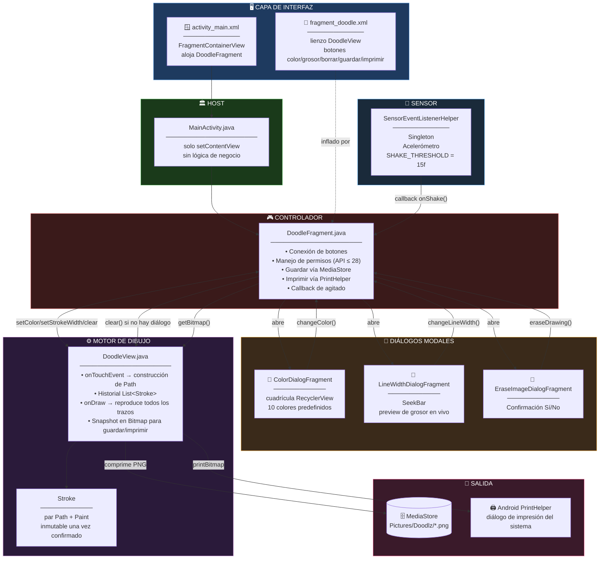
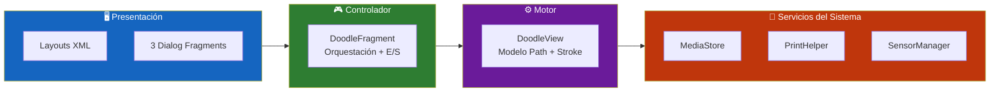
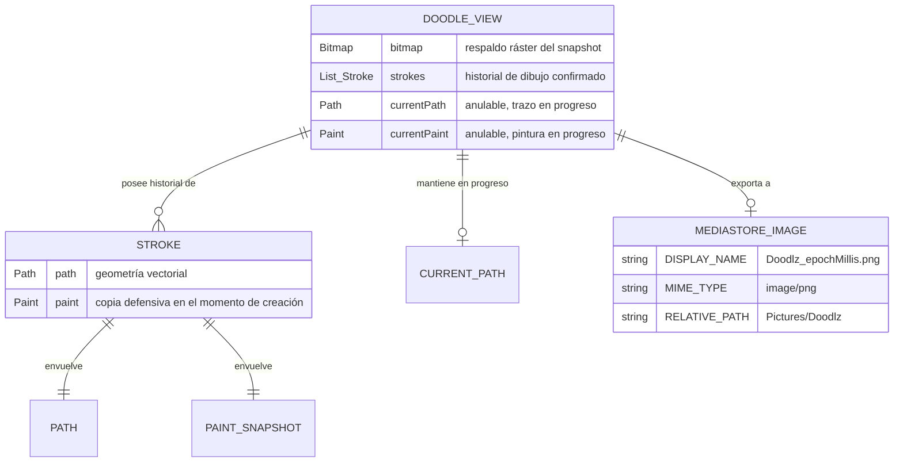
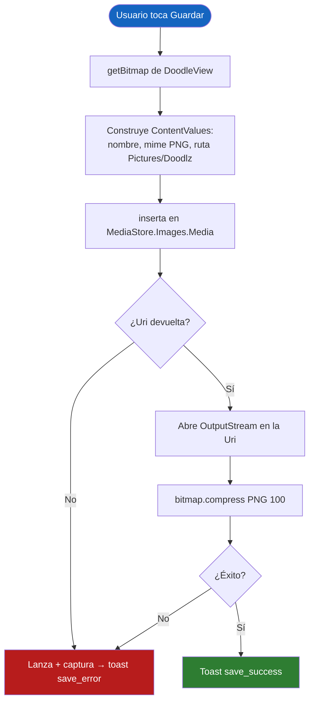
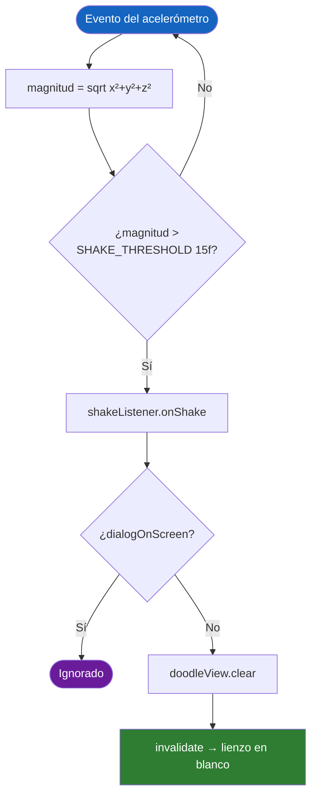
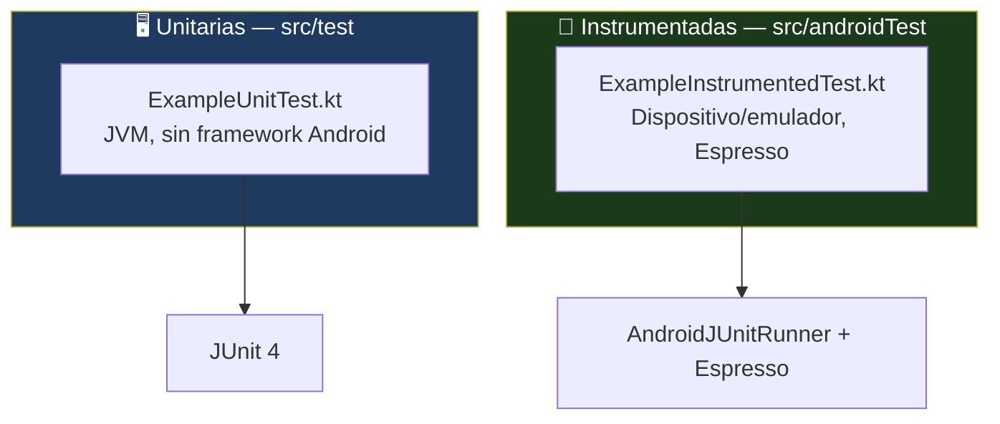

<div align="center">

**🌐 Choose Language / Selecione o Idioma / Elija el Idioma**

[](README.md)&nbsp;&nbsp;&nbsp;[](README_PT.md)&nbsp;&nbsp;&nbsp;[](README_ES.md)

</div>

---

<div align="center">

```
██████╗  ██████╗  ██████╗ ██████╗ ██╗     ███████╗
██╔══██╗██╔═══██╗██╔═══██╗██╔══██╗██║     ╚══███╔╝
██║  ██║██║   ██║██║   ██║██║  ██║██║       ███╔╝
██║  ██║██║   ██║██║   ██║██║  ██║██║      ███╔╝
██████╔╝╚██████╔╝╚██████╔╝██████╔╝███████╗███████╗
╚═════╝  ╚═════╝  ╚═════╝ ╚═════╝ ╚══════╝╚══════╝
       Aplicación Android de Dibujo con el Dedo
```

---

[](https://developer.android.com/)
[](https://openjdk.org/)
[](https://kotlinlang.org/)
[](https://gradle.org/)
[]()
[]()
[]()

<br/>

> **Una aplicación Android de dibujo con el dedo, con un lienzo personalizado basado en `View`**
> que registra cada trazo como una ruta vectorial, lo colorea, lo guarda, lo imprime y lo borra al agitar el dispositivo.

<br/>


-FF6B35?style=flat-square)


</div>

---

## 📑 Tabla de Contenidos

<details>
<summary>▶️ <strong>Haga clic para expandir / contraer esta sección</strong></summary>

<table>
<tr>
<td valign="top" width="50%">

**🏗️ Sistema**
- [Visión General](#-visión-general)
- [Arquitectura del Sistema](#️-arquitectura-del-sistema)
- [Stack Tecnológico](#️-stack-tecnológico)
- [Patrones de Diseño](#-patrones-de-diseño-aplicados)
- [Estructura del Proyecto](#-estructura-del-proyecto)

**📦 Módulos**
- [MainActivity — Host](#️-mainactivity--host-de-fragments)
- [DoodleFragment — Controlador](#-doodlefragment--controlador-de-dibujo)
- [DoodleView — Motor del Lienzo](#️-doodleview--motor-del-lienzo)
- [ColorDialogFragment](#-colordialogfragment--selector-de-paleta)
- [LineWidthDialogFragment](#-linewidthdialogfragment--ajuste-de-grosor)
- [EraseImageDialogFragment](#-eraseimagedialogfragment--puerta-de-confirmación)
- [SensorEventListenerHelper](#-sensoreventlistenerhelper--detector-de-agitado)

</td>
<td valign="top" width="50%">

**💼 Negocio**
- [Reglas de Negocio](#-reglas-de-negocio)
- [Requisitos Funcionales](#-requisitos-funcionales)
- [Requisitos No Funcionales](#-requisitos-no-funcionales)

**📐 Diseño**
- [Modelo de Datos](#️-modelo-de-datos)
- [Flujos del Sistema](#-flujos-del-sistema)
- [Flujo de Captura de Trazo](#flujo-de-captura-de-trazo)
- [Flujo de Guardado](#flujo-de-guardado)
- [Flujo de Borrado por Agitado](#flujo-de-borrado-por-agitado)

**🔐 Seguridad & Operación**
- [Seguridad](#-seguridad)
- [Instalación & Ejecución](#-instalación--ejecución)
- [Pruebas Automatizadas](#-pruebas-automatizadas)
- [Métricas & Monitoreo](#-métricas--monitoreo)
- [Limitaciones Conocidas](#️-limitaciones-conocidas)

</td>
</tr>
</table>

---

</details>

## 🌟 Visión General

<details>
<summary>▶️ <strong>Haga clic para expandir / contraer esta sección</strong></summary>

**Doodlz** es una aplicación Android nativa de dibujo con el dedo, escrita en Java. Dibuja mediante una subclase de `View` hecha a mano — `DoodleView` — que rastrea cada gesto táctil como un `Path` de Android, junto con una copia del `Paint` vigente en el momento en que el trazo comenzó. El resultado es una superficie de dibujo vectorial: los cambios de color y grosor afectan solo a los trazos dibujados *después* del cambio, nunca a los trazos ya presentes en el lienzo.

La aplicación es una única `Activity` que aloja un único `Fragment` principal (`DoodleFragment`), el cual a su vez abre tres `DialogFragment` modales para la selección de color, el ajuste del grosor de línea y la confirmación de borrado. Un `SensorEventListenerHelper` singleton escucha el acelerómetro del dispositivo y dispara un borrado completo del lienzo al detectar un agitado, salvo que haya un diálogo en pantalla en ese momento.

Guardar escribe el bitmap compuesto en la carpeta pública de la galería `Pictures/Doodlz` a través de la API `MediaStore` con almacenamiento con ámbito, e imprimir entrega el mismo bitmap al `PrintHelper` de Android para el diálogo de impresión del sistema.

### 🎯 Objetivos del Sistema

| Objetivo | Descripción |
|----------|-------------|
| ✏️ **Dibujo libre** | Capturar gestos táctiles continuos como rutas vectoriales suaves y con anti-aliasing |
| 🎨 **Selección de color** | Ofrecer una paleta de 10 colores mediante un diálogo selector en cuadrícula |
| 📏 **Control de grosor** | Ajustar el grosor de línea en vivo vía `SeekBar`, con retroalimentación visual inmediata |
| 🧹 **Borrado por agitado** | Detectar un agitado físico vía el acelerómetro y borrar el lienzo tras confirmación |
| 💾 **Exportación a la galería** | Guardar el dibujo terminado como PNG en la carpeta pública Pictures del dispositivo |
| 🖨️ **Impresión** | Enviar el dibujo a cualquier servicio de impresión registrado en el sistema |
| 🔐 **Permisos en runtime** | Solicitar permisos de almacenamiento solo en el rango heredado de API que aún los exige |
| 🎭 **Edición no destructiva** | Preservar el color y el grosor de los trazos ya dibujados cuando cambian los ajustes activos de la herramienta |

---

</details>

## 🏗️ Arquitectura del Sistema

<details>
<summary>▶️ <strong>Haga clic para expandir / contraer esta sección</strong></summary>

### Diagrama de Módulos



### Capas de la Arquitectura



---

</details>

## 🛠️ Stack Tecnológico

<details>
<summary>▶️ <strong>Haga clic para expandir / contraer esta sección</strong></summary>

<table>
<thead>
<tr>
<th>Capa</th>
<th>Tecnología</th>
<th>Versión</th>
<th>Finalidad</th>
</tr>
</thead>
<tbody>
<tr>
<td rowspan="2"><strong>🧠 Lenguaje</strong></td>
<td>Java</td>
<td>17</td>
<td>Toda la lógica de la aplicación — 8 clases</td>
</tr>
<tr>
<td>Plugin Kotlin Android</td>
<td>aplicado, no usado directamente</td>
<td>Declarado por compatibilidad con dependencias AndroidX KTX</td>
</tr>
<tr>
<td rowspan="3"><strong>🤖 Plataforma</strong></td>
<td>Android SDK</td>
<td>compile/target 34</td>
<td>Comportamiento objetivo de Android 14</td>
</tr>
<tr>
<td>SDK Mínimo</td>
<td>21</td>
<td>Piso Android 5.0 Lollipop</td>
</tr>
<tr>
<td>Fragments</td>
<td>AndroidX</td>
<td>`Fragment` + `DialogFragment`, basados en el child fragment manager</td>
</tr>
<tr>
<td rowspan="3"><strong>🎨 Gráficos</strong></td>
<td>Canvas / Path / Paint</td>
<td>Android Graphics</td>
<td>Renderizado de trazo vectorial a mano alzada</td>
</tr>
<tr>
<td>Bitmap</td>
<td>ARGB_8888</td>
<td>Snapshot ráster compuesto para guardar/imprimir</td>
</tr>
<tr>
<td>RecyclerView + GridLayoutManager</td>
<td>AndroidX</td>
<td>Cuadrícula de 5 columnas con las muestras de color</td>
</tr>
<tr>
<td rowspan="2"><strong>💾 Almacenamiento</strong></td>
<td>MediaStore</td>
<td>Images.Media</td>
<td>Inserción en `Pictures/Doodlz` con almacenamiento con ámbito |
</tr>
<tr>
<td>Permisos heredados</td>
<td>API ≤ 28</td>
<td>`WRITE_EXTERNAL_STORAGE` / `READ_EXTERNAL_STORAGE` vía Activity Result API</td>
</tr>
<tr>
<td><strong>🖨️ Impresión</strong></td>
<td>androidx.print.PrintHelper</td>
<td>1.0.0</td>
<td>Entrega el bitmap a cualquier servicio de impresión del sistema</td>
</tr>
<tr>
<td><strong>📳 Sensores</strong></td>
<td>SensorManager / Acelerómetro</td>
<td>Android Hardware</td>
<td>Detección de agitado mediante verificación de magnitud con umbral</td>
</tr>
<tr>
<td rowspan="2"><strong>🧪 Pruebas</strong></td>
<td>JUnit</td>
<td>4.13.2</td>
<td>Pruebas unitarias locales (`src/test`)</td>
</tr>
<tr>
<td>Espresso + AndroidX Test</td>
<td>3.5.1 / 1.1.5</td>
<td>Pruebas instrumentadas (`src/androidTest`)</td>
</tr>
<tr>
<td><strong>🔧 Build</strong></td>
<td>Gradle</td>
<td>Kotlin DSL</td>
<td>`build.gradle.kts` por módulo, stdlib de Kotlin fijada en 1.8.20</td>
</tr>
</tbody>
</table>

---

</details>

## 🎨 Patrones de Diseño Aplicados

<details>
<summary>▶️ <strong>Haga clic para expandir / contraer esta sección</strong></summary>

| Patrón | Dónde | Justificación |
|--------|-------|----------------|
| 🧭 **División estilo MVC** | `DoodleView` (modelo+vista de los trazos) vs. `DoodleFragment` (controlador: E/S, diálogos, permisos) | El estado de dibujo permanece dentro de la vista personalizada; la orquestación queda en el fragment |
| 🎯 **Snapshot tipo Command** | `Stroke(Path, Paint)` — cada trazo copia el `Paint` vigente en el momento de su creación | Los cambios posteriores de color/grosor no pueden alterar retroactivamente trazos ya confirmados |
| 🔂 **Singleton** | `SensorEventListenerHelper.getInstance(context)` | Un único listener de acelerómetro compartido entre los eventos del ciclo de vida del fragment, evitando registro duplicado |
| 👂 **Observer / Callback** | Interfaz `ShakeListener`, `SeekBar.OnSeekBarChangeListener`, listeners de clic | Desacopla el sensor y los diálogos del fragment que consume sus eventos |
| 🚦 **Bandera de Guarda** | Booleano `dialogOnScreen` en `DoodleFragment` | Impide que un agitado borre el lienzo mientras un diálogo modal ya está abierto |
| 🏭 **Patrón Adapter** | `ColorAdapter` + `ColorViewHolder` | Par estándar adapter/view-holder de RecyclerView para la cuadrícula de colores |
| 🔀 **Strategy (ramificación en runtime)** | Verificación `Build.VERSION.SDK_INT <= Build.VERSION_CODES.P` | Permiso de almacenamiento heredado solicitado solo donde la plataforma aún lo exige |
| 🧱 **Renderizado por Repetición** | `DoodleView.onDraw` recorre `List<Stroke>` en cada cuadro | El lienzo siempre se reconstruye a partir del historial autoritativo de trazos, nunca se muta en el lugar |

---

</details>

## 📁 Estructura del Proyecto

<details>
<summary>▶️ <strong>Haga clic para expandir / contraer esta sección</strong></summary>

```
Doodlz/
│
├── 📄 build.gradle.kts                  # Script de build raíz
├── 📄 settings.gradle.kts               # Inclusión de módulos
├── 📄 gradle.properties                 # Argumentos de la JVM, flags AndroidX
├── 📄 local.properties                  # Ruta local del SDK (no versionada)
├── 📄 gradlew / gradlew.bat             # Lanzadores del Gradle Wrapper
│
├── 📂 gradle/
│   ├── 📄 libs.versions.toml            # Catálogo de versiones
│   └── 📂 wrapper/                      # gradle-wrapper.jar + properties
│
└── 📂 app/
    ├── 📄 build.gradle.kts              # Niveles de SDK, dependencias, stdlib de Kotlin fijada
    ├── 📄 proguard-rules.pro            # Reglas de retención R8/ProGuard
    │
    └── 📂 src/
        ├── 📂 main/
        │   ├── 📄 AndroidManifest.xml
        │   ├── 📂 java/com/example/doodlz/
        │   │   ├── 📄 MainActivity.java             # Host de Activity única
        │   │   ├── 📄 DoodleFragment.java            # ★ Controlador — E/S, diálogos, permisos
        │   │   ├── 📄 DoodleView.java                # ★ Motor del lienzo — modelo Path/Stroke
        │   │   ├── 📄 ColorDialogFragment.java       # Selector de colores en cuadrícula
        │   │   ├── 📄 ColorViewHolder.java           # Holder de RecyclerView para una muestra
        │   │   ├── 📄 LineWidthDialogFragment.java   # Selector de grosor vía SeekBar
        │   │   ├── 📄 EraseImageDialogFragment.java  # Confirmación Sí/No de borrado
        │   │   └── 📄 SensorEventListenerHelper.java # Singleton detector de agitado
        │   └── 📂 res/
        │       ├── 📂 layout/
        │       │   ├── activity_main.xml
        │       │   ├── fragment_doodle.xml
        │       │   ├── fragment_color.xml
        │       │   ├── fragment_line_width.xml
        │       │   ├── fragment_erase_image.xml
        │       │   └── item_color.xml
        │       ├── 📂 drawable/                      # ic_print.xml, capas del launcher
        │       ├── 📂 mipmap-*dpi/                    # Iconos del launcher
        │       ├── 📂 values/                          # colors, dimens, strings, themes
        │       └── 📂 xml/                              # reglas de backup y extracción de datos
        │
        ├── 📂 test/java/com/example/doodlz/
        │   └── ExampleUnitTest.kt
        └── 📂 androidTest/java/com/example/doodlz/
            └── ExampleInstrumentedTest.kt
│
├── 📄 README.md                          # 🇺🇸 Inglés (principal)
├── 📄 README_PT.md                       # 🇧🇷 Portugués
└── 📄 README_ES.md                       # 🇪🇸 Español
```

---

</details>

## 📦 Módulos del Sistema

<details>
<summary>▶️ <strong>Haga clic para expandir / contraer esta sección</strong></summary>

### 🏛️ MainActivity — Host de Fragments

Una `AppCompatActivity` mínima cuyo cuerpo entero es `setContentView(R.layout.activity_main)`. Toda la lógica vive aguas abajo, en `DoodleFragment`; la activity no lleva estado ni callbacks propios.

---

### 🎮 DoodleFragment — Controlador de Dibujo

El centro de orquestación de la aplicación, implementando `SensorEventListenerHelper.ShakeListener`.

| Responsabilidad | Implementación |
|-------------------|----------------|
| Inflado de la vista | `onCreateView` infla `fragment_doodle.xml`, conecta `doodleView` y cinco botones |
| Flujo de permisos | `registerForActivityResult(RequestMultiplePermissions)`, solicitado solo cuando `SDK_INT <= P` |
| Ciclo de vida del sensor | `onResume`/`onPause` inician/detienen el `SensorEventListenerHelper` compartido |
| Apertura de diálogos | `openColorDialog`, `openLineWidthDialog`, `openEraseDialog` — cada uno pone `dialogOnScreen = true` |
| Guardar | `saveImage()` — construye `ContentValues`, inserta en `MediaStore.Images.Media`, transmite una compresión PNG a la `Uri` devuelta |
| Imprimir | `printImage()` — entrega `doodleView.getBitmap()` al `PrintHelper` |
| Manejo de agitado | `onShake()` borra el lienzo solo `if (!dialogOnScreen)` |

---

### ⚙️ DoodleView — Motor del Lienzo

Una `View` personalizada que es a la vez la superficie de dibujo y el modelo autoritativo de todo lo dibujado.

| Elemento | Rol |
|----------|-----|
| `Stroke` (clase interna) | Par inmutable de un `Path` y una copia defensiva del `Paint` activo cuando el trazo comenzó |
| `strokes: List<Stroke>` | Historial completo del dibujo, reproducido en `onDraw` en cada cuadro |
| `currentPath` / `currentPaint` | El trazo en progreso, renderizado sobre el historial confirmado mientras el dedo sigue en pantalla |
| `onTouchEvent` | `ACTION_DOWN` inicia una ruta, `ACTION_MOVE` la extiende con `lineTo`, `ACTION_UP` la confirma en `strokes` |
| `setColor` / `setStrokeWidth` | Mutan `drawPaint`, que se copia en `currentPaint` en el *siguiente* `ACTION_DOWN` — nunca afecta trazos ya confirmados |
| `clear()` | Vacía `strokes` y llama a `invalidate()` |
| `getBitmap()` | Dibuja la vista sobre su `Bitmap` de respaldo y lo devuelve para guardar/imprimir |

> [!NOTE]
> Los trazos confirmados nunca se redibujan sobre el `Bitmap` de respaldo durante el dibujo normal — `onDraw` reproduce la lista vectorial de `Path` directamente sobre el `Canvas` pasado por el framework. El par `Bitmap`/`drawCanvas` existe específicamente para producir un snapshot ráster bajo demanda en `getBitmap()`.

---

### 🎨 ColorDialogFragment — Selector de Paleta

Un `DialogFragment` que aloja una cuadrícula `RecyclerView` de 5 columnas con 10 constantes `Color` fijas (`BLACK`, `RED`, `BLUE`, `GREEN`, `YELLOW`, `MAGENTA`, `CYAN`, `GRAY`, `DKGRAY`, `LTGRAY`). Tocar una muestra llama a `changeColor()` en el fragment padre y cierra el diálogo. `ColorAdapter`/`ColorViewHolder` siguen el patrón estándar de adapter de RecyclerView.

---

### 📏 LineWidthDialogFragment — Ajuste de Grosor

Un `DialogFragment` que envuelve un `SeekBar` acotado por `R.dimen.max_line_width`, con piso en `R.dimen.default_line_width`. Cada llamada a `onProgressChanged` actualiza de inmediato el texto de preview en vivo y llama a `changeLineWidth()` en el padre — el grosor se aplica en tiempo real, no solo al cerrar. `onStopTrackingTouch` cierra el diálogo.

---

### 🧹 EraseImageDialogFragment — Puerta de Confirmación

Un `DialogFragment` simple de Sí/No. "Sí" llama a `eraseDrawing()` en el padre y cierra; "No" solo cierra. El título del diálogo se establece programáticamente como "Confirmar" en `onCreateDialog`.

---

### 📳 SensorEventListenerHelper — Detector de Agitado

Un singleton de ámbito de proceso (`getInstance(Context)`) que envuelve el acelerómetro del dispositivo.

| Aspecto | Detalle |
|---------|---------|
| Umbral | `SHAKE_THRESHOLD = 15f`, comparado contra `sqrt(x² + y² + z²)` |
| Ciclo de vida | `start()`/`stop()` registran/desregistran el listener de forma idempotente vía una bandera `isRunning` |
| Callback | `ShakeListener.onShake()`, implementado por `DoodleFragment` |
| Ámbito | `getInstance` retiene solo el `applicationContext`, evitando una fuga de `Activity` |

---

</details>

## 💼 Reglas de Negocio

<details>
<summary>▶️ <strong>Haga clic para expandir / contraer esta sección</strong></summary>

### ✏️ Reglas de Dibujo

| # | Regla | Aplicación |
|---|-------|------------|
| RN-01 | Un trazo comienza solo en `ACTION_DOWN` | `currentPath = new Path(); currentPath.moveTo(...)` |
| RN-02 | El color y el grosor de un trazo se fijan en el momento en que comienza | `currentPaint = new Paint(drawPaint)` — una copia defensiva, no una referencia |
| RN-03 | Un trazo se confirma en el historial solo en `ACTION_UP` | `strokes.add(new Stroke(currentPath, currentPaint))` |
| RN-04 | Cambiar color o grosor nunca altera trazos ya confirmados | `Stroke` guarda su propia copia de `Paint`, independiente de `drawPaint` |
| RN-05 | El lienzo redibuja todo el historial más el trazo en progreso en cada cuadro | `onDraw` recorre `strokes` y luego dibuja `currentPath` si no es nulo |

### 💬 Reglas de Diálogo

| # | Regla | Aplicación |
|---|-------|------------|
| RN-06 | Solo un diálogo modal puede estar abierto a la vez | Cada diálogo es `setCancelable(false)` y debe cerrarse explícitamente |
| RN-07 | Un agitado con un diálogo abierto no debe borrar el lienzo | Guarda `dialogOnScreen` en `onShake()` |
| RN-08 | Abrir cualquier diálogo activa la guarda; cualquier vía de cierre la desactiva | `openXDialog()` pone `true`; `changeColor`/`changeLineWidth`/`eraseDrawing` ponen `false` |

### 💾 Reglas de Guardado & Impresión

| # | Regla | Aplicación |
|---|-------|------------|
| RN-09 | Los archivos guardados se nombran `Doodlz_<epochMillis>.png` | `saveImage()` |
| RN-10 | Los archivos guardados siempre caen en `Pictures/Doodlz` | `RELATIVE_PATH` en el `ContentValues` |
| RN-11 | El permiso de almacenamiento se solicita solo por debajo de la API 29 | Guarda `Build.VERSION.SDK_INT <= Build.VERSION_CODES.P` |
| RN-12 | Un fallo al guardar no debe hacer caer la aplicación | `try/catch` alrededor de la inserción y compresión en `MediaStore`, con toast en caso de fallo |
| RN-13 | La impresión usa la misma lógica de bitmap que el guardado | Ambos llaman a `doodleView.getBitmap()` |

---

</details>

## ✅ Requisitos Funcionales

<details>
<summary>▶️ <strong>Haga clic para expandir / contraer esta sección</strong></summary>

| ID | Requisito | Prioridad | Estado |
|----|-----------|-----------|--------|
| **RF-01** | El sistema debe permitir que el usuario dibuje trazos libres con el dedo | 🔴 Alta | ✅ Implementado |
| **RF-02** | El sistema debe ofrecer una paleta de 10 colores predefinidos | 🔴 Alta | ✅ Implementado |
| **RF-03** | El sistema debe permitir ajuste en vivo del grosor del trazo | 🔴 Alta | ✅ Implementado |
| **RF-04** | El sistema debe preservar el color/grosor de trazos ya dibujados | 🔴 Alta | ✅ Implementado |
| **RF-05** | El sistema debe borrar el lienzo tras un borrado confirmado | 🔴 Alta | ✅ Implementado |
| **RF-06** | El sistema debe borrar el lienzo al detectar un agitado del dispositivo | 🟡 Media | ✅ Implementado |
| **RF-07** | El sistema debe suprimir el borrado por agitado mientras un diálogo está abierto | 🟡 Media | ✅ Implementado |
| **RF-08** | El sistema debe guardar el dibujo como PNG en la galería pública | 🔴 Alta | ✅ Implementado |
| **RF-09** | El sistema debe solicitar permiso de almacenamiento solo en Android heredado | 🟡 Media | ✅ Implementado |
| **RF-10** | El sistema debe imprimir el dibujo vía el servicio de impresión del sistema | 🟡 Media | ✅ Implementado |
| **RF-11** | El sistema debe notificar al usuario sobre éxito y fallo al guardar | 🟢 Baja | ✅ Implementado |
| **RF-12** | El sistema debe notificar al usuario sobre fallo al imprimir | 🟢 Baja | ✅ Implementado |
| **RF-13** | El sistema debe presentar la confirmación de borrado antes de borrar | 🟡 Media | ✅ Implementado |
| **RF-14** | El sistema debe renderizar el selector de grosor con una etiqueta numérica en vivo | 🟢 Baja | ✅ Implementado |

---

</details>

## ⚡ Requisitos No Funcionales

<details>
<summary>▶️ <strong>Haga clic para expandir / contraer esta sección</strong></summary>

| ID | Categoría | Requisito | Meta |
|----|-----------|-----------|------|
| **RNF-01** | ⚡ Rendimiento | Latencia de toque a dibujo | < 16 ms por cuadro (60 fps) |
| **RNF-02** | 🧠 Memoria | Historial de trazos en una sesión típica | Acotado por la RAM del dispositivo; sin techo explícito definido |
| **RNF-03** | 📱 Compatibilidad | Rango de versiones de Android | API 21 → API 34 |
| **RNF-04** | 🔋 Batería | El listener del acelerómetro corre solo con el fragment en resume | `onPause` llama a `stop()` |
| **RNF-05** | 🎨 Usabilidad | El preview de grosor se actualiza sin requerir cerrar el diálogo | Callback en vivo del `SeekBar` |
| **RNF-06** | 🔐 Privacidad | Ningún permiso de red declarado | Los dibujos nunca salen del dispositivo por esta app |
| **RNF-07** | 🧱 Mantenibilidad | Clases de propósito único, sin estáticos mutables compartidos más allá del singleton del sensor | 8 archivos Java pequeños |
| **RNF-08** | 🖨️ Interoperabilidad | La impresión funciona con cualquier servicio de impresión registrado en el sistema | `androidx.print.PrintHelper` |

---

</details>

## 🗄️ Modelo de Datos

<details>
<summary>▶️ <strong>Haga clic para expandir / contraer esta sección</strong></summary>

> [!NOTE]
> Doodlz no tiene base de datos. Su modelo de datos es el historial de trazos en memoria más el registro de MediaStore producido al guardar.

### Diagrama Entidad-Relación



### Valores por Defecto de Pintura

| Propiedad | Valor | Origen |
|-----------|-------|--------|
| Color inicial | `Color.BLACK` | Valor por defecto del campo `paintColor` |
| Grosor inicial | `R.dimen.default_line_width` | `dimens.xml` |
| Grosor máximo | `R.dimen.max_line_width` | `dimens.xml`, acota el `SeekBar` |
| Estilo | `Paint.Style.STROKE` | `init()` |
| Unión / Remate | `ROUND` / `ROUND` | `init()` — esquinas suaves a mano alzada |
| Anti-aliasing | habilitado | `init()` |

---

</details>

## 🔄 Flujos del Sistema

<details>
<summary>▶️ <strong>Haga clic para expandir / contraer esta sección</strong></summary>

### Flujo de Captura de Trazo

```mermaid
sequenceDiagram
    autonumber
    participant U as 👤 Usuario
    participant V as ⚙️ DoodleView
    U->>V: ACTION_DOWN en (x,y)
    V->>V: currentPath = new Path(); moveTo(x,y)
    V->>V: currentPaint = copia de drawPaint
    loop dedo en movimiento
        U->>V: ACTION_MOVE
        V->>V: currentPath.lineTo(x,y)
        V->>V: invalidate()
        V-->>U: onDraw redibuja historial + currentPath
    end
    U->>V: ACTION_UP
    V->>V: strokes.add(new Stroke(currentPath, currentPaint))
    V->>V: currentPath = null
```

### Flujo de Guardado



### Flujo de Borrado por Agitado



---

</details>

## 🔐 Seguridad

<details>
<summary>▶️ <strong>Haga clic para expandir / contraer esta sección</strong></summary>

### Controles Implementados

| Control | Implementación | Efecto |
|---------|----------------|--------|
| 🔐 **Almacenamiento con ámbito** | Inserción vía `MediaStore` en todos los niveles de API soportados | No exige acceso amplio al sistema de archivos en API 29+ |
| 🚦 **Solicitud de permiso solo en heredado** | Guarda `SDK_INT <= P` | Evita solicitar permisos que la plataforma ya no concede de forma significativa |
| ✅ **Validación de resultado** | `if (uri == null) throw` y verificación del resultado de la compresión | Un guardado fallido no puede corromper el estado en silencio |
| 🌐 **Sin permiso de red** | `INTERNET` ausente del manifiesto | Los dibujos no pueden salir del dispositivo por esta app |
| 📵 **Sin SDK de terceros** | Solo AndroidX + Material | Ninguna salida de datos hacia analítica o anuncios |

### Limitaciones de Seguridad Conocidas

> [!WARNING]
> Salvedades de la misma categoría que cualquier pequeña app de demostración Android; compréndalas antes de reutilizar.

| Limitación | Riesgo | Vía de mitigación |
|------------|--------|-------------------|
| 🗂️ **Almacenamiento en galería pública** | Cualquier app que lea la galería puede ver los dibujos guardados | Usar almacenamiento privado de la app si la confidencialidad importa |
| 🔁 **Denegación permanente no detectada** | Permiso denegado en Android heredado no muestra justificación, solo un toast | Añadir manejo con `shouldShowRequestPermissionRationale` |
| 🧬 **Build de release sin minificar** | `isMinifyEnabled = false` | Habilitar R8 para builds de release |
| 🪵 **Registro de depuración dejado en su lugar** | `SensorEventListenerHelper` registra los valores brutos de los ejes en cada lectura del sensor | Eliminar o proteger detrás de una bandera de depuración antes de publicar |

---

</details>

## 🚀 Instalación & Ejecución

<details>
<summary>▶️ <strong>Haga clic para expandir / contraer esta sección</strong></summary>

### Prerrequisitos

```bash
java -version          # JDK 17+
sdkmanager "platforms;android-34" "build-tools;34.0.0"
adb devices             # confirme que hay un dispositivo o emulador conectado
```

### Build

```bash
./gradlew assembleDebug      # app/build/outputs/apk/debug/app-debug.apk
./gradlew assembleRelease
./gradlew clean
./gradlew build               # compilación + lint + pruebas unitarias
```

### Ejecución

```bash
./gradlew installDebug
adb shell am start -n com.example.doodlz/.MainActivity
```

**Uso**

1. Dibuje con el dedo en cualquier parte del lienzo.
2. Toque **Color** para elegir en la cuadrícula de 10 muestras.
3. Toque **Grosor** y arrastre el control para redimensionar el trazo.
4. Toque **Borrar** y confirme para borrar, o agite el dispositivo.
5. Toque **Guardar** para escribir un PNG en `Pictures/Doodlz`.
6. Toque **Imprimir** para enviar el dibujo a un servicio de impresión del sistema.

### Objetivos de Gradle

| Objetivo | Finalidad |
|----------|-----------|
| `./gradlew assembleDebug` | Construir el APK de depuración |
| `./gradlew installDebug` | Compilar e instalar en el dispositivo conectado |
| `./gradlew test` | Ejecutar pruebas unitarias en la JVM |
| `./gradlew connectedAndroidTest` | Ejecutar pruebas instrumentadas en un dispositivo |
| `./gradlew lint` | Análisis estático |

---

</details>

## 🧪 Pruebas Automatizadas

<details>
<summary>▶️ <strong>Haga clic para expandir / contraer esta sección</strong></summary>

### Arquitectura de Pruebas



### Ejecutando las Pruebas

```bash
./gradlew test
./gradlew connectedAndroidTest
```

### Lista de Verificación Manual de Aceptación

| # | Escenario | Resultado esperado |
|---|-----------|--------------------|
| 1 | Dibujar un trazo, cambiar de color, dibujar otro | El primer trazo conserva su color original |
| 2 | Ajustar el grosor a mitad de sesión | Los trazos nuevos reflejan el nuevo grosor, los antiguos quedan sin cambios |
| 3 | Agitar sin diálogo abierto | El lienzo se borra |
| 4 | Agitar con un diálogo abierto | El lienzo permanece intacto |
| 5 | Guardar | El archivo aparece en `Pictures/Doodlz`, el toast confirma |
| 6 | Imprimir | El diálogo de impresión del sistema se abre con el dibujo |
| 7 | Denegar permiso de almacenamiento (API ≤ 28) | El toast informa la denegación, el guardado falla con elegancia |

---

</details>

## 📊 Métricas & Monitoreo

<details>
<summary>▶️ <strong>Haga clic para expandir / contraer esta sección</strong></summary>

| Métrica | Valor |
|---------|-------|
| Clases Java | 8 |
| Fragments | 4 (1 principal + 3 diálogos) |
| Colores predefinidos | 10 |
| Umbral de agitado | 15f (magnitud equivalente a m/s²) |
| SDK Mínimo / Objetivo / Compilación | 21 / 34 / 34 |
| Dependencias directas | 9 de implementación + 3 de prueba |

### Comandos de Diagnóstico

```bash
adb logcat --pid=$(adb shell pidof -s com.example.doodlz)
adb shell ls -l /sdcard/Pictures/Doodlz/
```

---

</details>

## ⚠️ Limitaciones Conocidas

<details>
<summary>▶️ <strong>Haga clic para expandir / contraer esta sección</strong></summary>

> [!IMPORTANT]
> Construido como demostración educativa de dibujo personalizado en `View`, composición de `Fragment` e interacción impulsada por sensor.

| Categoría | Problema | Estado |
|-----------|----------|--------|
| ↩️ **Sin deshacer/rehacer** | Eliminar el último trazo exige un borrado completo | ⚠️ Abierto — extraer el último elemento de `strokes` |
| 🪵 **Registro de sensor detallado** | Cada lectura del acelerómetro se registra en `Log.i` | ⚠️ Abierto — eliminar o proteger para release |
| 🧬 **Release sin minificar** | `isMinifyEnabled = false` | ⚠️ Abierto — habilitar R8 |
| 🧪 **Sin cobertura de pruebas personalizada** | Solo existen las pruebas de ejemplo generadas | ⚠️ Abierto — añadir pruebas para la inmutabilidad de `Stroke` y el umbral de agitado |
| 📱 **Sin guardado de estado en rotación** | El dibujo se pierde si el fragment se recrea en la rotación | ⚠️ Abierto — persistir los trazos entre cambios de configuración |

</details>

---

<div align="center">

---

### 🎨 Doodlz

*Cada trazo recuerda con qué color nació*

[](https://developer.android.com/)
[](https://openjdk.org/)
[]()

<br/>

```
"Un lienzo que nunca olvida con qué color nació cada línea."
```

</div>
