<div align="center">


# 🎨 Doodlz — Aplicación de Dibujo para Android

**Una aplicación de dibujo nativa para Android, escrita en Java, que funciona como**
**un lienzo de pintura digital con soporte multitáctil, paleta de colores y guardado de imágenes.**

<br>


-brightgreen?style=for-the-badge)


<br>

🌐 **Choose Language / Selecione o idioma / Elija el idioma**

[](README.md)
[](README_PT.md)
[](README_ES.md)

<br>


</div>

---

## 📚 Tabla de Contenidos

| # | Sección |
|:-:|:------|
| 1 | [📖 Acerca del Proyecto](#-acerca-del-proyecto) |
| 2 | [✨ Características Principales](#-características-principales) |
| 3 | [🛠️ Stack Tecnológico](#️-stack-tecnológico) |
| 4 | [🔑 Aspectos Destacados de la Implementación](#-aspectos-destacados-de-la-implementación) |
| 5 | [📂 Estructura del Repositorio](#-estructura-del-repositorio) |
| 6 | [🚀 Cómo Ejecutar](#-cómo-ejecutar) |
| 7 | [📋 Documentación de Ingeniería de Software](#-documentación-de-ingeniería-de-software) |
| 8 | [🤝 Cómo Contribuir](#-cómo-contribuir) |
| 9 | [👨‍💻 Autor](#-autor) |
| 10 | [📄 Licencia](#-licencia) |

<details>
<summary>📋 Ir directamente al índice de la Documentación de Ingeniería de Software (35 artefactos)</summary>

**Requisitos**
- [✅ Requisitos Funcionales (RF)](#-requisitos-funcionales-rf)
- [⚙️ Requisitos No Funcionales (RNF)](#️-requisitos-no-funcionales-rnf)
- [📏 Reglas de Negocio (RN)](#-reglas-de-negocio-rn)
- [🌐 Requisitos de Dominio](#-requisitos-de-dominio)
- [💾 Requisitos de Datos](#-requisitos-de-datos)
- [🖥️ Requisitos de Interfaz](#️-requisitos-de-interfaz)
- [🎯 Casos de Uso](#-casos-de-uso)
- [🔗 Matriz de Trazabilidad de Requisitos](#-matriz-de-trazabilidad-de-requisitos)
- [📄 Documento de Especificación de Requisitos de Software (SRS)](#-documento-de-especificación-de-requisitos-de-software-srs)

**Diagramas UML**
- [🧩 Diagrama de Casos de Uso](#-diagrama-de-casos-de-uso)
- [🏗️ Diagrama de Clases](#️-diagrama-de-clases)
- [📦 Diagrama de Objetos](#-diagrama-de-objetos)
- [🔁 Diagrama de Secuencia](#-diagrama-de-secuencia)
- [💬 Diagrama de Comunicación](#-diagrama-de-comunicación)
- [🏃 Diagrama de Actividades](#-diagrama-de-actividades)
- [🔄 Diagrama de Máquina de Estados](#-diagrama-de-máquina-de-estados)
- [🧱 Diagrama de Componentes](#-diagrama-de-componentes)
- [🚢 Diagrama de Despliegue](#-diagrama-de-despliegue)
- [📦 Diagrama de Paquetes](#-diagrama-de-paquetes-1)
- [🧬 Diagrama de Estructura Compuesta](#-diagrama-de-estructura-compuesta)
- [🗺️ Diagrama de Visión General de Interacción](#️-diagrama-de-visión-general-de-interacción)
- [⏱️ Diagrama de Tiempo (Timing)](#️-diagrama-de-tiempo-timing)

**Modelo de Datos**
- [🗄️ Diagrama Entidad-Relación (DER)](#️-diagrama-entidad-relación-der)
- [💡 Modelo Conceptual de Datos](#-modelo-conceptual-de-datos)
- [🧮 Modelo Lógico de Datos](#-modelo-lógico-de-datos)
- [⚙️ Modelo Físico de Datos](#️-modelo-físico-de-datos-1)
- [📖 Diccionario de Datos](#-diccionario-de-datos)
- [🔀 Diagrama de Flujo de Datos (DFD)](#-diagrama-de-flujo-de-datos-dfd)
- [🧵 Diagrama de Linaje de Datos](#-diagrama-de-linaje-de-datos)

**Arquitectura & UX**
- [🏛️ Diagrama de Arquitectura (Visión General)](#️-diagrama-de-arquitectura-visión-general)
- [🔀 Diagrama de Flujo](#-diagrama-de-flujo)
- [🙋 Persona](#-persona)
- [🧭 Mapa de Viaje del Usuario](#-mapa-de-viaje-del-usuario)
- [📐 Wireframe](#-wireframe)
- [🖼️ Mockup](#️-mockup)

</details>

---

## 📖 Acerca del Proyecto

> **Doodlz** es una aplicación de dibujo nativa para Android que transforma la pantalla del dispositivo en un **lienzo de pintura digital** totalmente interactivo.

El corazón del proyecto es una **vista personalizada** (`DoodleView`) que captura y renderiza los movimientos de los dedos en tiempo real, con soporte completo **multitáctil** — permitiendo dibujar con varios dedos simultáneamente.

Además de la experiencia de dibujo, la app incluye un menú de herramientas completo e integración directa con el **hardware del dispositivo**: basta agitar el teléfono para limpiar la pantalla, utilizando el acelerómetro nativo de Android.

---

## ✨ Características Principales

| Ícono | Característica | Descripción |
|:-----:|:---------------|:----------|
| ✍️ | **Dibujo Multitáctil** | Dibuja con varios dedos al mismo tiempo. Cada toque se rastrea con un `Path` individual e independiente. |
| 🎨 | **Selector de Colores** | `ColorDialogFragment` con `RecyclerView` que muestra una paleta de colores completa para el pincel. |
| 〰️ | **Selector de Grosor** | `LineWidthDialogFragment` con `SeekBar` para ajustar con precisión el grosor de la línea en tiempo real. |
| 💾 | **Guardar Dibujo** | Guarda la imagen actual directamente en la galería del dispositivo mediante `MediaStore`. |
| 🖨️ | **Imprimir** | Envía el dibujo al servicio de impresión nativo de Android. |
| 🗑️ | **Borrar con Confirmación** | `EraseImageDialogFragment` solicita confirmación antes de limpiar la pantalla, evitando pérdidas accidentales. |
| 📳 | **Borrar al Agitar** | Usa el **Acelerómetro** (`Sensor.TYPE_ACCELEROMETER`) para detectar el gesto de "shake" y borrar automáticamente. |

---

## 🛠️ Stack Tecnológico

| Tecnología | Función en el Proyecto |
|:-----------|:------------------|
| **Java** | Lenguaje principal de toda la lógica de la aplicación. |
| **Android SDK** | Framework nativo para el desarrollo en Android. |
| **Arquitectura de Fragmentos + Actividad Única** | `MainActivity` aloja a `DoodleFragment` como controlador principal. |
| **Vista Personalizada (`DoodleView`)** | Vista personalizada que contiene todo el motor de dibujo 2D. |
| **Bitmap / Canvas / Paint / Path** | APIs nativas de gráficos 2D de Android para renderizar los trazos. |
| **SensorManager** | Acceso al acelerómetro para detectar el gesto de agitar. |
| **MediaStore** | API de Android para guardar imágenes en la galería del dispositivo. |
| **AndroidManifest.xml** | Declaración de permisos (`WRITE_EXTERNAL_STORAGE`) y configuración de la app. |
| **Gradle (Kotlin DSL)** | Sistema de build y gestión de dependencias del proyecto. |

---

## 🔑 Aspectos Destacados de la Implementación

### 🖌️ DoodleView.java — El Lienzo de Pintura Multitáctil

> El núcleo de todo el proyecto. `DoodleView` es una `View` personalizada que gestiona toda la lógica de dibujo en tiempo real.

| Componente | Tipo | Responsabilidad |
|:-----------|:----:|:-----------------|
| `bitmap` | `Bitmap` | Lienzo de fondo donde los trazos persisten entre redibujados. |
| `bitmapCanvas` | `Canvas` | Canvas asociado al `Bitmap`, donde `Paint` dibuja efectivamente. |
| `pathMap` | `HashMap<Integer, Path>` | Almacena el trazo (`Path`) de cada dedo, identificado por `pointerId`. |
| `previousPointMap` | `HashMap<Integer, Point>` | Guarda el punto anterior de cada dedo para generar líneas suaves y continuas. |

**Eventos táctiles procesados por `onTouchEvent`:**

```java
// Cada evento se maneja individualmente para soportar múltiples dedos
switch (action) {
    case MotionEvent.ACTION_DOWN:         // El primer dedo toca la pantalla
    case MotionEvent.ACTION_POINTER_DOWN: // Un dedo adicional toca la pantalla
    case MotionEvent.ACTION_MOVE:         // Cualquier dedo se mueve
    case MotionEvent.ACTION_UP:           // El último dedo sale de la pantalla
    case MotionEvent.ACTION_POINTER_UP:   // Un dedo adicional sale de la pantalla
}
```

---

### 📳 SensorEventListenerHelper.java — Borrar al Agitar

> Esta clase encapsula toda la lógica del acelerómetro, manteniendo a `DoodleFragment` limpio y con una única responsabilidad.

```java
// Lógica de detección del gesto de "shake"
float acceleration = /* cálculo de la aceleración resultante */;

if (acceleration > SHAKE_THRESHOLD) {
    // Invoca eraseImage() en DoodleFragment
    doodleFragment.eraseImage();
}
```

| Elemento | Detalle |
|:-----|:--------|
| **Sensor utilizado** | `Sensor.TYPE_ACCELEROMETER` |
| **Umbral (Threshold)** | Constante `SHAKE_THRESHOLD` — define la sensibilidad del gesto. |
| **Acción disparada** | Llama a `eraseImage()` en `DoodleFragment` cuando se supera el umbral. |

---

## 📂 Estructura del Repositorio

```plaintext
doodlz/
│
├── 📄 build.gradle.kts                        # ⚙️  Configuración del proyecto (nivel raíz)
│
└── 📁 app/
    ├── 📄 build.gradle.kts                    # ⚙️  Configuración del módulo 'app'
    │
    └── 📁 src/main/
        │
        ├── 📄 AndroidManifest.xml             # 🔐 Permisos y configuración de la app
        │
        ├── 📁 java/com/example/doodlz/
        │   ├── 📄 MainActivity.java           # 🏠 Actividad principal (Host)
        │   ├── 📄 DoodleFragment.java         # 🎛️  Fragmento principal (Controlador)
        │   ├── 📄 DoodleView.java             # 🖌️  Motor de dibujo Multitáctil ← CORE
        │   ├── 📄 SensorEventListenerHelper.java # 📳 Lógica del Acelerómetro ← CORE
        │   ├── 📄 ColorDialogFragment.java    # 🎨 Diálogo de selección de color
        │   ├── 📄 LineWidthDialogFragment.java # 〰️  Diálogo de grosor de línea
        │   └── 📄 EraseImageDialogFragment.java # 🗑️  Diálogo de confirmación de borrado
        │
        └── 📁 res/
            ├── 📁 layout/                     # 🖼️  Layouts XML de pantallas y diálogos
            │   ├── 📄 activity_main.xml
            │   ├── 📄 fragment_doodle.xml
            │   ├── 📄 fragment_color.xml
            │   └── 📄 fragment_line_width.xml
            ├── 📁 drawable/                   # 🎭 Íconos y vectores de la app
            └── 📁 values/                     # 📝 Strings, colores y dimensiones
```

---

## 🚀 Cómo Ejecutar

### 📋 Prerrequisitos

| Requisito | Detalle |
|:----------|:--------|
| **Android Studio** | Versión **Hedgehog** o superior, instalada y configurada. |
| **JDK** | Versión **11 o superior** (normalmente incluida en Android Studio). |
| **Dispositivo o Emulador** | Android físico (USB + depuración habilitada) o AVD configurado. |

---

### 🔧 Paso a Paso

**1. Clona el repositorio:**

```bash
git clone https://github.com/VictorHJesusSantiago/doodlz.git
```

**2. Ábrelo en Android Studio:**

```
Android Studio → File → Open → Selecciona la carpeta 'doodlz'
```

**3. Sincroniza Gradle:**

> Android Studio detectará el proyecto automáticamente. Espera la sincronización de dependencias — el proceso es rápido, ya que el proyecto no tiene librerías externas.

```
Build → Sync Project with Gradle Files
```

**4. Ejecuta la aplicación:**

```
Run → Run 'app'  (o haz clic en el botón ▶️ de la barra de herramientas)
```

---

### 📱 Probando Funcionalidades de Hardware

| Funcionalidad | Cómo Probarla |
|:---------------|:------------|
| 🎨 **Dibujo Multitáctil** | En un dispositivo físico, usa varios dedos a la vez. |
| 📳 **Borrar al Agitar** | Agita el dispositivo físico. En el emulador, usa `Extended Controls → Virtual sensors`. |
| 💾 **Guardar en la Galería** | Concede el permiso `WRITE_EXTERNAL_STORAGE` cuando se solicite. |

---

## 📋 Documentación de Ingeniería de Software

> Un conjunto condensado de artefactos de ingeniería de software (requisitos, UML, modelo de datos y UX) que describen Doodlz. Cada elemento de abajo es expandible — haz clic para verlo.

### 📝 Requisitos

<details>
<summary><b>✅ Requisitos Funcionales (RF)</b></summary>

| ID | Requisito | Descripción | Prioridad |
|:---|:------------|:-------------|:--------:|
| RF01 | Dibujo multitáctil | La app debe permitir dibujar con varios dedos simultáneamente, cada uno rastreado como un `Path` independiente. | Alta |
| RF02 | Selección de color | El usuario debe poder elegir el color del trazo en un diálogo de paleta (`ColorDialogFragment`). | Alta |
| RF03 | Ajuste de grosor de línea | El usuario debe poder ajustar el grosor del trazo mediante un `SeekBar` (`LineWidthDialogFragment`). | Media |
| RF04 | Guardar imagen | El usuario debe poder guardar el dibujo actual en la galería del dispositivo mediante `MediaStore`. | Alta |
| RF05 | Imprimir imagen | El usuario debe poder enviar el dibujo a una impresora mediante el framework de impresión de Android. | Baja |
| RF06 | Borrar con confirmación | El usuario debe poder limpiar el lienzo, con un diálogo de confirmación para evitar pérdidas accidentales. | Alta |
| RF07 | Borrar al agitar | Agitar el dispositivo debe disparar el mismo flujo de confirmación de borrado mediante el acelerómetro. | Media |

</details>

<details>
<summary><b>⚙️ Requisitos No Funcionales (RNF)</b></summary>

| ID | Categoría | Requisito |
|:---|:---------|:------------|
| RNF01 | Rendimiento | El dibujo debe renderizarse sin retraso perceptible — el lienzo se redibuja con `invalidate()` en cada evento de movimiento. |
| RNF02 | Compatibilidad | La app debe ejecutarse en el rango de API de Android declarado en `build.gradle.kts` (minSdk/targetSdk). |
| RNF03 | Usabilidad | Todas las acciones destructivas (borrar) requieren confirmación explícita del usuario antes de ejecutarse. |
| RNF04 | Portabilidad | Los layouts deben adaptarse a teléfonos y tablets de distintos tamaños y orientaciones. |
| RNF05 | Mantenibilidad | La lógica de dibujo está aislada en `DoodleView`; la lógica de sensores en `SensorEventListenerHelper` (responsabilidad única). |
| RNF06 | Uso de recursos | El `Bitmap` en memoria se mantiene solo a la resolución de pantalla, evitando errores de falta de memoria. |

</details>

<details>
<summary><b>📏 Reglas de Negocio (RN)</b></summary>

- **RN01** — El color de trazo predeterminado es negro y el grosor predeterminado es una constante predefinida hasta que el usuario lo cambie.
- **RN02** — El lienzo solo puede borrarse tras una confirmación explícita (diálogo), ya sea activada manualmente o por agitación.
- **RN03** — Guardar una imagen requiere permiso de almacenamiento (`WRITE_EXTERNAL_STORAGE` en Android legado, almacenamiento con ámbito mediante `MediaStore` en versiones modernas).
- **RN04** — Cada dedo activo (`pointerId`) posee exactamente un `Path` independiente; al levantar el dedo, su entrada de seguimiento se finaliza y elimina.
- **RN05** — La impresión reutiliza el mismo `Bitmap` usado para guardar — lo que el usuario ve es exactamente lo que se guarda/imprime (WYSIWYG).

</details>

<details>
<summary><b>🌐 Requisitos de Dominio</b></summary>

El dominio de la aplicación es el **dibujo digital ráster en 2D**. Conceptos centrales del dominio:

- **Canvas (Lienzo)** — la superficie de dibujo (respaldada por un `Bitmap`).
- **Trazo / Path** — una línea continua dibujada por un dedo.
- **Pointer (Puntero)** — un único dedo/toque identificado por `pointerId`.
- **Pincel** — combinación de `Color` (color) + `Line Width` (grosor) aplicada mediante `Paint`.
- **Gesto** — una entrada de hardware reconocida (agitar) mapeada a una acción del dominio (borrar).

**Restricción de dominio:** el modelo se limita a la salida ráster 2D — no hay persistencia vectorial, capas, ni historial de deshacer/rehacer.

</details>

<details>
<summary><b>💾 Requisitos de Datos</b></summary>

| Dato | Ciclo de vida | Ubicación |
|:-----|:---------|:---------|
| Objetos `Path` activos (`pathMap`, `previousPointMap`) | Transitorio (en memoria, por sesión táctil) | Instancia de `DoodleView` |
| `Bitmap` del dibujo | Vigente durante la sesión (en memoria) | Instancia de `DoodleView` |
| Imagen PNG exportada | Persistente | `MediaStore` / Galería del dispositivo |
| Color / grosor actuales | Vigente durante la sesión | Campos de `DoodleView` |

La app **no tiene base de datos relacional ni backend remoto** — todo dato persistente es el activo de imagen exportado.

</details>

<details>
<summary><b>🖥️ Requisitos de Interfaz</b></summary>

| Pantalla | Componente | Requisito |
|:-------|:----------|:------------|
| Pantalla Principal de Dibujo | `DoodleFragment` + `DoodleView` | Lienzo a pantalla completa con menú de opciones (Color, Grosor, Borrar, Guardar, Imprimir). |
| Diálogo de Color | `ColorDialogFragment` | Paleta `RecyclerView` con vista previa del pincel en tiempo real. |
| Diálogo de Grosor | `LineWidthDialogFragment` | `SeekBar` con vista previa del pincel en tiempo real. |
| Diálogo de Confirmación de Borrado | `EraseImageDialogFragment` | Botones Sí / Cancelar; Cancelar no altera el estado. |

Todos los diálogos son modales y no deben alterar el estado de la app al descartarse mediante Cancelar/atrás.

</details>

<details>
<summary><b>🎯 Casos de Uso</b></summary>

| ID | Caso de Uso | Actor | Flujo Principal |
|:---|:---------|:------|:----------|
| UC01 | Dibujar en el Lienzo | Usuario | El usuario toca y arrastra en la pantalla → `DoodleView` crea/actualiza un `Path` por dedo → el lienzo se redibuja. |
| UC02 | Seleccionar Color | Usuario | El usuario abre el menú → Color → elige una muestra → el color del pincel se actualiza. |
| UC03 | Ajustar Grosor | Usuario | El usuario abre el menú → Grosor → arrastra el `SeekBar` → el grosor del pincel se actualiza. |
| UC04 | Guardar Imagen | Usuario | El usuario abre el menú → Guardar → la app escribe el `Bitmap` en `MediaStore`. |
| UC05 | Imprimir Imagen | Usuario | El usuario abre el menú → Imprimir → se abre el diálogo de impresión de Android con el `Bitmap`. |
| UC06 | Borrar Lienzo (manual) | Usuario | El usuario abre el menú → Borrar → confirma → el lienzo se limpia. |
| UC07 | Borrar Lienzo (agitar) | Usuario | El usuario agita el dispositivo → el acelerómetro supera el umbral → se muestra la confirmación de borrado → confirma → el lienzo se limpia. |

</details>

<details>
<summary><b>🔗 Matriz de Trazabilidad de Requisitos</b></summary>

| Requisito | Caso de Uso | Clase que Implementa | Verificación |
|:------------|:---------|:--------------------|:--------------|
| RF01 / RN04 | UC01 | `DoodleView.onTouchEvent` | Prueba manual con varios dedos en el dispositivo |
| RF02 | UC02 | `ColorDialogFragment` | Seleccionar muestra, dibujar, confirmar color aplicado |
| RF03 | UC03 | `LineWidthDialogFragment` | Ajustar `SeekBar`, dibujar, confirmar grosor aplicado |
| RF04 / RN05 | UC04 | `DoodleFragment.saveImage` | Guardar, verificar archivo en la galería |
| RF05 / RN05 | UC05 | `DoodleFragment.printImage` | Disparar impresión, verificar que la vista previa coincide con el lienzo |
| RF06 / RN02 | UC06 | `EraseImageDialogFragment`, `DoodleView.clear` | Borrar desde el menú, confirmar lienzo limpio |
| RF07 / RN02 | UC07 | `SensorEventListenerHelper` | Agitar el dispositivo, confirmar que aparece el diálogo |
| RNF01 | UC01 | `DoodleView.onDraw` | Verificación visual de retraso durante el dibujo |
| RNF03 | UC06, UC07 | `EraseImageDialogFragment` | Confirmar que el diálogo bloquea el borrado accidental |

</details>

<details>
<summary><b>📄 Documento de Especificación de Requisitos de Software (SRS)</b></summary>

Esquema condensado de SRS (estilo IEEE 830):

1. **Introducción**
   - *Propósito*: describir el comportamiento funcional y no funcional de la app de dibujo Doodlz.
   - *Alcance*: app Android de actividad única para dibujo libre, guardado e impresión de imágenes.
   - *Definiciones*: ver [Requisitos de Dominio](#-requisitos-de-dominio).
2. **Descripción General**
   - *Perspectiva del producto*: app autónoma, sin backend, usa servicios del sistema Android (`SensorManager`, `MediaStore`, framework de impresión).
   - *Características de los usuarios*: usuarios casuales de cualquier edad, sin necesidad de capacitación.
   - *Restricciones*: Java + Android SDK, sin librerías externas (ver [Stack Tecnológico](#️-stack-tecnológico)).
3. **Requisitos Específicos**: ver [Requisitos Funcionales](#-requisitos-funcionales-rf), [Requisitos No Funcionales](#️-requisitos-no-funcionales-rnf) y [Reglas de Negocio](#-reglas-de-negocio-rn).
4. **Apéndices**: ver [Diagramas UML](#-diagrama-de-casos-de-uso), [Modelo de Datos](#️-diagrama-entidad-relación-der) y [Arquitectura & UX](#️-diagrama-de-arquitectura-visión-general) más abajo.

</details>

---

### 🧩 Diagramas UML

<details>
<summary><b>🧩 Diagrama de Casos de Uso</b></summary>

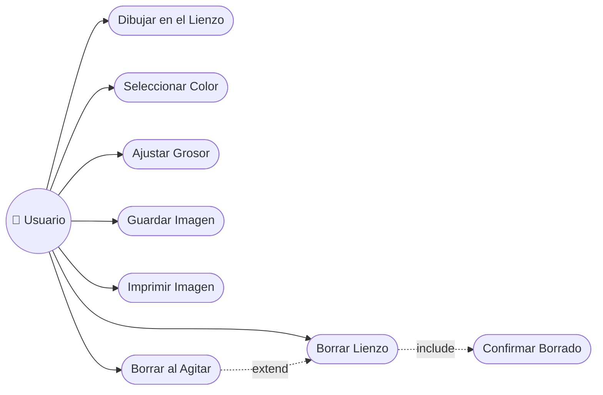

</details>

<details>
<summary><b>🏗️ Diagrama de Clases</b></summary>

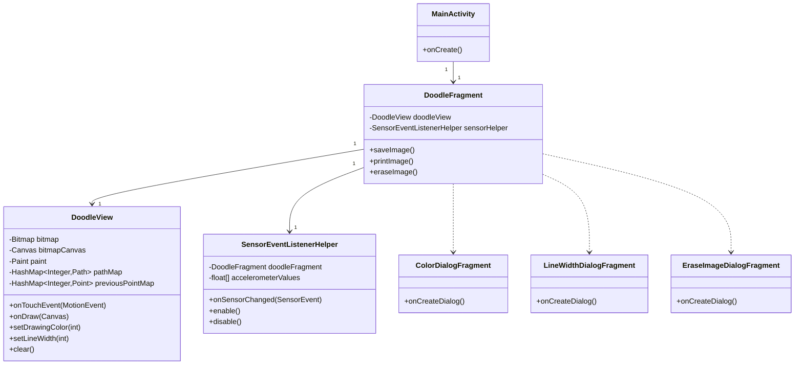

</details>

<details>
<summary><b>📦 Diagrama de Objetos</b></summary>

Instantánea de una instancia de `DoodleView` mientras se dibuja, con dos dedos activos:

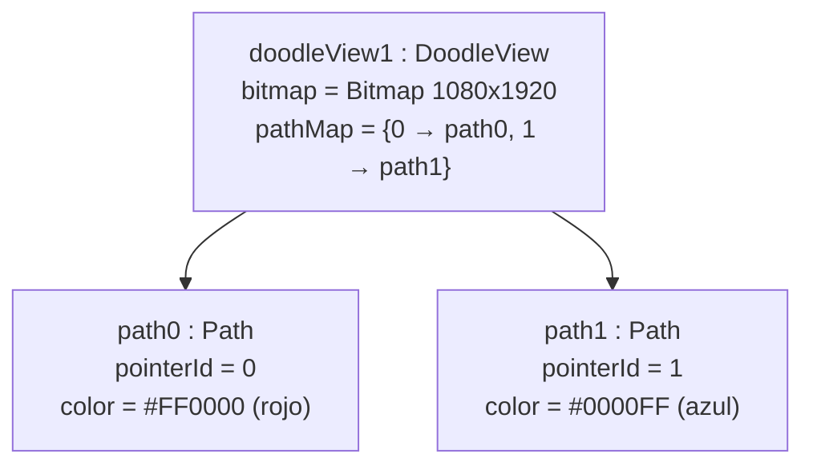

</details>

<details>
<summary><b>🔁 Diagrama de Secuencia</b></summary>

Dibujo de un solo trazo (un dedo, `ACTION_DOWN` → `ACTION_MOVE` → `ACTION_UP`):

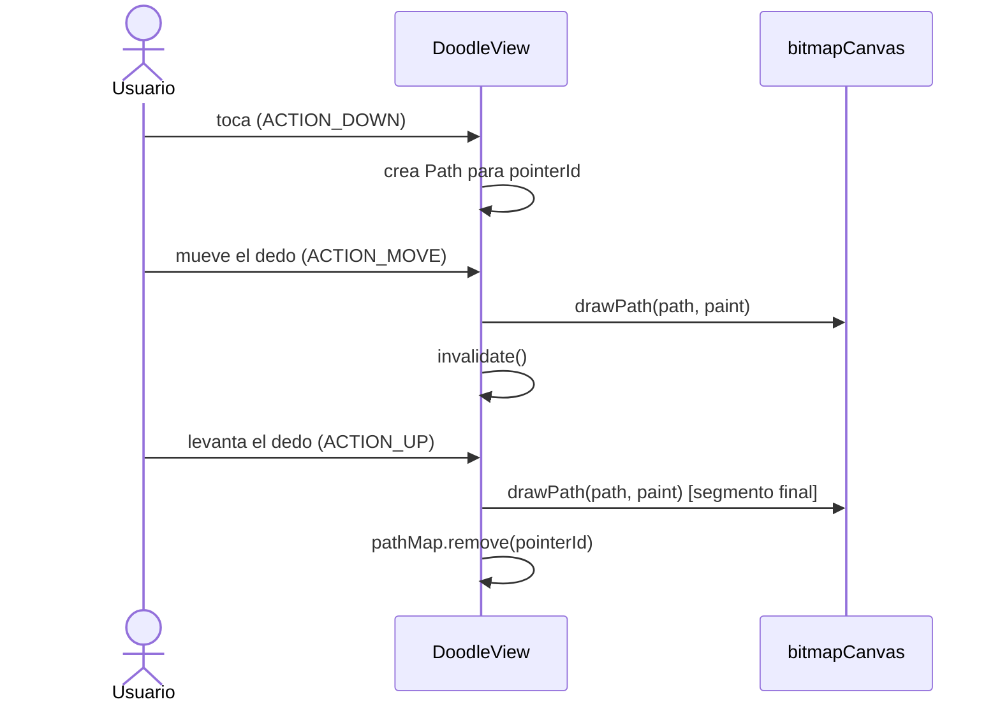

</details>

<details>
<summary><b>💬 Diagrama de Comunicación</b></summary>

Flujo de mensajes para "Borrar al Agitar" (numerado para mostrar el orden):

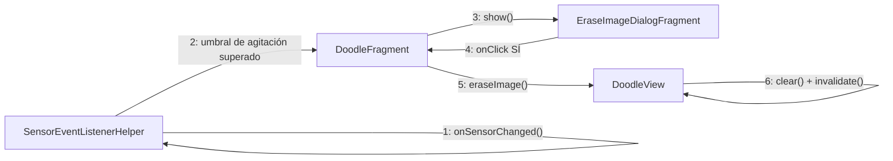

</details>

<details>
<summary><b>🏃 Diagrama de Actividades</b></summary>

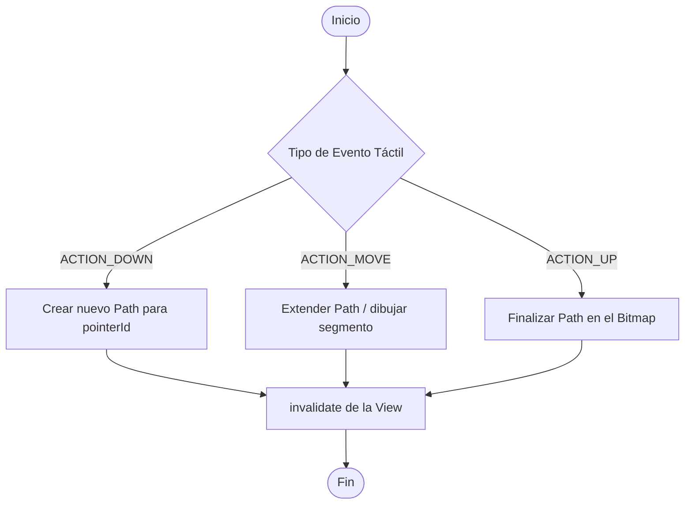

</details>

<details>
<summary><b>🔄 Diagrama de Máquina de Estados</b></summary>

Estados de `DoodleView` respecto a los eventos táctiles y de borrado:

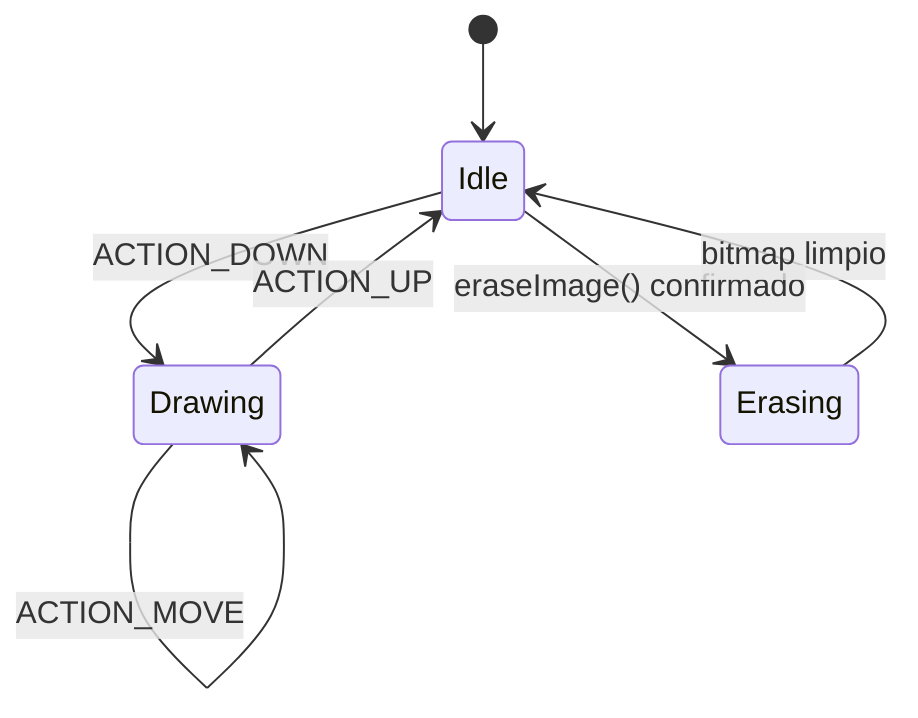

</details>

<details>
<summary><b>🧱 Diagrama de Componentes</b></summary>

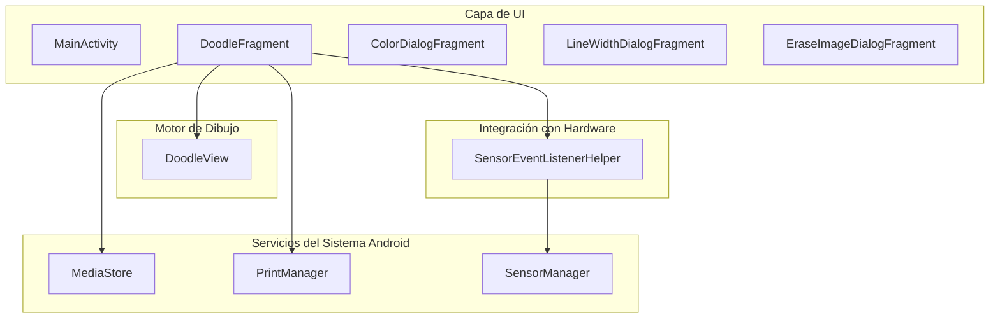

</details>

<details>
<summary><b>🚢 Diagrama de Despliegue</b></summary>

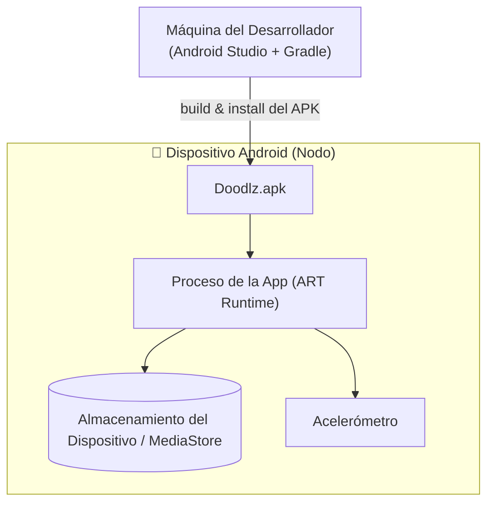

</details>

<details>
<summary><b>📦 Diagrama de Paquetes</b></summary>

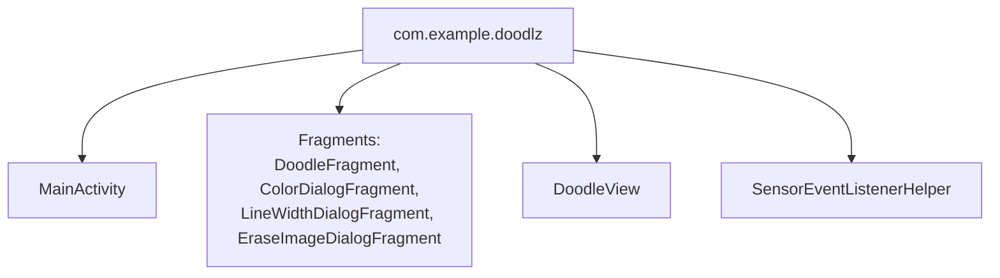

</details>

<details>
<summary><b>🧬 Diagrama de Estructura Compuesta</b></summary>

Estructura interna de `DoodleView`:

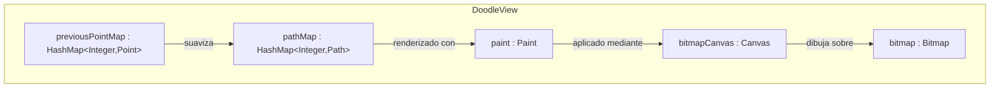

</details>

<details>
<summary><b>🗺️ Diagrama de Visión General de Interacción</b></summary>

Mapa de alto nivel de cómo se conectan los fragmentos de interacción (secuencia):

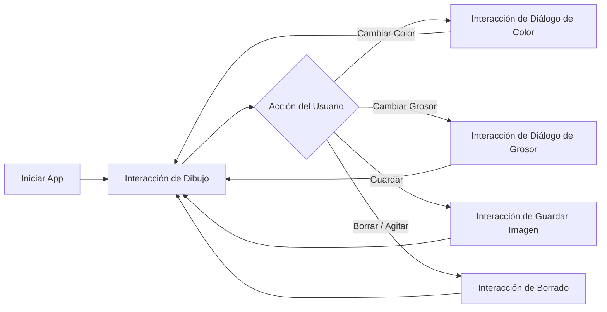

</details>

<details>
<summary><b>⏱️ Diagrama de Tiempo (Timing)</b></summary>

Ciclo de vida del toque de un solo dedo a lo largo del tiempo:

```text
Tiempo       t0          t1          t2          t3          t4
Dedo 0       DOWN ─────── MOVE ─────── MOVE ─────── MOVE ─────── UP
pathMap[0]   creado ───── actualizado  actualizado  actualizado  eliminado
Canvas       inactivo ─── drawPath ─── drawPath ─── drawPath ─── drawPath (final)
Estado View  Idle ─────── Drawing ──── Drawing ──── Drawing ──── Idle
```

</details>

---

### 🗄️ Modelo de Datos

<details>
<summary><b>🗄️ Diagrama Entidad-Relación (DER)</b></summary>

Doodlz no tiene base de datos relacional; el diagrama siguiente modela los **datos en tiempo de ejecución/exportados** en notación ER para completar la documentación.

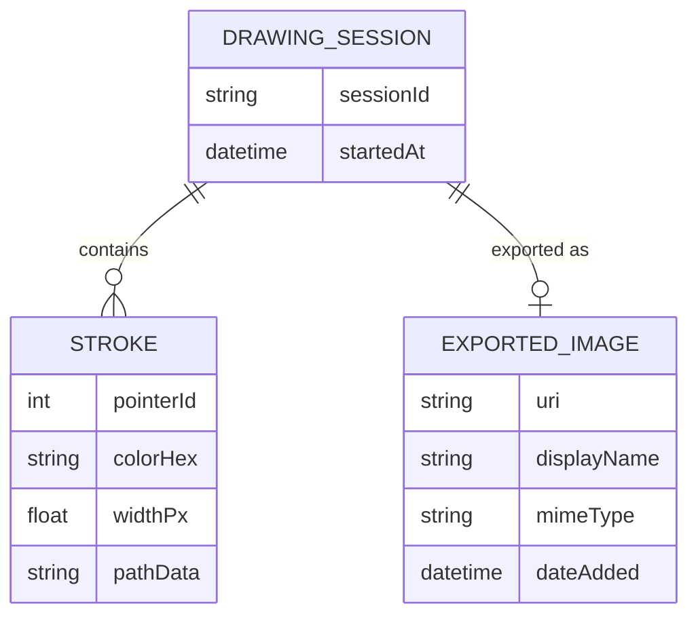

</details>

<details>
<summary><b>💡 Modelo Conceptual de Datos</b></summary>

A nivel conceptual, una **Sesión de Dibujo** se compone de uno o más **Trazos** (uno por gesto de dedo) y puede generar una **Imagen Exportada**.

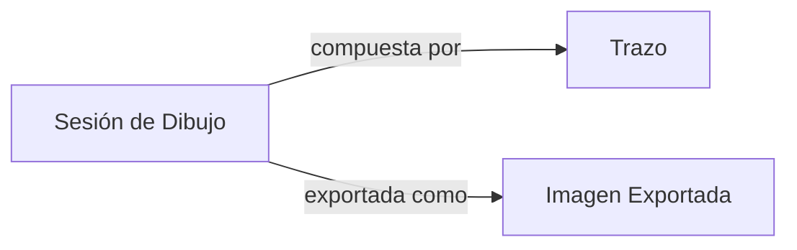

</details>

<details>
<summary><b>🧮 Modelo Lógico de Datos</b></summary>

| Entidad | Campo | Tipo | Descripción |
|:-------|:------|:-----|:------------|
| Stroke (Trazo) | pointerId | Integer | Identifica el dedo que dibujó el trazo |
| Stroke (Trazo) | colorHex | String(8) | Color del trazo (ARGB) |
| Stroke (Trazo) | widthPx | Float | Grosor del trazo en píxeles |
| Stroke (Trazo) | pathData | Path (en memoria) | Secuencia de segmentos de línea/curva |
| ExportedImage | uri | String | URI de contenido de `MediaStore` |
| ExportedImage | displayName | String | Nombre de archivo mostrado en la galería |
| ExportedImage | mimeType | String | `image/png` |
| ExportedImage | dateAdded | DateTime | Marca de tiempo de la exportación |

</details>

<details>
<summary><b>⚙️ Modelo Físico de Datos</b></summary>

El único dato físicamente persistido es el PNG exportado, almacenado mediante `MediaStore.Images.Media` con las columnas siguientes:

| Columna | Tipo | Notas |
|:-------|:-----|:------|
| `DISPLAY_NAME` | TEXT | Nombre del archivo (ej.: `doodlz_<timestamp>.png`) |
| `MIME_TYPE` | TEXT | `image/png` |
| `RELATIVE_PATH` / `DATA` | TEXT | Ruta de almacenamiento (directorio Pictures) |
| `DATE_ADDED` | INTEGER (Unix time) | Establecido automáticamente por `MediaStore` |

Todos los demás datos (`bitmap`, `pathMap`, `previousPointMap`, color/grosor actuales) existen solo en memoria del proceso (campos de la instancia `DoodleView`) y se descartan al cerrar la app.

</details>

<details>
<summary><b>📖 Diccionario de Datos</b></summary>

| Campo | Tipo | Ámbito | Descripción |
|:------|:-----|:------|:------------|
| `bitmap` | `Bitmap` | `DoodleView` (memoria) | Superficie ráster que contiene todos los trazos confirmados |
| `bitmapCanvas` | `Canvas` | `DoodleView` (memoria) | Canvas asociado al `bitmap`, usado por `Paint` para dibujar |
| `paint` | `Paint` | `DoodleView` (memoria) | Pincel actual: color, grosor, estilo |
| `pathMap` | `HashMap<Integer, Path>` | `DoodleView` (memoria) | Trazos activos indexados por `pointerId` |
| `previousPointMap` | `HashMap<Integer, Point>` | `DoodleView` (memoria) | Último punto conocido de cada dedo, para suavizado |
| `SHAKE_THRESHOLD` | `float` (constante) | `SensorEventListenerHelper` | Aceleración mínima para disparar el borrado |
| `DISPLAY_NAME` | `String` | `MediaStore` (persistido) | Nombre del archivo de imagen exportado |
| `MIME_TYPE` | `String` | `MediaStore` (persistido) | Tipo MIME de la imagen exportada (`image/png`) |

</details>

<details>
<summary><b>🔀 Diagrama de Flujo de Datos (DFD)</b></summary>

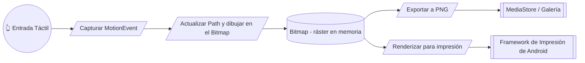

</details>

<details>
<summary><b>🧵 Diagrama de Linaje de Datos</b></summary>

Cómo un solo toque se convierte en una imagen guardada:

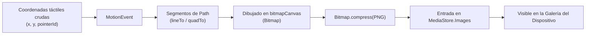

</details>

---

### 🏛️ Arquitectura & UX

<details>
<summary><b>🏛️ Diagrama de Arquitectura (Visión General)</b></summary>

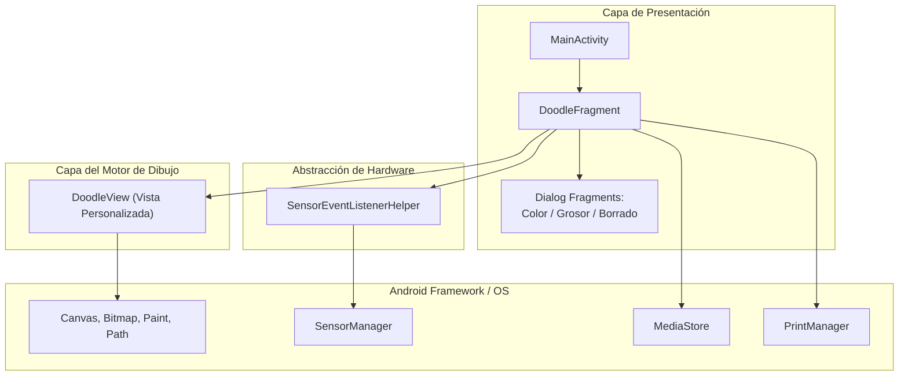

</details>

<details>
<summary><b>🔀 Diagrama de Flujo</b></summary>

Flujo de navegación de la app:

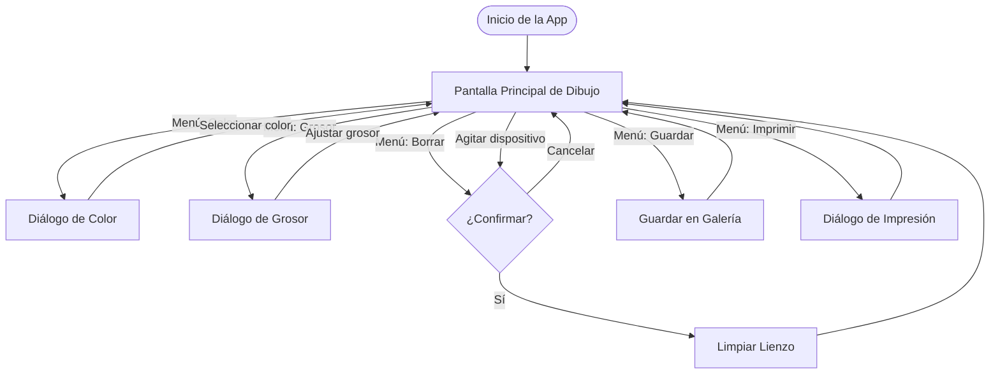

</details>

<details>
<summary><b>🙋 Persona</b></summary>

| | Persona 1 | Persona 2 |
|:--|:----------|:----------|
| **Nombre** | Ana, 8 años | Carlos, 34 años |
| **Rol** | Niña, dibujante casual | Profesor |
| **Objetivo** | Dibujar libremente con los dedos, ver colores vivos, guardar dibujos para mostrar a la familia | Esbozar rápidamente un diagrama en la tablet para ilustrar un concepto en clase |
| **Nivel tecnológico** | Bajo — necesita botones grandes y obvios | Medio — cómodo con menús |
| **Puntos de dolor** | Borrar un dibujo por accidente | Líneas demasiado finas para verse desde el fondo del aula |
| **Cómo ayuda Doodlz** | Borrar al agitar es divertido; el diálogo de confirmación evita pérdidas accidentales | El control de grosor permite trazos gruesos y visibles, con guardado/impresión instantáneos |

</details>

<details>
<summary><b>🧭 Mapa de Viaje del Usuario</b></summary>

| Etapa | Acción | Pensamiento del Usuario | Emoción | Punto de Dolor | Oportunidad |
|:------|:-------|:--------------|:--------|:-----------|:-------------|
| 1. Apertura | Abre la app | "Veamos qué hace esto" | 🙂 Curioso | — | Lienzo limpio se muestra de inmediato |
| 2. Dibujo | Toca y arrastra los dedos | "¡Puedo dibujar con más de un dedo!" | 😄 Encantado | El retraso frustraría | Renderizado fluido en tiempo real |
| 3. Personalización | Abre diálogos de color/grosor | "Quiero una línea roja más gruesa" | 🙂 Comprometido | Demasiadas opciones podrían confundir | Paleta simple + control deslizante |
| 4. Guardar | Toca Guardar | "Quiero conservar esto" | 😊 Satisfecho | La falta de permiso bloquea el guardado | Solicitud de permiso clara |
| 5. Borrar | Agita el dispositivo o toca Borrar | "Voy a empezar de nuevo" | 😟 Ansioso (miedo a perder el trabajo) | Agitación accidental borra todo | Diálogo de confirmación |

</details>

<details>
<summary><b>📐 Wireframe</b></summary>

Diseño de baja fidelidad de la pantalla principal de dibujo:

```text
┌──────────────────────────────────────────┐
│ ☰  Doodlz                          ⋮ Menú │
├──────────────────────────────────────────┤
│                                            │
│                                            │
│                                            │
│            (Lienzo de Dibujo)             │
│                                            │
│                                            │
│                                            │
│                                            │
├──────────────────────────────────────────┤
│ [🎨 Color]  [〰️ Grosor]  [🗑️ Borrar]  [💾 Guardar] │
└──────────────────────────────────────────┘
```

</details>

<details>
<summary><b>🖼️ Mockup</b></summary>

Descripción de alta fidelidad de la pantalla principal y el diálogo de colores:

```text
┌──────────────────────────────────────────┐
│ ☰  Doodlz                  🎨 〰️ 🗑️ 💾 🖨️ ⋮ │  ← Barra oscura (#212121)
├──────────────────────────────────────────┤
│  Lienzo blanco (#FFFFFF)                  │
│                                            │
│   ╭───╮          ╭──────╮                 │
│   │   ╰──────────╯      ╲                 │
│   │  trazo rojo (#F44336) ╲                │
│   ╰────────────╮            ╲             │
│                 ╲  trazo azul (#2196F3)    │
│                  ╰─────────────────       │
│                                            │
└──────────────────────────────────────────┘

Diálogo de Color (cuadrícula RecyclerView):
┌───────────────────────────┐
│ 🟥 🟧 🟨 🟩 🟦 🟪 ⬛ ⬜      │
│ Selecciona el color del pincel │
│        [ OK ]  [ Cancelar ] │
└───────────────────────────┘
```

</details>

---

## 🤝 Cómo Contribuir

> ¡Las contribuciones son muy bienvenidas! Sigue los pasos a continuación para colaborar de forma organizada.

| Paso | Acción | Comando |
|:-----:|:-----|:--------|
| 1️⃣ | **Fork** | Crea un fork del repositorio en tu cuenta. | — |
| 2️⃣ | **Branch** | Crea tu rama de feature a partir de `main`. | `git checkout -b feature/NuevaFeature` |
| 3️⃣ | **Commit** | Guarda los cambios con un mensaje claro y semántico. | `git commit -m 'feat: Agrega NuevaFeature'` |
| 4️⃣ | **Push** | Envía la rama al repositorio remoto. | `git push origin feature/NuevaFeature` |
| 5️⃣ | **Pull Request** | Abre un PR detallando los cambios realizados. | — |

<div align="center">

<br>

**¡Si este proyecto te fue útil para tus estudios, deja una estrella ⭐️ en el repositorio!**

</div>

---

## 👨‍💻 Autor

<div align="center">

<br>

**Victor H. J. Santiago**

<br>

[](https://github.com/VictorHJesusSantiago)
[](https://www.linkedin.com/in/victor-henrique-de-jesus-santiago/)

</div>

---

## 📄 Licencia

<div align="center">

Este proyecto está distribuido bajo la **Licencia MIT**.
Consulta el archivo [`LICENSE`](./LICENSE) en el repositorio para más información.


</div>

---

<div align="center">

*Hecho con 🎨 y Java por **Victor H. J. Santiago***

</div>
