<div align="center">


# 🎨 Doodlz — Aplicativo de Desenho Android

**Um aplicativo de desenho nativo para Android, escrito em Java, que funciona como**
**uma tela de pintura digital com suporte a multi-toque, paleta de cores e salvamento de imagens.**

<br>


-brightgreen?style=for-the-badge)


<br>

🌐 **Choose Language / Selecione o idioma / Elija el idioma**

[](README.md)
[](README_PT.md)
[](README_ES.md)

<br>


</div>

---

## 📚 Tabela de Conteúdos

| # | Seção |
|:-:|:------|
| 1 | [📖 Sobre o Projeto](#-sobre-o-projeto) |
| 2 | [✨ Funcionalidades Principais](#-funcionalidades-principais) |
| 3 | [🛠️ Pilha de Tecnologias](#️-pilha-de-tecnologias) |
| 4 | [🔑 Destaques da Implementação](#-destaques-da-implementação) |
| 5 | [📂 Estrutura do Repositório](#-estrutura-do-repositório) |
| 6 | [🚀 Como Executar](#-como-executar) |
| 7 | [📋 Documentação de Engenharia de Software](#-documentação-de-engenharia-de-software) |
| 8 | [🤝 Como Contribuir](#-como-contribuir) |
| 9 | [👨‍💻 Autor](#-autor) |
| 10 | [📄 Licença](#-licença) |

<details>
<summary>📋 Ir direto para o índice da Documentação de Engenharia de Software (35 artefatos)</summary>

**Requisitos**
- [✅ Requisitos Funcionais (RF)](#-requisitos-funcionais-rf)
- [⚙️ Requisitos Não Funcionais (RNF)](#️-requisitos-não-funcionais-rnf)
- [📏 Regras de Negócio (RN)](#-regras-de-negócio-rn)
- [🌐 Requisitos de Domínio](#-requisitos-de-domínio)
- [💾 Requisitos de Dados](#-requisitos-de-dados)
- [🖥️ Requisitos de Interface](#️-requisitos-de-interface)
- [🎯 Casos de Uso](#-casos-de-uso)
- [🔗 Matriz de Rastreabilidade de Requisitos](#-matriz-de-rastreabilidade-de-requisitos)
- [📄 Documento de Especificação de Requisitos de Software (SRS)](#-documento-de-especificação-de-requisitos-de-software-srs)

**Diagramas UML**
- [🧩 Diagrama de Casos de Uso](#-diagrama-de-casos-de-uso)
- [🏗️ Diagrama de Classes](#️-diagrama-de-classes)
- [📦 Diagrama de Objetos](#-diagrama-de-objetos)
- [🔁 Diagrama de Sequência](#-diagrama-de-sequência)
- [💬 Diagrama de Comunicação](#-diagrama-de-comunicação)
- [🏃 Diagrama de Atividades](#-diagrama-de-atividades)
- [🔄 Diagrama de Máquina de Estados](#-diagrama-de-máquina-de-estados)
- [🧱 Diagrama de Componentes](#-diagrama-de-componentes)
- [🚢 Diagrama de Implantação](#-diagrama-de-implantação)
- [📦 Diagrama de Pacotes](#-diagrama-de-pacotes-1)
- [🧬 Diagrama de Estrutura Composta](#-diagrama-de-estrutura-composta)
- [🗺️ Diagrama de Visão Geral de Interação](#️-diagrama-de-visão-geral-de-interação)
- [⏱️ Diagrama de Tempo (Timing)](#️-diagrama-de-tempo-timing)

**Modelo de Dados**
- [🗄️ Diagrama Entidade-Relacionamento (DER)](#️-diagrama-entidade-relacionamento-der)
- [💡 Modelo Conceitual de Dados](#-modelo-conceitual-de-dados)
- [🧮 Modelo Lógico de Dados](#-modelo-lógico-de-dados)
- [⚙️ Modelo Físico de Dados](#️-modelo-físico-de-dados-1)
- [📖 Dicionário de Dados](#-dicionário-de-dados)
- [🔀 Diagrama de Fluxo de Dados (DFD)](#-diagrama-de-fluxo-de-dados-dfd)
- [🧵 Diagrama de Linhagem de Dados](#-diagrama-de-linhagem-de-dados)

**Arquitetura & UX**
- [🏛️ Diagrama de Arquitetura (Visão Geral)](#️-diagrama-de-arquitetura-visão-geral)
- [🔀 Fluxograma](#-fluxograma)
- [🙋 Persona](#-persona)
- [🧭 Mapa de Jornada do Usuário](#-mapa-de-jornada-do-usuário)
- [📐 Wireframe](#-wireframe)
- [🖼️ Mockup](#️-mockup)

</details>

---

## 📖 Sobre o Projeto

> **Doodlz** é uma aplicação de desenho nativa para Android que transforma a tela do dispositivo em uma **tela de pintura digital** totalmente interativa.

O coração do projeto é uma **View personalizada** (`DoodleView`) que captura e renderiza os movimentos dos dedos em tempo real, com suporte completo a **multi-toque** — permitindo desenhar com vários dedos simultaneamente.

Além da experiência de desenho, o app inclui um menu de ferramentas completo e integração direta com o **hardware do dispositivo**: basta agitar o celular para limpar a tela, utilizando o acelerômetro nativo do Android.

---

## ✨ Funcionalidades Principais

| Ícone | Funcionalidade | Descrição |
|:-----:|:---------------|:----------|
| ✍️ | **Desenho Multi-Touch** | Desenhe com vários dedos ao mesmo tempo. Cada toque é rastreado com um `Path` individual e independente. |
| 🎨 | **Seletor de Cores** | `ColorDialogFragment` com `RecyclerView` exibindo uma paleta de cores completa para o pincel. |
| 〰️ | **Seletor de Espessura** | `LineWidthDialogFragment` com `SeekBar` para ajuste preciso da espessura da linha em tempo real. |
| 💾 | **Salvar Desenho** | Salva a imagem atual diretamente na galeria do dispositivo via `MediaStore`. |
| 🖨️ | **Imprimir** | Envia o desenho para o serviço de impressão nativo do Android. |
| 🗑️ | **Apagar com Confirmação** | `EraseImageDialogFragment` solicita confirmação antes de limpar a tela para evitar perdas acidentais. |
| 📳 | **Apagar ao Agitar** | Usa o **Acelerômetro** (`Sensor.TYPE_ACCELEROMETER`) para detectar o gesto de "shake" e apagar automaticamente. |

---

## 🛠️ Pilha de Tecnologias

| Tecnologia | Função no Projeto |
|:-----------|:------------------|
| **Java** | Linguagem principal de toda a lógica do aplicativo. |
| **Android SDK** | Framework nativo para desenvolvimento Android. |
| **Arquitetura Fragmentos + Atividade Única** | `MainActivity` hospeda o `DoodleFragment` como controlador principal. |
| **Custom View (`DoodleView`)** | View personalizada que contém todo o motor de desenho 2D. |
| **Bitmap / Canvas / Paint / Path** | APIs nativas de gráficos 2D do Android para renderização dos traços. |
| **SensorManager** | Acesso ao Acelerômetro para detecção do gesto de agitar. |
| **MediaStore** | API do Android para salvar imagens na galeria do dispositivo. |
| **AndroidManifest.xml** | Declaração de permissões (`WRITE_EXTERNAL_STORAGE`) e configuração do app. |
| **Gradle (Kotlin DSL)** | Sistema de build e gestão de dependências do projeto. |

---

## 🔑 Destaques da Implementação

### 🖌️ DoodleView.java — A Tela de Pintura Multi-Touch

> O núcleo de todo o projeto. `DoodleView` é uma `View` personalizada que gerencia toda a lógica de desenho em tempo real.

| Componente | Tipo | Responsabilidade |
|:-----------|:----:|:-----------------|
| `bitmap` | `Bitmap` | Tela de fundo onde os traços são persistidos entre redesenhos. |
| `bitmapCanvas` | `Canvas` | Canvas associado ao `Bitmap`, onde o `Paint` efetivamente desenha. |
| `pathMap` | `HashMap<Integer, Path>` | Armazena o traço (`Path`) de cada dedo, identificado pelo `pointerId`. |
| `previousPointMap` | `HashMap<Integer, Point>` | Guarda o ponto anterior de cada dedo para gerar linhas suaves e contínuas. |

**Eventos de toque processados pelo `onTouchEvent`:**

```java
// Cada evento é tratado individualmente para suportar múltiplos dedos
switch (action) {
    case MotionEvent.ACTION_DOWN:        // Primeiro dedo toca a tela
    case MotionEvent.ACTION_POINTER_DOWN: // Dedo adicional toca a tela
    case MotionEvent.ACTION_MOVE:        // Qualquer dedo se move
    case MotionEvent.ACTION_UP:          // Último dedo sai da tela
    case MotionEvent.ACTION_POINTER_UP:  // Um dedo adicional sai da tela
}
```

---

### 📳 SensorEventListenerHelper.java — Apagar ao Agitar

> Esta classe encapsula toda a lógica do acelerômetro, mantendo o `DoodleFragment` limpo e com responsabilidade única.

```java
// Lógica de detecção do gesto de "shake"
float acceleration = /* cálculo da aceleração resultante */;

if (acceleration > SHAKE_THRESHOLD) {
    // Invoca eraseImage() no DoodleFragment
    doodleFragment.eraseImage();
}
```

| Item | Detalhe |
|:-----|:--------|
| **Sensor utilizado** | `Sensor.TYPE_ACCELEROMETER` |
| **Threshold** | Constante `SHAKE_THRESHOLD` — define a sensibilidade do gesto. |
| **Ação disparada** | Chama `eraseImage()` no `DoodleFragment` quando o threshold é excedido. |

---

## 📂 Estrutura do Repositório

```plaintext
doodlz/
│
├── 📄 build.gradle.kts                        # ⚙️  Configurações do projeto (nível raiz)
│
└── 📁 app/
    ├── 📄 build.gradle.kts                    # ⚙️  Configurações do módulo 'app'
    │
    └── 📁 src/main/
        │
        ├── 📄 AndroidManifest.xml             # 🔐 Permissões e configuração do app
        │
        ├── 📁 java/com/example/doodlz/
        │   ├── 📄 MainActivity.java           # 🏠 Atividade principal (Host)
        │   ├── 📄 DoodleFragment.java         # 🎛️  Fragmento principal (Controlador)
        │   ├── 📄 DoodleView.java             # 🖌️  Motor de desenho Multi-Touch ← CORE
        │   ├── 📄 SensorEventListenerHelper.java # 📳 Lógica do Acelerômetro ← CORE
        │   ├── 📄 ColorDialogFragment.java    # 🎨 Dialog de seleção de cor
        │   ├── 📄 LineWidthDialogFragment.java # 〰️  Dialog de espessura da linha
        │   └── 📄 EraseImageDialogFragment.java # 🗑️  Dialog de confirmação de apagar
        │
        └── 📁 res/
            ├── 📁 layout/                     # 🖼️  Layouts XML das telas e dialogs
            │   ├── 📄 activity_main.xml
            │   ├── 📄 fragment_doodle.xml
            │   ├── 📄 fragment_color.xml
            │   └── 📄 fragment_line_width.xml
            ├── 📁 drawable/                   # 🎭 Ícones e vetores do app
            └── 📁 values/                     # 📝 Strings, Cores e Dimensões
```

---

## 🚀 Como Executar

### 📋 Pré-requisitos

| Requisito | Detalhe |
|:----------|:--------|
| **Android Studio** | Versão **Hedgehog** ou superior, instalada e configurada. |
| **JDK** | Versão **11 ou superior** (geralmente incluído no Android Studio). |
| **Dispositivo ou Emulador** | Android físico (USB + depuração ativada) ou AVD configurado. |

---

### 🔧 Passo a Passo

**1. Clone o repositório:**

```bash
git clone https://github.com/VictorHJesusSantiago/doodlz.git
```

**2. Abra no Android Studio:**

```
Android Studio → File → Open → Selecione a pasta 'doodlz'
```

**3. Sincronize o Gradle:**

> O Android Studio detectará o projeto automaticamente. Aguarde a sincronização das dependências — o processo é rápido, pois o projeto não possui bibliotecas externas.

```
Build → Sync Project with Gradle Files
```

**4. Execute a aplicação:**

```
Run → Run 'app'  (ou clique no botão ▶️ na barra de ferramentas)
```

---

### 📱 Testando Funcionalidades de Hardware

| Funcionalidade | Como Testar |
|:---------------|:------------|
| 🎨 **Desenho Multi-Touch** | Em dispositivo físico, use múltiplos dedos simultaneamente. |
| 📳 **Apagar ao Agitar** | Agite o dispositivo físico. No emulador, use `Extended Controls → Virtual sensors`. |
| 💾 **Salvar na Galeria** | Conceda a permissão `WRITE_EXTERNAL_STORAGE` quando solicitada. |

---

## 📋 Documentação de Engenharia de Software

> Um conjunto condensado de artefatos de engenharia de software (requisitos, UML, modelo de dados e UX) descrevendo o Doodlz. Cada item abaixo é expansível — clique para visualizar.

### 📝 Requisitos

<details>
<summary><b>✅ Requisitos Funcionais (RF)</b></summary>

| ID | Requisito | Descrição | Prioridade |
|:---|:------------|:-------------|:--------:|
| RF01 | Desenho multi-touch | O app deve permitir desenhar com vários dedos simultaneamente, cada um rastreado como um `Path` independente. | Alta |
| RF02 | Seleção de cor | O usuário deve poder escolher a cor do traço em um diálogo de paleta (`ColorDialogFragment`). | Alta |
| RF03 | Ajuste de espessura da linha | O usuário deve poder ajustar a espessura do traço via `SeekBar` (`LineWidthDialogFragment`). | Média |
| RF04 | Salvar imagem | O usuário deve poder salvar o desenho atual na galeria do dispositivo via `MediaStore`. | Alta |
| RF05 | Imprimir imagem | O usuário deve poder enviar o desenho para uma impressora via framework de impressão do Android. | Baixa |
| RF06 | Apagar com confirmação | O usuário deve poder limpar a tela, com um diálogo de confirmação para evitar perdas acidentais. | Alta |
| RF07 | Apagar ao agitar | Agitar o dispositivo deve disparar o mesmo fluxo de confirmação de apagar via acelerômetro. | Média |

</details>

<details>
<summary><b>⚙️ Requisitos Não Funcionais (RNF)</b></summary>

| ID | Categoria | Requisito |
|:---|:---------|:------------|
| RNF01 | Desempenho | O desenho deve renderizar sem atraso perceptível — a tela é redesenhada via `invalidate()` em cada evento de movimento. |
| RNF02 | Compatibilidade | O app deve rodar na faixa de API Android declarada em `build.gradle.kts` (minSdk/targetSdk). |
| RNF03 | Usabilidade | Todas as ações destrutivas (apagar) exigem confirmação explícita do usuário antes de executar. |
| RNF04 | Portabilidade | Os layouts devem se adaptar a celulares e tablets de tamanhos e orientações variados. |
| RNF05 | Manutenibilidade | A lógica de desenho fica isolada em `DoodleView`; a lógica de sensores em `SensorEventListenerHelper` (responsabilidade única). |
| RNF06 | Uso de recursos | O `Bitmap` em memória é mantido apenas na resolução da tela, evitando erros de falta de memória. |

</details>

<details>
<summary><b>📏 Regras de Negócio (RN)</b></summary>

- **RN01** — A cor padrão do traço é preta e a espessura padrão é uma constante predefinida até que o usuário a altere.
- **RN02** — A tela só pode ser apagada após confirmação explícita (diálogo), seja acionada manualmente ou por agitação.
- **RN03** — Salvar uma imagem requer permissão de armazenamento (`WRITE_EXTERNAL_STORAGE` em Android legado, armazenamento delimitado via `MediaStore` em versões modernas).
- **RN04** — Cada dedo ativo (`pointerId`) possui exatamente um `Path` independente; ao levantar o dedo, sua entrada de rastreamento é finalizada e removida.
- **RN05** — A impressão reutiliza o mesmo `Bitmap` usado para salvar — o que o usuário vê é exatamente o que é salvo/impresso (WYSIWYG).

</details>

<details>
<summary><b>🌐 Requisitos de Domínio</b></summary>

O domínio da aplicação é o **desenho digital raster em 2D**. Conceitos centrais do domínio:

- **Canvas (Tela)** — a superfície de desenho (baseada em um `Bitmap`).
- **Traço / Path** — uma linha contínua desenhada por um dedo.
- **Pointer (Apontador)** — um único dedo/toque identificado por `pointerId`.
- **Pincel** — combinação de `Color` (cor) + `Line Width` (espessura) aplicada via `Paint`.
- **Gesto** — uma entrada de hardware reconhecida (agitar) mapeada para uma ação do domínio (apagar).

**Restrição de domínio:** o modelo é restrito à saída raster 2D — não há persistência vetorial, camadas, nem histórico de desfazer/refazer.

</details>

<details>
<summary><b>💾 Requisitos de Dados</b></summary>

| Dado | Ciclo de vida | Localização |
|:-----|:---------|:---------|
| Objetos `Path` ativos (`pathMap`, `previousPointMap`) | Transiente (em memória, por sessão de toque) | Instância de `DoodleView` |
| `Bitmap` do desenho | Vida útil da sessão (em memória) | Instância de `DoodleView` |
| Imagem PNG exportada | Persistente | `MediaStore` / Galeria do dispositivo |
| Cor / espessura atuais | Vida útil da sessão | Campos de `DoodleView` |

O app **não possui banco de dados relacional nem backend remoto** — todo dado persistente é o asset de imagem exportado.

</details>

<details>
<summary><b>🖥️ Requisitos de Interface</b></summary>

| Tela | Componente | Requisito |
|:-------|:----------|:------------|
| Tela Principal de Desenho | `DoodleFragment` + `DoodleView` | Tela em tela cheia com menu de opções (Cor, Espessura, Apagar, Salvar, Imprimir). |
| Diálogo de Cor | `ColorDialogFragment` | Paleta `RecyclerView` com pré-visualização do pincel em tempo real. |
| Diálogo de Espessura | `LineWidthDialogFragment` | `SeekBar` com pré-visualização do pincel em tempo real. |
| Diálogo de Confirmação de Apagar | `EraseImageDialogFragment` | Botões Sim / Cancelar; Cancelar não altera o estado. |

Todos os diálogos são modais e não devem alterar o estado do app quando descartados via Cancelar/voltar.

</details>

<details>
<summary><b>🎯 Casos de Uso</b></summary>

| ID | Caso de Uso | Ator | Fluxo Principal |
|:---|:---------|:------|:----------|
| UC01 | Desenhar na Tela | Usuário | O usuário toca e arrasta na tela → `DoodleView` cria/atualiza um `Path` por dedo → a tela é redesenhada. |
| UC02 | Selecionar Cor | Usuário | O usuário abre o menu → Cor → escolhe uma amostra → a cor do pincel é atualizada. |
| UC03 | Ajustar Espessura | Usuário | O usuário abre o menu → Espessura → arrasta o `SeekBar` → a espessura do pincel é atualizada. |
| UC04 | Salvar Imagem | Usuário | O usuário abre o menu → Salvar → o app grava o `Bitmap` no `MediaStore`. |
| UC05 | Imprimir Imagem | Usuário | O usuário abre o menu → Imprimir → o diálogo de impressão do Android abre com o `Bitmap`. |
| UC06 | Apagar Tela (manual) | Usuário | O usuário abre o menu → Apagar → confirma → a tela é limpa. |
| UC07 | Apagar Tela (agitar) | Usuário | O usuário agita o dispositivo → o acelerômetro excede o limite → confirmação de apagar é exibida → confirma → a tela é limpa. |

</details>

<details>
<summary><b>🔗 Matriz de Rastreabilidade de Requisitos</b></summary>

| Requisito | Caso de Uso | Classe que Implementa | Verificação |
|:------------|:---------|:--------------------|:--------------|
| RF01 / RN04 | UC01 | `DoodleView.onTouchEvent` | Teste manual com múltiplos dedos no dispositivo |
| RF02 | UC02 | `ColorDialogFragment` | Selecionar amostra, desenhar, confirmar cor aplicada |
| RF03 | UC03 | `LineWidthDialogFragment` | Ajustar `SeekBar`, desenhar, confirmar espessura aplicada |
| RF04 / RN05 | UC04 | `DoodleFragment.saveImage` | Salvar, verificar arquivo na galeria |
| RF05 / RN05 | UC05 | `DoodleFragment.printImage` | Disparar impressão, verificar preview igual à tela |
| RF06 / RN02 | UC06 | `EraseImageDialogFragment`, `DoodleView.clear` | Apagar via menu, confirmar tela limpa |
| RF07 / RN02 | UC07 | `SensorEventListenerHelper` | Agitar dispositivo, confirmar exibição do diálogo |
| RNF01 | UC01 | `DoodleView.onDraw` | Verificação visual de atraso durante o desenho |
| RNF03 | UC06, UC07 | `EraseImageDialogFragment` | Confirmar que o diálogo bloqueia apagamento acidental |

</details>

<details>
<summary><b>📄 Documento de Especificação de Requisitos de Software (SRS)</b></summary>

Esboço condensado de SRS (estilo IEEE 830):

1. **Introdução**
   - *Propósito*: descrever o comportamento funcional e não funcional do app de desenho Doodlz.
   - *Escopo*: app Android de atividade única para desenho livre, salvamento e impressão de imagens.
   - *Definições*: ver [Requisitos de Domínio](#-requisitos-de-domínio).
2. **Descrição Geral**
   - *Perspectiva do produto*: app autônomo, sem backend, utiliza serviços do sistema Android (`SensorManager`, `MediaStore`, framework de impressão).
   - *Características dos usuários*: usuários casuais de qualquer idade, sem necessidade de treinamento.
   - *Restrições*: Java + Android SDK, sem bibliotecas externas (ver [Pilha de Tecnologias](#️-pilha-de-tecnologias)).
3. **Requisitos Específicos**: ver [Requisitos Funcionais](#-requisitos-funcionais-rf), [Requisitos Não Funcionais](#️-requisitos-não-funcionais-rnf) e [Regras de Negócio](#-regras-de-negócio-rn).
4. **Apêndices**: ver [Diagramas UML](#-diagrama-de-casos-de-uso), [Modelo de Dados](#️-diagrama-entidade-relacionamento-der) e [Arquitetura & UX](#️-diagrama-de-arquitetura-visão-geral) abaixo.

</details>

---

### 🧩 Diagramas UML

<details>
<summary><b>🧩 Diagrama de Casos de Uso</b></summary>

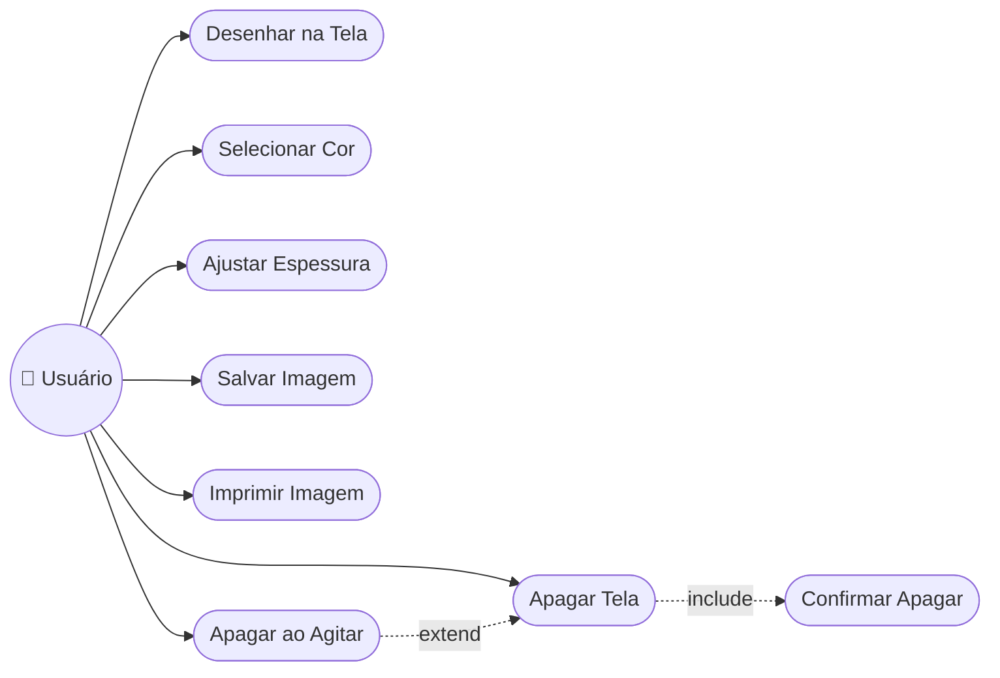

</details>

<details>
<summary><b>🏗️ Diagrama de Classes</b></summary>

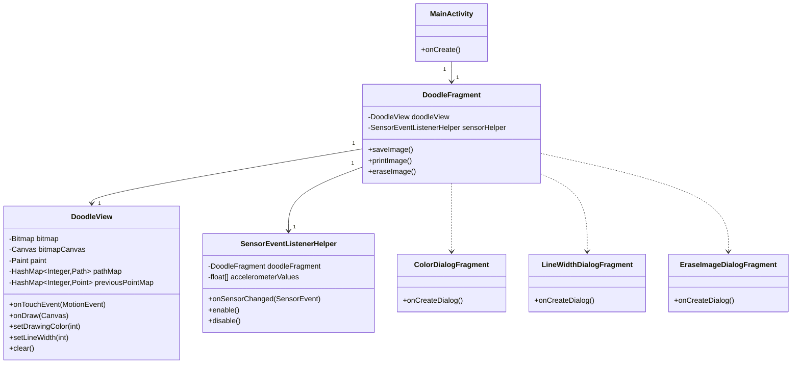

</details>

<details>
<summary><b>📦 Diagrama de Objetos</b></summary>

Snapshot de uma instância de `DoodleView` durante o desenho, com dois dedos ativos:

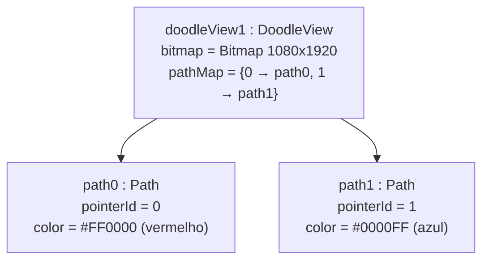

</details>

<details>
<summary><b>🔁 Diagrama de Sequência</b></summary>

Desenho de um único traço (um dedo, `ACTION_DOWN` → `ACTION_MOVE` → `ACTION_UP`):

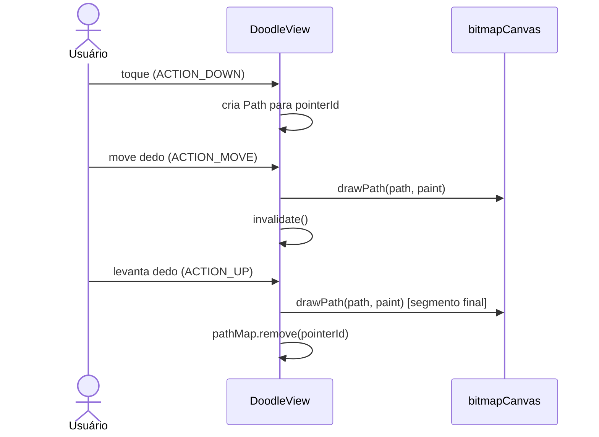

</details>

<details>
<summary><b>💬 Diagrama de Comunicação</b></summary>

Fluxo de mensagens para "Apagar ao Agitar" (numerado para mostrar a ordem):

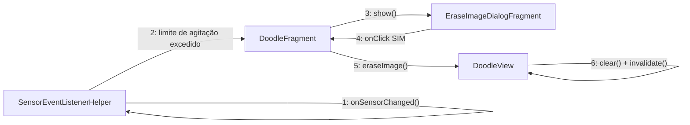

</details>

<details>
<summary><b>🏃 Diagrama de Atividades</b></summary>

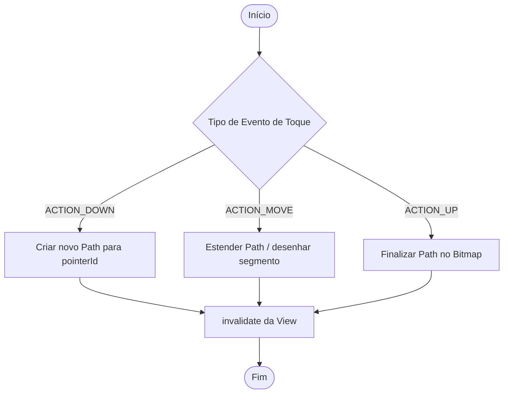

</details>

<details>
<summary><b>🔄 Diagrama de Máquina de Estados</b></summary>

Estados de `DoodleView` em relação aos eventos de toque e apagar:

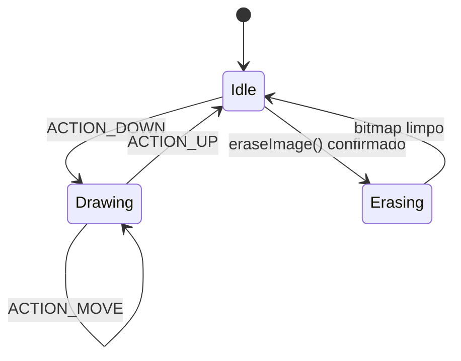

</details>

<details>
<summary><b>🧱 Diagrama de Componentes</b></summary>

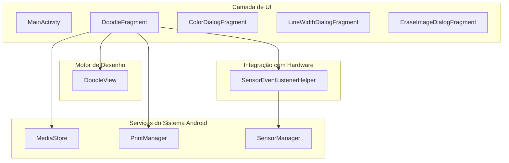

</details>

<details>
<summary><b>🚢 Diagrama de Implantação</b></summary>

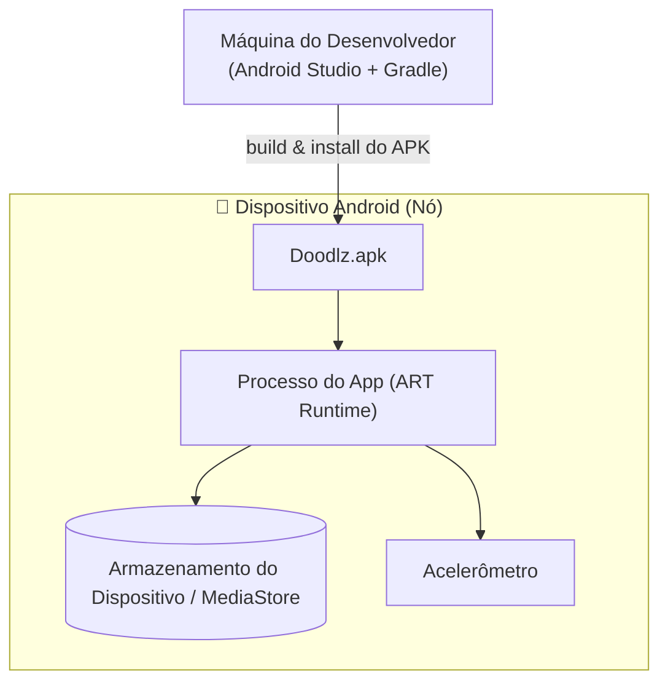

</details>

<details>
<summary><b>📦 Diagrama de Pacotes</b></summary>

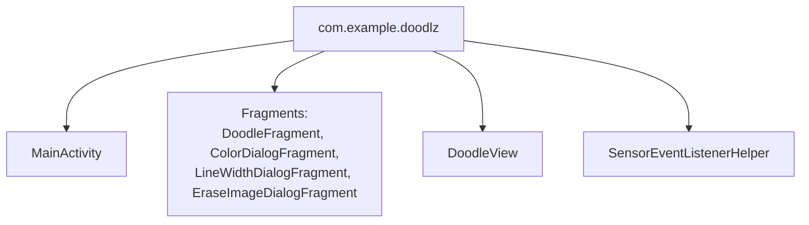

</details>

<details>
<summary><b>🧬 Diagrama de Estrutura Composta</b></summary>

Estrutura interna de `DoodleView`:

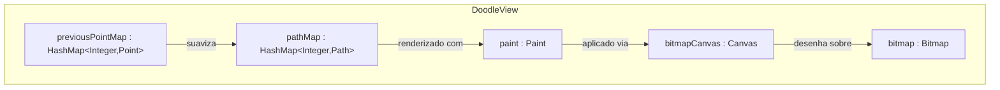

</details>

<details>
<summary><b>🗺️ Diagrama de Visão Geral de Interação</b></summary>

Mapa de alto nível de como os fragmentos de interação (sequência) se conectam:

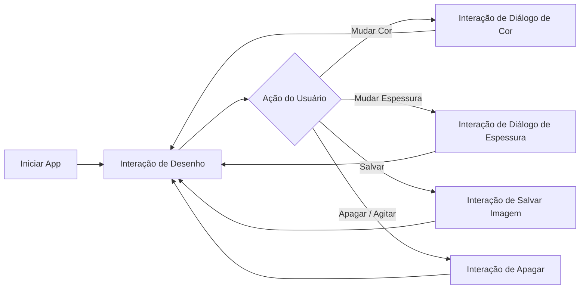

</details>

<details>
<summary><b>⏱️ Diagrama de Tempo (Timing)</b></summary>

Ciclo de vida do toque de um único dedo ao longo do tempo:

```text
Tempo        t0          t1          t2          t3          t4
Dedo 0       DOWN ─────── MOVE ─────── MOVE ─────── MOVE ─────── UP
pathMap[0]   criado ───── atualizado ─ atualizado ─ atualizado ─ removido
Canvas       ocioso ────── drawPath ── drawPath ── drawPath ── drawPath (final)
Estado View  Idle ───────  Drawing ─── Drawing ─── Drawing ───  Idle
```

</details>

---

### 🗄️ Modelo de Dados

<details>
<summary><b>🗄️ Diagrama Entidade-Relacionamento (DER)</b></summary>

O Doodlz não possui banco de dados relacional; o diagrama abaixo modela os **dados de runtime/exportados** em notação ER para completude da documentação.

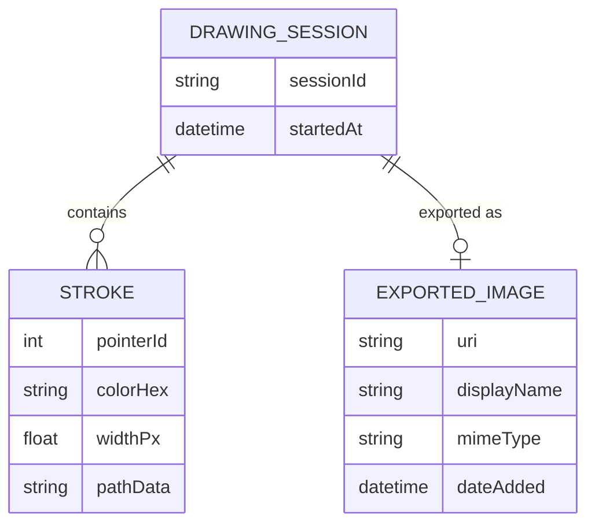

</details>

<details>
<summary><b>💡 Modelo Conceitual de Dados</b></summary>

No nível conceitual, uma **Sessão de Desenho** é composta por um ou mais **Traços** (um por gesto de dedo) e pode gerar uma **Imagem Exportada**.

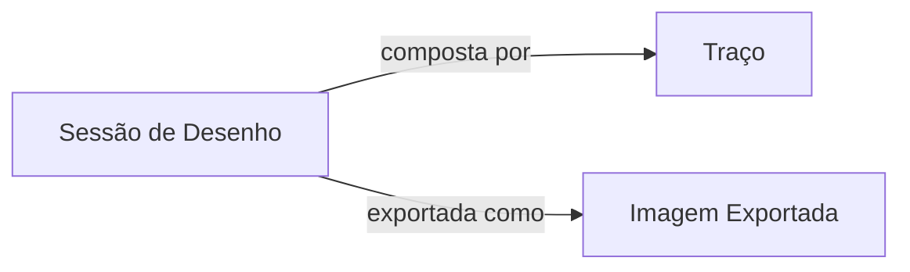

</details>

<details>
<summary><b>🧮 Modelo Lógico de Dados</b></summary>

| Entidade | Campo | Tipo | Descrição |
|:-------|:------|:-----|:------------|
| Stroke (Traço) | pointerId | Integer | Identifica o dedo que desenhou o traço |
| Stroke (Traço) | colorHex | String(8) | Cor do traço (ARGB) |
| Stroke (Traço) | widthPx | Float | Espessura do traço em pixels |
| Stroke (Traço) | pathData | Path (em memória) | Sequência de segmentos de linha/curva |
| ExportedImage | uri | String | URI de conteúdo do `MediaStore` |
| ExportedImage | displayName | String | Nome do arquivo exibido na galeria |
| ExportedImage | mimeType | String | `image/png` |
| ExportedImage | dateAdded | DateTime | Timestamp da exportação |

</details>

<details>
<summary><b>⚙️ Modelo Físico de Dados</b></summary>

O único dado fisicamente persistido é o PNG exportado, armazenado via `MediaStore.Images.Media` com as colunas abaixo:

| Coluna | Tipo | Observações |
|:-------|:-----|:------|
| `DISPLAY_NAME` | TEXT | Nome do arquivo (ex.: `doodlz_<timestamp>.png`) |
| `MIME_TYPE` | TEXT | `image/png` |
| `RELATIVE_PATH` / `DATA` | TEXT | Caminho de armazenamento (diretório Pictures) |
| `DATE_ADDED` | INTEGER (Unix time) | Definido automaticamente pelo `MediaStore` |

Todos os demais dados (`bitmap`, `pathMap`, `previousPointMap`, cor/espessura atuais) existem apenas em memória do processo (campos da instância `DoodleView`) e são descartados ao fechar o app.

</details>

<details>
<summary><b>📖 Dicionário de Dados</b></summary>

| Campo | Tipo | Escopo | Descrição |
|:------|:-----|:------|:------------|
| `bitmap` | `Bitmap` | `DoodleView` (memória) | Superfície raster contendo todos os traços confirmados |
| `bitmapCanvas` | `Canvas` | `DoodleView` (memória) | Canvas associado ao `bitmap`, usado pelo `Paint` para desenhar |
| `paint` | `Paint` | `DoodleView` (memória) | Pincel atual: cor, espessura, estilo |
| `pathMap` | `HashMap<Integer, Path>` | `DoodleView` (memória) | Traços ativos indexados por `pointerId` |
| `previousPointMap` | `HashMap<Integer, Point>` | `DoodleView` (memória) | Último ponto conhecido de cada dedo, para suavização |
| `SHAKE_THRESHOLD` | `float` (constante) | `SensorEventListenerHelper` | Aceleração mínima para disparar o apagar |
| `DISPLAY_NAME` | `String` | `MediaStore` (persistido) | Nome do arquivo de imagem exportado |
| `MIME_TYPE` | `String` | `MediaStore` (persistido) | Tipo MIME da imagem exportada (`image/png`) |

</details>

<details>
<summary><b>🔀 Diagrama de Fluxo de Dados (DFD)</b></summary>

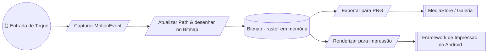

</details>

<details>
<summary><b>🧵 Diagrama de Linhagem de Dados</b></summary>

Como um único toque se transforma em uma imagem salva:

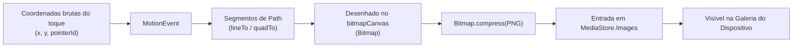

</details>

---

### 🏛️ Arquitetura & UX

<details>
<summary><b>🏛️ Diagrama de Arquitetura (Visão Geral)</b></summary>

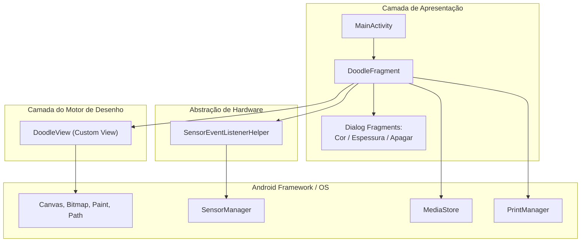

</details>

<details>
<summary><b>🔀 Fluxograma</b></summary>

Fluxo de navegação do app:

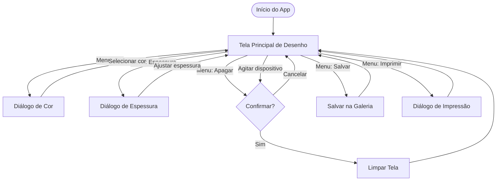

</details>

<details>
<summary><b>🙋 Persona</b></summary>

| | Persona 1 | Persona 2 |
|:--|:----------|:----------|
| **Nome** | Ana, 8 anos | Carlos, 34 anos |
| **Papel** | Criança, desenhista casual | Professor |
| **Objetivo** | Desenhar livremente com os dedos, ver cores vibrantes, salvar desenhos para mostrar à família | Esboçar rapidamente um diagrama no tablet para ilustrar um conceito em aula |
| **Familiaridade com tecnologia** | Baixa — precisa de botões grandes e óbvios | Média — confortável com menus |
| **Dores** | Apagar um desenho acidentalmente | Linhas muito finas para ver do fundo da sala |
| **Como o Doodlz ajuda** | Apagar ao agitar é divertido, o diálogo de confirmação evita perdas acidentais | O slider de espessura permite traços grossos e visíveis, com salvar/imprimir instantâneos |

</details>

<details>
<summary><b>🧭 Mapa de Jornada do Usuário</b></summary>

| Etapa | Ação | Pensamento do Usuário | Emoção | Ponto de Dor | Oportunidade |
|:------|:-------|:--------------|:--------|:-----------|:-------------|
| 1. Abertura | Abre o app | "Vamos ver o que isso faz" | 🙂 Curioso | — | Tela limpa exibida imediatamente |
| 2. Desenho | Toca e arrasta os dedos | "Posso desenhar com mais de um dedo!" | 😄 Encantado | Atraso frustraria | Renderização suave em tempo real |
| 3. Personalização | Abre diálogos de cor/espessura | "Quero uma linha vermelha mais grossa" | 🙂 Engajado | Muitas opções poderiam confundir | Paleta simples + slider |
| 4. Salvar | Toca em Salvar | "Quero guardar isso" | 😊 Satisfeito | Permissão ausente bloqueia o salvamento | Prompt de permissão claro |
| 5. Apagar | Agita o dispositivo ou toca em Apagar | "Vou começar de novo" | 😟 Ansioso (medo de perder o trabalho) | Agitação acidental apaga tudo | Diálogo de confirmação |

</details>

<details>
<summary><b>📐 Wireframe</b></summary>

Layout de baixa fidelidade da tela principal de desenho:

```text
┌──────────────────────────────────────────┐
│ ☰  Doodlz                          ⋮ Menu │
├──────────────────────────────────────────┤
│                                            │
│                                            │
│                                            │
│              (Tela de Desenho)            │
│                                            │
│                                            │
│                                            │
│                                            │
├──────────────────────────────────────────┤
│ [🎨 Cor]  [〰️ Espessura]  [🗑️ Apagar]  [💾 Salvar] │
└──────────────────────────────────────────┘
```

</details>

<details>
<summary><b>🖼️ Mockup</b></summary>

Descrição de alta fidelidade da tela principal e do diálogo de cores:

```text
┌──────────────────────────────────────────┐
│ ☰  Doodlz                  🎨 〰️ 🗑️ 💾 🖨️ ⋮ │  ← Barra escura (#212121)
├──────────────────────────────────────────┤
│  Tela branca (#FFFFFF)                    │
│                                            │
│   ╭───╮          ╭──────╮                 │
│   │   ╰──────────╯      ╲                 │
│   │  traço vermelho (#F44336) ╲            │
│   ╰────────────╮            ╲             │
│                 ╲  traço azul (#2196F3)    │
│                  ╰─────────────────       │
│                                            │
└──────────────────────────────────────────┘

Diálogo de Cor (grade RecyclerView):
┌───────────────────────────┐
│ 🟥 🟧 🟨 🟩 🟦 🟪 ⬛ ⬜      │
│ Selecione a cor do pincel    │
│        [ OK ]  [ Cancelar ] │
└───────────────────────────┘
```

</details>

---

## 🤝 Como Contribuir

> Contribuições são muito bem-vindas! Siga as etapas abaixo para colaborar de forma organizada.

| Passo | Ação | Comando |
|:-----:|:-----|:--------|
| 1️⃣ | **Fork** | Crie um fork do repositório para a sua conta. | — |
| 2️⃣ | **Branch** | Crie sua feature branch a partir da `main`. | `git checkout -b feature/NovaFeature` |
| 3️⃣ | **Commit** | Salve as alterações com mensagem clara e semântica. | `git commit -m 'feat: Adiciona NovaFeature'` |
| 4️⃣ | **Push** | Envie a branch para o repositório remoto. | `git push origin feature/NovaFeature` |
| 5️⃣ | **Pull Request** | Abra um PR detalhando as mudanças realizadas. | — |

<div align="center">

<br>

**Se este projeto foi útil para os seus estudos, deixe uma estrela ⭐️ no repositório!**

</div>

---

## 👨‍💻 Autor

<div align="center">

<br>

**Victor H. J. Santiago**

<br>

[](https://github.com/VictorHJesusSantiago)
[](https://www.linkedin.com/in/victor-henrique-de-jesus-santiago/)

</div>

---

## 📄 Licença

<div align="center">

Este projeto está distribuído sob a **Licença MIT**.
Consulte o arquivo [`LICENSE`](./LICENSE) no repositório para mais informações.


</div>

---

<div align="center">

*Feito com 🎨 e Java por **Victor H. J. Santiago***

</div>
