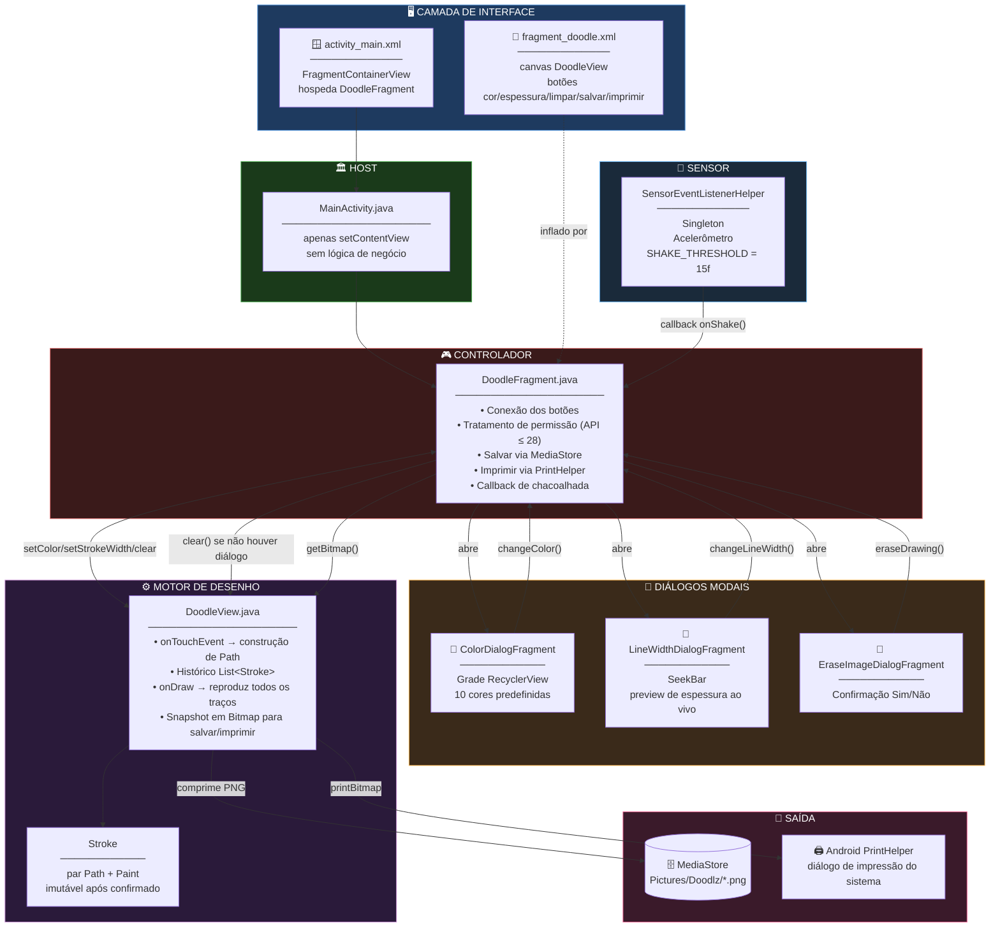
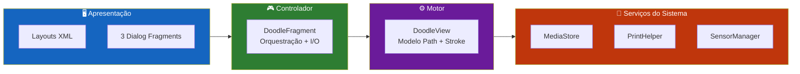
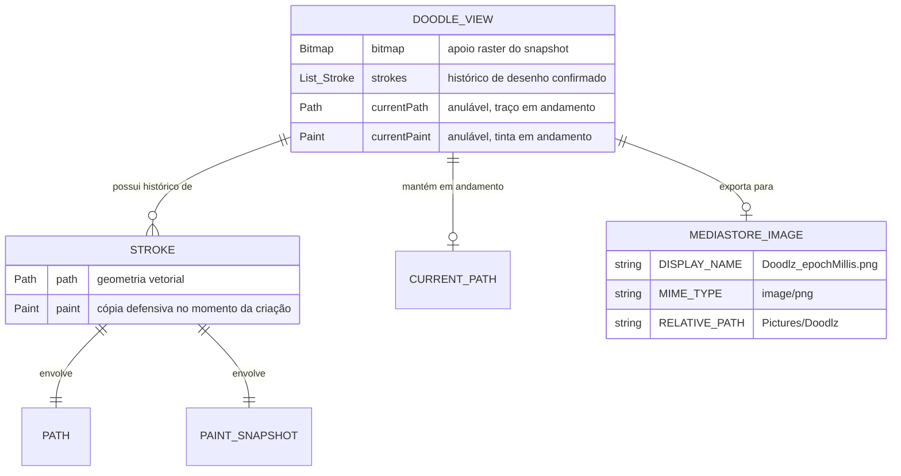
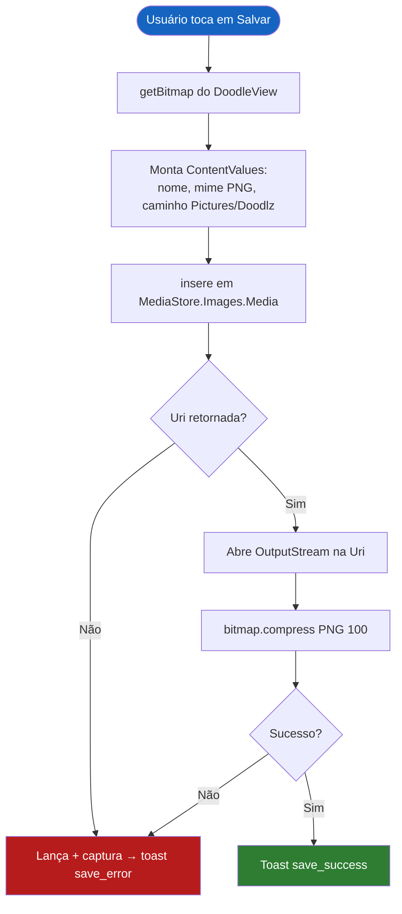
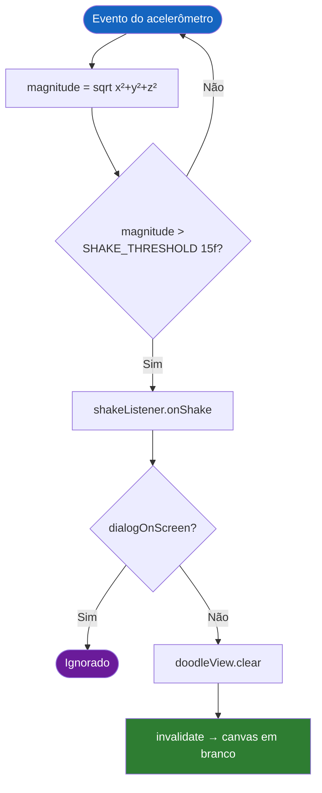
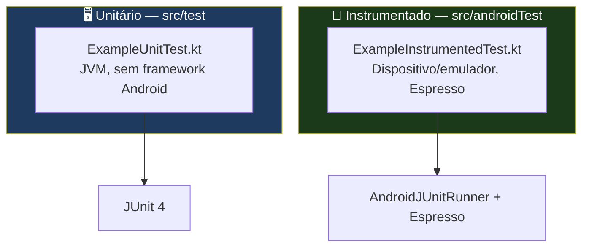

<div align="center">

**🌐 Choose Language / Selecione o Idioma / Elija el Idioma**

[](README.md)&nbsp;&nbsp;&nbsp;[](README_PT.md)&nbsp;&nbsp;&nbsp;[](README_ES.md)

</div>

---

<div align="center">

```
██████╗  ██████╗  ██████╗ ██████╗ ██╗     ███████╗
██╔══██╗██╔═══██╗██╔═══██╗██╔══██╗██║     ╚══███╔╝
██║  ██║██║   ██║██║   ██║██║  ██║██║       ███╔╝
██║  ██║██║   ██║██║   ██║██║  ██║██║      ███╔╝
██████╔╝╚██████╔╝╚██████╔╝██████╔╝███████╗███████╗
╚═════╝  ╚═════╝  ╚═════╝ ╚═════╝ ╚══════╝╚══════╝
      Aplicativo Android de Desenho com o Dedo (Touch)
```

---

[](https://developer.android.com/)
[](https://openjdk.org/)
[](https://kotlinlang.org/)
[](https://gradle.org/)
[]()
[]()
[]()

<br/>

> **Um aplicativo Android de desenho com o dedo, com um canvas customizado baseado em `View`**
> que registra cada traço como um caminho vetorial, colore, salva, imprime e limpa a tela ao chacoalhar o aparelho.

<br/>


-FF6B35?style=flat-square)


</div>

---

## 📑 Índice

<details>
<summary>▶️ <strong>Clique para expandir / recolher esta seção</strong></summary>

<table>
<tr>
<td valign="top" width="50%">

**🏗️ Sistema**
- [Visão Geral](#-visão-geral)
- [Arquitetura do Sistema](#️-arquitetura-do-sistema)
- [Stack Tecnológica](#️-stack-tecnológica)
- [Padrões de Projeto](#-padrões-de-projeto-aplicados)
- [Estrutura do Projeto](#-estrutura-do-projeto)

**📦 Módulos**
- [MainActivity — Host](#️-mainactivity--host-de-fragments)
- [DoodleFragment — Controlador](#-doodlefragment--controlador-de-desenho)
- [DoodleView — Motor do Canvas](#️-doodleview--motor-do-canvas)
- [ColorDialogFragment](#-colordialogfragment--seletor-de-paleta)
- [LineWidthDialogFragment](#-linewidthdialogfragment--ajuste-de-espessura)
- [EraseImageDialogFragment](#-eraseimagedialogfragment--porta-de-confirmação)
- [SensorEventListenerHelper](#-sensoreventlistenerhelper--detector-de-chacoalhada)

</td>
<td valign="top" width="50%">

**💼 Negócio**
- [Regras de Negócio](#-regras-de-negócio)
- [Requisitos Funcionais](#-requisitos-funcionais)
- [Requisitos Não Funcionais](#-requisitos-não-funcionais)

**📐 Design**
- [Modelo de Dados](#️-modelo-de-dados)
- [Fluxos do Sistema](#-fluxos-do-sistema)
- [Fluxo de Captura de Traço](#fluxo-de-captura-de-traço)
- [Fluxo de Salvamento](#fluxo-de-salvamento)
- [Fluxo de Limpeza por Chacoalhada](#fluxo-de-limpeza-por-chacoalhada)

**🔐 Segurança & Operação**
- [Segurança](#-segurança)
- [Instalação & Execução](#-instalação--execução)
- [Testes Automatizados](#-testes-automatizados)
- [Métricas & Monitoramento](#-métricas--monitoramento)
- [Limitações Conhecidas](#️-limitações-conhecidas)

</td>
</tr>
</table>

---

</details>

## 🌟 Visão Geral

<details>
<summary>▶️ <strong>Clique para expandir / recolher esta seção</strong></summary>

**Doodlz** é um aplicativo Android nativo de desenho com o dedo, escrito em Java. Ele desenha através de uma subclasse de `View` feita à mão — `DoodleView` — que rastreia cada gesto de toque como um `Path` do Android, junto de uma cópia do `Paint` vigente no momento em que o traço começou. O resultado é uma superfície de desenho vetorial: mudanças de cor e espessura afetam apenas os traços desenhados *depois* da mudança, nunca os traços já presentes no canvas.

O aplicativo é uma única `Activity` que hospeda um único `Fragment` principal (`DoodleFragment`), o qual por sua vez abre três `DialogFragment`s modais para seleção de cor, ajuste de espessura de linha e confirmação de apagar. Um `SensorEventListenerHelper` singleton escuta o acelerômetro do aparelho e dispara uma limpeza completa do canvas ao detectar uma chacoalhada, a menos que haja um diálogo na tela no momento.

Salvar grava o bitmap composto na pasta pública da galeria `Pictures/Doodlz` através da API `MediaStore` com armazenamento escopado, e imprimir entrega o mesmo bitmap ao `PrintHelper` do Android para o diálogo de impressão do sistema.

### 🎯 Objetivos do Sistema

| Objetivo | Descrição |
|----------|-----------|
| ✏️ **Desenho livre** | Capturar gestos de toque contínuos como caminhos vetoriais suaves e com anti-aliasing |
| 🎨 **Seleção de cor** | Oferecer uma paleta de 10 cores através de um diálogo seletor em grade |
| 📏 **Controle de espessura** | Ajustar a espessura da linha ao vivo via `SeekBar`, com retorno visual imediato |
| 🧹 **Limpeza por chacoalhada** | Detectar uma chacoalhada física via acelerômetro e limpar o canvas após confirmação |
| 💾 **Exportação para a galeria** | Salvar o desenho finalizado como PNG na pasta pública Pictures do aparelho |
| 🖨️ **Impressão** | Enviar o desenho para qualquer serviço de impressão registrado no sistema |
| 🔐 **Permissões em runtime** | Solicitar permissões de armazenamento apenas na faixa legada de API que ainda as exige |
| 🎭 **Edição não destrutiva** | Preservar a cor e a espessura dos traços já desenhados quando as configurações ativas da ferramenta mudam |

---

</details>

## 🏗️ Arquitetura do Sistema

<details>
<summary>▶️ <strong>Clique para expandir / recolher esta seção</strong></summary>

### Diagrama de Módulos



### Camadas da Arquitetura



---

</details>

## 🛠️ Stack Tecnológica

<details>
<summary>▶️ <strong>Clique para expandir / recolher esta seção</strong></summary>

<table>
<thead>
<tr>
<th>Camada</th>
<th>Tecnologia</th>
<th>Versão</th>
<th>Finalidade</th>
</tr>
</thead>
<tbody>
<tr>
<td rowspan="2"><strong>🧠 Linguagem</strong></td>
<td>Java</td>
<td>17</td>
<td>Toda a lógica da aplicação — 8 classes</td>
</tr>
<tr>
<td>Plugin Kotlin Android</td>
<td>aplicado, não usado diretamente</td>
<td>Declarado por compatibilidade com dependências AndroidX KTX</td>
</tr>
<tr>
<td rowspan="3"><strong>🤖 Plataforma</strong></td>
<td>Android SDK</td>
<td>compile/target 34</td>
<td>Comportamento alvo do Android 14</td>
</tr>
<tr>
<td>SDK Mínimo</td>
<td>21</td>
<td>Piso Android 5.0 Lollipop</td>
</tr>
<tr>
<td>Fragments</td>
<td>AndroidX</td>
<td>`Fragment` + `DialogFragment`, baseados no child fragment manager</td>
</tr>
<tr>
<td rowspan="3"><strong>🎨 Gráficos</strong></td>
<td>Canvas / Path / Paint</td>
<td>Android Graphics</td>
<td>Renderização de traço vetorial à mão livre</td>
</tr>
<tr>
<td>Bitmap</td>
<td>ARGB_8888</td>
<td>Snapshot raster composto para salvar/imprimir</td>
</tr>
<tr>
<td>RecyclerView + GridLayoutManager</td>
<td>AndroidX</td>
<td>Grade de 5 colunas com as amostras de cor</td>
</tr>
<tr>
<td rowspan="2"><strong>💾 Armazenamento</strong></td>
<td>MediaStore</td>
<td>Images.Media</td>
<td>Inserção em `Pictures/Doodlz` com armazenamento escopado |
</tr>
<tr>
<td>Permissões legadas</td>
<td>API ≤ 28</td>
<td>`WRITE_EXTERNAL_STORAGE` / `READ_EXTERNAL_STORAGE` via Activity Result API</td>
</tr>
<tr>
<td><strong>🖨️ Impressão</strong></td>
<td>androidx.print.PrintHelper</td>
<td>1.0.0</td>
<td>Entrega o bitmap a qualquer serviço de impressão do sistema</td>
</tr>
<tr>
<td><strong>📳 Sensores</strong></td>
<td>SensorManager / Acelerômetro</td>
<td>Android Hardware</td>
<td>Detecção de chacoalhada por verificação de magnitude com limiar</td>
</tr>
<tr>
<td rowspan="2"><strong>🧪 Testes</strong></td>
<td>JUnit</td>
<td>4.13.2</td>
<td>Testes unitários locais (`src/test`)</td>
</tr>
<tr>
<td>Espresso + AndroidX Test</td>
<td>3.5.1 / 1.1.5</td>
<td>Testes instrumentados (`src/androidTest`)</td>
</tr>
<tr>
<td><strong>🔧 Build</strong></td>
<td>Gradle</td>
<td>Kotlin DSL</td>
<td>`build.gradle.kts` por módulo, stdlib Kotlin fixada em 1.8.20</td>
</tr>
</tbody>
</table>

---

</details>

## 🎨 Padrões de Projeto Aplicados

<details>
<summary>▶️ <strong>Clique para expandir / recolher esta seção</strong></summary>

| Padrão | Onde | Justificativa |
|--------|------|----------------|
| 🧭 **Divisão estilo MVC** | `DoodleView` (modelo+view dos traços) vs. `DoodleFragment` (controlador: I/O, diálogos, permissões) | O estado de desenho fica dentro da view customizada; a orquestração fica no fragment |
| 🎯 **Snapshot tipo Command** | `Stroke(Path, Paint)` — cada traço copia o `Paint` vigente no momento de sua criação | Mudanças posteriores de cor/espessura não podem alterar retroativamente traços já confirmados |
| 🔂 **Singleton** | `SensorEventListenerHelper.getInstance(context)` | Um único listener de acelerômetro compartilhado entre os eventos do ciclo de vida do fragment, evitando registro duplicado |
| 👂 **Observer / Callback** | Interface `ShakeListener`, `SeekBar.OnSeekBarChangeListener`, listeners de clique | Desacopla o sensor e os diálogos do fragment que consome seus eventos |
| 🚦 **Flag de Guarda** | Booleano `dialogOnScreen` em `DoodleFragment` | Impede que uma chacoalhada limpe o canvas enquanto um diálogo modal já está aberto |
| 🏭 **Padrão Adapter** | `ColorAdapter` + `ColorViewHolder` | Par padrão adapter/view-holder do RecyclerView para a grade de cores |
| 🔀 **Strategy (ramificação em runtime)** | Verificação `Build.VERSION.SDK_INT <= Build.VERSION_CODES.P` | Permissão de armazenamento legada solicitada apenas onde a plataforma ainda a exige |
| 🧱 **Renderização por Replay** | `DoodleView.onDraw` itera `List<Stroke>` a cada quadro | O canvas é sempre reconstruído a partir do histórico autoritativo de traços, nunca mutado no lugar |

---

</details>

## 📁 Estrutura do Projeto

<details>
<summary>▶️ <strong>Clique para expandir / recolher esta seção</strong></summary>

```
Doodlz/
│
├── 📄 build.gradle.kts                  # Script de build raiz
├── 📄 settings.gradle.kts               # Inclusão de módulos
├── 📄 gradle.properties                 # Argumentos da JVM, flags AndroidX
├── 📄 local.properties                  # Caminho local do SDK (não versionado)
├── 📄 gradlew / gradlew.bat             # Lançadores do Gradle Wrapper
│
├── 📂 gradle/
│   ├── 📄 libs.versions.toml            # Catálogo de versões
│   └── 📂 wrapper/                      # gradle-wrapper.jar + properties
│
└── 📂 app/
    ├── 📄 build.gradle.kts              # Níveis de SDK, dependências, stdlib Kotlin fixada
    ├── 📄 proguard-rules.pro            # Regras de retenção R8/ProGuard
    │
    └── 📂 src/
        ├── 📂 main/
        │   ├── 📄 AndroidManifest.xml
        │   ├── 📂 java/com/example/doodlz/
        │   │   ├── 📄 MainActivity.java             # Host de Activity única
        │   │   ├── 📄 DoodleFragment.java            # ★ Controlador — I/O, diálogos, permissões
        │   │   ├── 📄 DoodleView.java                # ★ Motor do canvas — modelo Path/Stroke
        │   │   ├── 📄 ColorDialogFragment.java       # Seletor de cores em grade
        │   │   ├── 📄 ColorViewHolder.java           # Holder do RecyclerView para uma amostra
        │   │   ├── 📄 LineWidthDialogFragment.java   # Seletor de espessura via SeekBar
        │   │   ├── 📄 EraseImageDialogFragment.java  # Confirmação Sim/Não de apagar
        │   │   └── 📄 SensorEventListenerHelper.java # Singleton detector de chacoalhada
        │   └── 📂 res/
        │       ├── 📂 layout/
        │       │   ├── activity_main.xml
        │       │   ├── fragment_doodle.xml
        │       │   ├── fragment_color.xml
        │       │   ├── fragment_line_width.xml
        │       │   ├── fragment_erase_image.xml
        │       │   └── item_color.xml
        │       ├── 📂 drawable/                      # ic_print.xml, camadas do launcher
        │       ├── 📂 mipmap-*dpi/                    # Ícones do launcher
        │       ├── 📂 values/                          # colors, dimens, strings, themes
        │       └── 📂 xml/                              # regras de backup e extração de dados
        │
        ├── 📂 test/java/com/example/doodlz/
        │   └── ExampleUnitTest.kt
        └── 📂 androidTest/java/com/example/doodlz/
            └── ExampleInstrumentedTest.kt
│
├── 📄 README.md                          # 🇺🇸 Inglês (principal)
├── 📄 README_PT.md                       # 🇧🇷 Português
└── 📄 README_ES.md                       # 🇪🇸 Espanhol
```

---

</details>

## 📦 Módulos do Sistema

<details>
<summary>▶️ <strong>Clique para expandir / recolher esta seção</strong></summary>

### 🏛️ MainActivity — Host de Fragments

Uma `AppCompatActivity` mínima cujo corpo inteiro é `setContentView(R.layout.activity_main)`. Toda a lógica vive a jusante, em `DoodleFragment`; a activity não carrega estado nem callbacks próprios.

---

### 🎮 DoodleFragment — Controlador de Desenho

O centro de orquestração da aplicação, implementando `SensorEventListenerHelper.ShakeListener`.

| Responsabilidade | Implementação |
|-------------------|----------------|
| Inflação da view | `onCreateView` infla `fragment_doodle.xml`, conecta `doodleView` e cinco botões |
| Fluxo de permissão | `registerForActivityResult(RequestMultiplePermissions)`, solicitado apenas quando `SDK_INT <= P` |
| Ciclo de vida do sensor | `onResume`/`onPause` iniciam/param o `SensorEventListenerHelper` compartilhado |
| Abertura de diálogos | `openColorDialog`, `openLineWidthDialog`, `openEraseDialog` — cada um define `dialogOnScreen = true` |
| Salvar | `saveImage()` — monta `ContentValues`, insere em `MediaStore.Images.Media`, transmite uma compressão PNG para a `Uri` retornada |
| Imprimir | `printImage()` — entrega `doodleView.getBitmap()` ao `PrintHelper` |
| Tratamento de chacoalhada | `onShake()` limpa o canvas apenas `if (!dialogOnScreen)` |

---

### ⚙️ DoodleView — Motor do Canvas

Uma `View` customizada que é ao mesmo tempo a superfície de desenho e o modelo autoritativo de tudo que foi desenhado.

| Elemento | Papel |
|----------|-------|
| `Stroke` (classe interna) | Par imutável de um `Path` e uma cópia defensiva do `Paint` ativo quando o traço começou |
| `strokes: List<Stroke>` | Histórico completo do desenho, reproduzido em `onDraw` a cada quadro |
| `currentPath` / `currentPaint` | O traço em andamento, renderizado sobre o histórico confirmado enquanto o dedo ainda está na tela |
| `onTouchEvent` | `ACTION_DOWN` inicia um caminho, `ACTION_MOVE` o estende com `lineTo`, `ACTION_UP` o confirma em `strokes` |
| `setColor` / `setStrokeWidth` | Alteram `drawPaint`, que é copiado para `currentPaint` no *próximo* `ACTION_DOWN` — nunca afeta traços já confirmados |
| `clear()` | Esvazia `strokes` e chama `invalidate()` |
| `getBitmap()` | Desenha a view sobre seu `Bitmap` de apoio e o retorna para salvar/imprimir |

> [!NOTE]
> Traços confirmados nunca são redesenhados sobre o `Bitmap` de apoio durante o desenho normal — `onDraw` reproduz a lista vetorial de `Path` diretamente sobre o `Canvas` passado pelo framework. O par `Bitmap`/`drawCanvas` existe especificamente para produzir um snapshot raster sob demanda em `getBitmap()`.

---

### 🎨 ColorDialogFragment — Seletor de Paleta

Um `DialogFragment` que hospeda uma grade `RecyclerView` de 5 colunas com 10 constantes `Color` fixas (`BLACK`, `RED`, `BLUE`, `GREEN`, `YELLOW`, `MAGENTA`, `CYAN`, `GRAY`, `DKGRAY`, `LTGRAY`). Tocar em uma amostra chama `changeColor()` no fragment pai e fecha o diálogo. `ColorAdapter`/`ColorViewHolder` seguem o padrão de adapter do RecyclerView.

---

### 📏 LineWidthDialogFragment — Ajuste de Espessura

Um `DialogFragment` que envolve um `SeekBar` limitado por `R.dimen.max_line_width`, com piso em `R.dimen.default_line_width`. Toda chamada de `onProgressChanged` atualiza imediatamente o texto de preview ao vivo e chama `changeLineWidth()` no pai — a espessura se aplica em tempo real, não só ao fechar. `onStopTrackingTouch` fecha o diálogo.

---

### 🧹 EraseImageDialogFragment — Porta de Confirmação

Um `DialogFragment` simples de Sim/Não. "Sim" chama `eraseDrawing()` no pai e fecha; "Não" apenas fecha. O título do diálogo é definido programaticamente como "Confirmar" em `onCreateDialog`.

---

### 📳 SensorEventListenerHelper — Detector de Chacoalhada

Um singleton de escopo de processo (`getInstance(Context)`) que envolve o acelerômetro do aparelho.

| Aspecto | Detalhe |
|---------|---------|
| Limiar | `SHAKE_THRESHOLD = 15f`, comparado contra `sqrt(x² + y² + z²)` |
| Ciclo de vida | `start()`/`stop()` registram/desregistram o listener de forma idempotente via flag `isRunning` |
| Callback | `ShakeListener.onShake()`, implementado por `DoodleFragment` |
| Escopo | `getInstance` retém apenas o `applicationContext`, evitando vazamento de `Activity` |

---

</details>

## 💼 Regras de Negócio

<details>
<summary>▶️ <strong>Clique para expandir / recolher esta seção</strong></summary>

### ✏️ Regras de Desenho

| # | Regra | Aplicação |
|---|-------|-----------|
| RN-01 | Um traço só começa em `ACTION_DOWN` | `currentPath = new Path(); currentPath.moveTo(...)` |
| RN-02 | A cor e a espessura de um traço são fixadas no momento em que ele começa | `currentPaint = new Paint(drawPaint)` — uma cópia defensiva, não uma referência |
| RN-03 | Um traço só é confirmado no histórico em `ACTION_UP` | `strokes.add(new Stroke(currentPath, currentPaint))` |
| RN-04 | Mudar cor ou espessura nunca altera traços já confirmados | `Stroke` guarda sua própria cópia de `Paint`, independente de `drawPaint` |
| RN-05 | O canvas redesenha todo o histórico mais o traço em andamento a cada quadro | `onDraw` itera `strokes` e depois desenha `currentPath` se não for nulo |

### 💬 Regras de Diálogo

| # | Regra | Aplicação |
|---|-------|-----------|
| RN-06 | Apenas um diálogo modal pode estar aberto por vez | Cada diálogo é `setCancelable(false)` e deve ser fechado explicitamente |
| RN-07 | Uma chacoalhada com um diálogo aberto não deve limpar o canvas | Guarda `dialogOnScreen` em `onShake()` |
| RN-08 | Abrir qualquer diálogo define a guarda; qualquer caminho de fechamento a limpa | `openXDialog()` define `true`; `changeColor`/`changeLineWidth`/`eraseDrawing` definem `false` |

### 💾 Regras de Salvamento & Impressão

| # | Regra | Aplicação |
|---|-------|-----------|
| RN-09 | Arquivos salvos são nomeados `Doodlz_<epochMillis>.png` | `saveImage()` |
| RN-10 | Arquivos salvos sempre caem em `Pictures/Doodlz` | `RELATIVE_PATH` no `ContentValues` |
| RN-11 | A permissão de armazenamento é solicitada apenas abaixo da API 29 | Guarda `Build.VERSION.SDK_INT <= Build.VERSION_CODES.P` |
| RN-12 | Uma falha ao salvar não deve derrubar o aplicativo | `try/catch` ao redor da inserção e compressão no `MediaStore`, com toast em caso de falha |
| RN-13 | A impressão usa a mesma lógica de bitmap do salvamento | Ambos chamam `doodleView.getBitmap()` |

---

</details>

## ✅ Requisitos Funcionais

<details>
<summary>▶️ <strong>Clique para expandir / recolher esta seção</strong></summary>

| ID | Requisito | Prioridade | Status |
|----|-----------|------------|--------|
| **RF-01** | O sistema deve permitir que o usuário desenhe traços livres com o dedo | 🔴 Alta | ✅ Implementado |
| **RF-02** | O sistema deve oferecer uma paleta de 10 cores predefinidas | 🔴 Alta | ✅ Implementado |
| **RF-03** | O sistema deve permitir ajuste ao vivo da espessura do traço | 🔴 Alta | ✅ Implementado |
| **RF-04** | O sistema deve preservar a cor/espessura de traços já desenhados | 🔴 Alta | ✅ Implementado |
| **RF-05** | O sistema deve limpar o canvas após um apagar confirmado | 🔴 Alta | ✅ Implementado |
| **RF-06** | O sistema deve limpar o canvas ao detectar uma chacoalhada do aparelho | 🟡 Média | ✅ Implementado |
| **RF-07** | O sistema deve suprimir a limpeza por chacoalhada enquanto um diálogo está aberto | 🟡 Média | ✅ Implementado |
| **RF-08** | O sistema deve salvar o desenho como PNG na galeria pública | 🔴 Alta | ✅ Implementado |
| **RF-09** | O sistema deve solicitar permissão de armazenamento apenas em Android legado | 🟡 Média | ✅ Implementado |
| **RF-10** | O sistema deve imprimir o desenho via o serviço de impressão do sistema | 🟡 Média | ✅ Implementado |
| **RF-11** | O sistema deve notificar o usuário sobre sucesso e falha ao salvar | 🟢 Baixa | ✅ Implementado |
| **RF-12** | O sistema deve notificar o usuário sobre falha ao imprimir | 🟢 Baixa | ✅ Implementado |
| **RF-13** | O sistema deve apresentar a confirmação de apagar antes de limpar | 🟡 Média | ✅ Implementado |
| **RF-14** | O sistema deve renderizar o seletor de espessura com um rótulo numérico ao vivo | 🟢 Baixa | ✅ Implementado |

---

</details>

## ⚡ Requisitos Não Funcionais

<details>
<summary>▶️ <strong>Clique para expandir / recolher esta seção</strong></summary>

| ID | Categoria | Requisito | Meta |
|----|-----------|-----------|------|
| **RNF-01** | ⚡ Desempenho | Latência de toque até desenho | < 16 ms por quadro (60 fps) |
| **RNF-02** | 🧠 Memória | Histórico de traços em uma sessão típica | Limitado pela RAM do aparelho; sem teto explícito definido |
| **RNF-03** | 📱 Compatibilidade | Faixa de versões do Android | API 21 → API 34 |
| **RNF-04** | 🔋 Bateria | O listener do acelerômetro roda apenas com o fragment em resume | `onPause` chama `stop()` |
| **RNF-05** | 🎨 Usabilidade | O preview de espessura atualiza sem exigir fechar o diálogo | Callback ao vivo do `SeekBar` |
| **RNF-06** | 🔐 Privacidade | Nenhuma permissão de rede declarada | Os desenhos nunca saem do aparelho por este app |
| **RNF-07** | 🧱 Manutenibilidade | Classes de propósito único, sem estáticos mutáveis compartilhados além do singleton do sensor | 8 arquivos Java pequenos |
| **RNF-08** | 🖨️ Interoperabilidade | A impressão funciona com qualquer serviço de impressão registrado no sistema | `androidx.print.PrintHelper` |

---

</details>

## 🗄️ Modelo de Dados

<details>
<summary>▶️ <strong>Clique para expandir / recolher esta seção</strong></summary>

> [!NOTE]
> O Doodlz não tem banco de dados. Seu modelo de dados é o histórico de traços em memória mais o registro do MediaStore produzido ao salvar.

### Diagrama Entidade-Relacionamento



### Padrões de Pintura

| Propriedade | Valor | Origem |
|-------------|-------|--------|
| Cor inicial | `Color.BLACK` | Padrão do campo `paintColor` |
| Espessura inicial | `R.dimen.default_line_width` | `dimens.xml` |
| Espessura máxima | `R.dimen.max_line_width` | `dimens.xml`, limita o `SeekBar` |
| Estilo | `Paint.Style.STROKE` | `init()` |
| Junção / Ponta | `ROUND` / `ROUND` | `init()` — cantos suaves à mão livre |
| Anti-aliasing | habilitado | `init()` |

---

</details>

## 🔄 Fluxos do Sistema

<details>
<summary>▶️ <strong>Clique para expandir / recolher esta seção</strong></summary>

### Fluxo de Captura de Traço

```mermaid
sequenceDiagram
    autonumber
    participant U as 👤 Usuário
    participant V as ⚙️ DoodleView
    U->>V: ACTION_DOWN em (x,y)
    V->>V: currentPath = new Path(); moveTo(x,y)
    V->>V: currentPaint = cópia de drawPaint
    loop dedo se movendo
        U->>V: ACTION_MOVE
        V->>V: currentPath.lineTo(x,y)
        V->>V: invalidate()
        V-->>U: onDraw redesenha histórico + currentPath
    end
    U->>V: ACTION_UP
    V->>V: strokes.add(new Stroke(currentPath, currentPaint))
    V->>V: currentPath = null
```

### Fluxo de Salvamento



### Fluxo de Limpeza por Chacoalhada



---

</details>

## 🔐 Segurança

<details>
<summary>▶️ <strong>Clique para expandir / recolher esta seção</strong></summary>

### Controles Implementados

| Controle | Implementação | Efeito |
|----------|---------------|--------|
| 🔐 **Armazenamento escopado** | Inserção via `MediaStore` em todos os níveis de API suportados | Não exige acesso amplo ao sistema de arquivos na API 29+ |
| 🚦 **Solicitação de permissão só no legado** | Guarda `SDK_INT <= P` | Evita solicitar permissões que a plataforma não concede mais de forma significativa |
| ✅ **Validação de resultado** | `if (uri == null) throw` e verificação do resultado da compressão | Um salvamento falho não pode corromper o estado silenciosamente |
| 🌐 **Sem permissão de rede** | `INTERNET` ausente do manifesto | Os desenhos não podem sair do aparelho por este app |
| 📵 **Sem SDK de terceiros** | Apenas AndroidX + Material | Nenhuma saída de dados para analytics ou anúncios |

### Limitações de Segurança Conhecidas

> [!WARNING]
> Ressalvas da mesma categoria de qualquer pequeno app de demonstração Android; entenda-as antes de reutilizar.

| Limitação | Risco | Caminho de mitigação |
|-----------|-------|----------------------|
| 🗂️ **Armazenamento em galeria pública** | Qualquer app que leia a galeria pode ver os desenhos salvos | Usar armazenamento privado do app se a confidencialidade importar |
| 🔁 **Negação permanente não detectada** | Permissão negada em Android legado não mostra justificativa, apenas um toast | Adicionar tratamento com `shouldShowRequestPermissionRationale` |
| 🧬 **Build de release sem minificação** | `isMinifyEnabled = false` | Habilitar R8 para builds de release |
| 🪵 **Log de depuração deixado no lugar** | `SensorEventListenerHelper` registra os valores brutos dos eixos a cada leitura do sensor | Remover ou proteger atrás de uma flag de debug antes de publicar |

---

</details>

## 🚀 Instalação & Execução

<details>
<summary>▶️ <strong>Clique para expandir / recolher esta seção</strong></summary>

### Pré-requisitos

```bash
java -version          # JDK 17+
sdkmanager "platforms;android-34" "build-tools;34.0.0"
adb devices             # confirme que há um dispositivo ou emulador conectado
```

### Build

```bash
./gradlew assembleDebug      # app/build/outputs/apk/debug/app-debug.apk
./gradlew assembleRelease
./gradlew clean
./gradlew build               # compilação + lint + testes unitários
```

### Execução

```bash
./gradlew installDebug
adb shell am start -n com.example.doodlz/.MainActivity
```

**Uso**

1. Desenhe com o dedo em qualquer lugar do canvas.
2. Toque em **Cor** para escolher na grade de 10 amostras.
3. Toque em **Espessura** e arraste o slider para redimensionar o traço.
4. Toque em **Limpar** e confirme para apagar, ou chacoalhe o aparelho.
5. Toque em **Salvar** para gravar um PNG em `Pictures/Doodlz`.
6. Toque em **Imprimir** para enviar o desenho a um serviço de impressão do sistema.

### Alvos do Gradle

| Alvo | Finalidade |
|------|------------|
| `./gradlew assembleDebug` | Gerar o APK de debug |
| `./gradlew installDebug` | Compilar e instalar no dispositivo conectado |
| `./gradlew test` | Executar testes unitários na JVM |
| `./gradlew connectedAndroidTest` | Executar testes instrumentados em um dispositivo |
| `./gradlew lint` | Análise estática |

---

</details>

## 🧪 Testes Automatizados

<details>
<summary>▶️ <strong>Clique para expandir / recolher esta seção</strong></summary>

### Arquitetura de Testes



### Executando os Testes

```bash
./gradlew test
./gradlew connectedAndroidTest
```

### Checklist Manual de Aceitação

| # | Cenário | Resultado esperado |
|---|---------|---------------------|
| 1 | Desenhar um traço, mudar de cor, desenhar outro | O primeiro traço mantém sua cor original |
| 2 | Ajustar a espessura no meio da sessão | Novos traços refletem a nova espessura, os antigos ficam inalterados |
| 3 | Chacoalhar sem diálogo aberto | O canvas se limpa |
| 4 | Chacoalhar com um diálogo aberto | O canvas permanece intocado |
| 5 | Salvar | O arquivo aparece em `Pictures/Doodlz`, o toast confirma |
| 6 | Imprimir | O diálogo de impressão do sistema abre com o desenho |
| 7 | Negar permissão de armazenamento (API ≤ 28) | Toast informa a negação, o salvamento falha graciosamente |

---

</details>

## 📊 Métricas & Monitoramento

<details>
<summary>▶️ <strong>Clique para expandir / recolher esta seção</strong></summary>

| Métrica | Valor |
|---------|-------|
| Classes Java | 8 |
| Fragments | 4 (1 principal + 3 diálogos) |
| Cores predefinidas | 10 |
| Limiar de chacoalhada | 15f (magnitude equivalente a m/s²) |
| SDK Mínimo / Alvo / Compilação | 21 / 34 / 34 |
| Dependências diretas | 9 de implementação + 3 de teste |

### Comandos de Diagnóstico

```bash
adb logcat --pid=$(adb shell pidof -s com.example.doodlz)
adb shell ls -l /sdcard/Pictures/Doodlz/
```

---

</details>

## ⚠️ Limitações Conhecidas

<details>
<summary>▶️ <strong>Clique para expandir / recolher esta seção</strong></summary>

> [!IMPORTANT]
> Construído como demonstração educacional de desenho customizado em `View`, composição de `Fragment` e interação orientada por sensor.

| Categoria | Problema | Status |
|-----------|----------|--------|
| ↩️ **Sem desfazer/refazer** | Remover o último traço exige uma limpeza completa | ⚠️ Aberto — remover o último elemento de `strokes` |
| 🪵 **Log de sensor verboso** | Cada leitura do acelerômetro é registrada em `Log.i` | ⚠️ Aberto — remover ou proteger para release |
| 🧬 **Release sem minificação** | `isMinifyEnabled = false` | ⚠️ Aberto — habilitar R8 |
| 🧪 **Sem cobertura de testes customizada** | Só existem os testes de exemplo gerados | ⚠️ Aberto — adicionar testes para a imutabilidade de `Stroke` e o limiar de chacoalhada |
| 📱 **Sem salvamento de estado na rotação** | O desenho se perde se o fragment for recriado na rotação | ⚠️ Aberto — persistir os traços entre mudanças de configuração |

</details>

---

<div align="center">

---

### 🎨 Doodlz

*Cada traço lembra de que cor nasceu*

[](https://developer.android.com/)
[](https://openjdk.org/)
[]()

<br/>

```
"Um canvas que nunca esquece de que cor cada linha nasceu."
```

</div>
